# Phase 7A — Organization Trust Domain Architecture Specification

## Version 1

Date: 2026-07-28

Status: proposed for architecture review

Authority: candidate authoritative architecture for Tutela Organization Trust

Scope: architecture and documentation only

Implementation status: not authorized

## Production Cycle 1 registration and runtime authority amendment

An authenticated local trader may register one primary Organization when that
user holds no active `owner` Membership in another Organization. This is an
application-layer launch policy, not a permanent Domain invariant.
Registration atomically appends an `active` Registry profile revision and an
active `owner` Membership for the creator.

Registry `active` means registered and operational only. It does not imply
verification, Trust, Activity Eligibility, Participation Eligibility,
Publication Eligibility, or trading authority. Production Cycle 1 Membership
roles are only `owner` and `member`. An active owner may manage Membership
role/status, submit or revise Organization evidence, and initiate Verification;
Membership never constructs Decision, Trust, or any Eligibility result.

The production composition writes Registry/Membership atomically, stores
platform evidence immutably, invokes the existing Organization Verification
Application Service, and binds Participation only to PostgreSQL load and
Replay-derived Trust. Activity Eligibility remains independent and gates the
application composition. Offer documentary evidence is bound to the exact
Offer Verification Attempt. External KYB/compliance providers remain optional
future evidence sources and cannot directly approve TUTELA authority.

## 1. Executive Summary

Organization Trust is the first capability formally organized with Offer
Verification under the broader Tutela Trust Domain.

Organization Trust answers one narrow question:

> Can this specific legal organization currently be trusted to participate in
> the Tutela platform?

The answer is time-bound, evidence-backed, policy-versioned, auditable, and
specific to the identified organization. It does not authorize an offer,
publication, negotiation, transaction, contract, payment, settlement, or any
other platform action.

The Tutela Trust Domain unifies trust capabilities through shared philosophy
and architectural standards. It does not centralize their decisions, data,
lifecycles, repositories, or engines. Organization Trust and Offer
Verification remain independently owned bounded contexts.

This specification adopts the proven Phase 6 architecture:

- one Decision Engine owns one capability's decisions;
- one Workflow Coordinator owns that capability's lifecycle transitions;
- process, decision, lifecycle, status, and eligibility remain distinct;
- submitted inputs are immutable;
- history is append-only;
- Reason Codes and Rule IDs are stable and machine-readable;
- policies and reference data resolve exact recorded versions;
- evaluation/completion is sealed;
- missing authority fails closed;
- downstream capabilities consume narrow read models rather than internals.

The proposed Organization Trust decision set is:

```text
verified
revision_required
manual_review
rejected
```

`rejected` applies only to the evaluated submission and recorded policies. It
is not a permanent ban and does not implement sanctions, AML, KYC, or general
regulatory compliance.

Organization Trust Status is a derived, rebuildable current-effective
projection. Immutable decisions and invalidation events are authoritative; a
mutable status column is not.

The approved legacy repository contains no authoritative Organization entity.
`users.company_name`, `users.verified`, legacy KYB-looking fields, document
presence, and per-offer seller flags are not Organization Trust evidence. They
may be mapped only through an explicit recovery adapter that preserves unknown
semantics and creates no trust.

No implementation, migration, schema, API, route, UI, database write, or
runtime change is introduced by this document.

## 2. Tutela Trust Domain Definition

### 2.1 Purpose

The Tutela Trust Domain is a conceptual and governance domain for independently
owned trust capabilities.

It defines:

- shared trust philosophy;
- ubiquitous architectural terminology;
- decision-ownership rules;
- evidence and history standards;
- fail-closed conventions;
- integration boundaries;
- audit conventions;
- recovery principles;
- privacy and security expectations;
- compatibility rules between trust capabilities.

### 2.2 What it does not own

The Trust Domain does not own:

- a universal trust decision;
- a global trust score;
- a common mutable trust state;
- one database for all trust evidence;
- a shared capability lifecycle;
- a universal verification engine;
- a generic policy that controls all capabilities;
- publication or participation eligibility;
- transaction authorization;
- cross-capability decision overrides.

### 2.3 Conceptually unified, operationally decentralized

The domain is unified by standards and language. It is decentralized by
authority and runtime ownership.

Every capability has its own:

- bounded context;
- aggregate roots;
- decisions;
- process;
- lifecycle;
- status projection;
- policies and versions;
- Rule IDs and Reason Codes;
- snapshots and fingerprints;
- findings;
- attempts;
- evidence, where applicable;
- repositories;
- workflow transitions;
- history;
- integration contract.

No capability may create, replace, reinterpret, or mutate another capability's
decision.

## 3. Trust Domain Capability Model

Current capabilities:

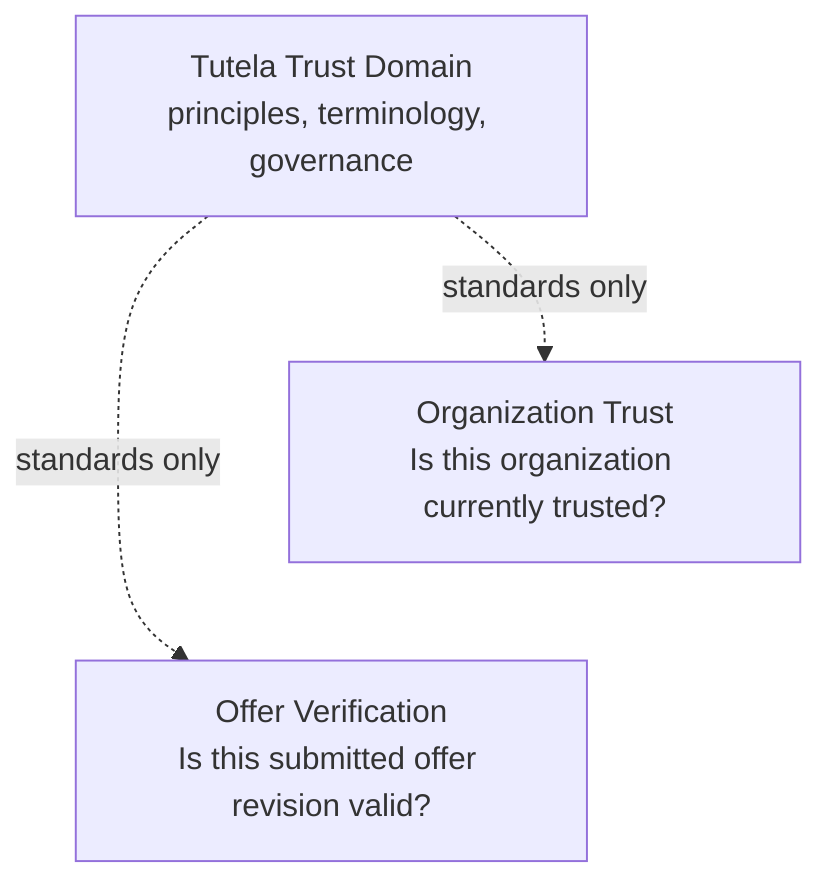

Conceptual future capabilities may include Counterparty Trust, Payment Trust,
Logistics Trust, Shipment Trust, Settlement Trust, and External Provider
Trust. They are names only in Version 1. Their decisions, policies, and engines
are not designed here.

### 3.1 Capability independence rules

| Capability concern | Organization Trust | Offer Verification |
|---|---|---|
| Business question | Is the organization currently trusted? | Is this submitted offer revision technically and commercially valid? |
| Primary subject | Legal organization | Offer Submission Revision |
| Decision owner | Organization Trust Decision Engine | Offer Verification Decision Engine |
| Lifecycle owner | Organization Trust Workflow Coordinator | Offer Workflow Coordinator |
| Evidence | Organization/evidence-specific | Allowlisted offer snapshot |
| Policies | Organization Trust policy families | Technical and Commercial Offer policies |
| History | Organization Trust history | Offer Verification history |
| Downstream authority | Trust fact only | Offer-verification eligibility only |

## 4. Domain Responsibilities

### 4.1 Organization Trust owns

- Organization Trust Profile;
- Organization Verification Submission and Revision;
- Organization Snapshot;
- Organization Verification Attempt and process;
- Organization Trust Evidence references and assessments;
- Organization Findings;
- Organization Trust Decisions;
- Organization trust-status derivation;
- Organization Trust events and history;
- Organization Trust Workflow transitions;
- Organization Trust policies, rules, Reason Codes, and versions;
- trust invalidation and re-verification behavior;
- recovery behavior for this capability.

### 4.2 Organization identity owns

The Organization aggregate owns:

- stable Tutela Organization ID;
- legal identity and jurisdiction;
- registered and trading names;
- registration identifiers;
- organization type;
- parent/subsidiary/branch identity references;
- profile revisions;
- Organization Lifecycle;
- organization-member association references.

Organization identity is not trust. An Organization may exist without ever
being submitted for verification.

### 4.3 Identity and Access owns

- user accounts;
- authentication credentials;
- sessions;
- organization membership;
- member roles and delegated authority;
- login enablement.

An account or membership does not prove Organization Trust.

### 4.4 Organization Trust does not decide

- offer technical or commercial validity;
- offer lifecycle or publication;
- marketplace ranking;
- negotiation, order, or contract approval;
- deal-specific counterparty eligibility;
- payment, escrow, or settlement;
- sanctions or AML outcomes;
- individual KYC;
- general regulatory compliance;
- transaction monitoring;
- risk scoring.

### 4.5 Independent concept matrix

| Concept | Exact question | Owner | Source of authority | Must never imply |
|---|---|---|---|---|
| User account existence | Does an authenticated user record exist? | Identity and Access | Account record | Organization existence, membership, or trust |
| Organization registration | Has Tutela created a distinct Organization identity? | Organization Identity | Organization aggregate | active lifecycle or trust |
| Organization Lifecycle | Is the Organization identity operationally active, suspended, or closed? | Organization Identity Coordinator | Lifecycle transition history | Verification Process, Decision, Trust Status, or eligibility |
| Verification Process | How far has this Attempt progressed? | Organization Trust orchestration | Attempt process events | verified, rejected, or trusted |
| Organization Trust Decision | What did the Engine conclude for this Attempt? | Organization Trust Decision Engine | Sealed completed Attempt | current applicability, lifecycle, or participation |
| Organization Trust Status | What is the current effective trust standing? | Trust Status Deriver | Decisions plus validity/invalidation facts | action-specific participation |
| Participation Eligibility | May this Organization perform one specified action now? | Future action-specific capability | Composition of independent authoritative facts | ownership of Organization Trust |

An authenticated account may exist without Organization membership. An
Organization may be registered without an active account, verification
submission, or trust. A completed decision may be historical and no longer
effective. A trusted Organization may still be ineligible for a specific
platform action.

## 5. Architectural Principles

1. **One capability, one Decision Engine.** Only the Organization Trust
   Decision Engine creates an Organization Trust Decision.
2. **Coordinator owns lifecycle.** The Organization Trust Workflow Coordinator
   applies engine-issued outcomes and never evaluates rules.
3. **Independent state dimensions.** Organization Lifecycle, Verification
   Process, Decision, Trust Status, and Participation Eligibility never
   substitute for one another.
4. **Immutable submission evidence.** Submitted revisions, snapshots,
   fingerprints, completed attempts, findings, decisions, and audit history
   are immutable.
5. **Append-only history.** Correction creates a new fact; it never rewrites a
   historical fact.
6. **Deterministic engine.** The engine consumes normalized findings,
   recorded versions, and an injected clock. It performs no network, database,
   file, OCR, AI, lifecycle, or publication operation.
7. **Sealed completion.** Repositories persist only opaque engine-issued
   completion objects bound to the attempt and snapshot.
8. **No fabricated decisions.** Routes, reviewers, administrators, workers,
   repositories, external providers, and clients cannot submit decisions.
9. **Fail closed.** Missing authority or integrity never produces `verified`.
10. **Exact version resolution.** Every used policy, ruleset, serializer,
    reference dataset, and confidence model remains resolvable by recorded
    version. No silent fallback is allowed.
11. **Policy-family independence.** A policy family does not read another
    family's private configuration.
12. **Neutral reference data.** Shared canonical facts are resolved through
    versioned neutral providers.
13. **Capability-level data ownership.** Another trust capability may consume
    only a narrow integration contract.
14. **Server authority.** Identity, snapshots, commands, findings, decisions,
    versions, and transition targets are server-created.
15. **Recovery first.** Legacy ambiguity remains unknown; it is never
    converted into trust.
16. **Privacy by boundary.** Raw evidence and sensitive ownership data are not
    exposed through general trust-status projections.

## 6. Core Domain Vocabulary

This vocabulary is authoritative for future development, APIs, database
design, documentation, tests, operations, analytics, and AI-advisory
integrations.

### Tutela Trust Domain

The conceptual governance domain that defines shared trust architecture
without owning capability decisions or mutable state.

### Trust Capability

An independently owned bounded context that answers one trust question through
its own policies, evidence, decisions, lifecycle, history, and integration
contract.

### Organization

A distinct legal entity represented by a stable Tutela Organization ID.
Organization is not a user account, company-name string, branch label, seller
flag, or trust status.

### Organization Profile

The versioned legal and operational identity data associated with an
Organization. It is source data for a future submission but is not itself a
trust decision.

### Organization Registration

The server-authorized act that creates an Organization identity record and its
initial profile. Registration creates no trust.

### Organization Lifecycle

The operational existence state of the Organization record: `registered`,
`active`, `suspended`, or `closed`. It does not communicate verification
progress, trust, or participation eligibility.

### Organization Trust

The bounded capability that determines whether one identified Organization is
currently trusted by Tutela under recorded policies and evidence.

### Organization Verification

The complete controlled process of submitting, evaluating, deciding, and
coordinating Organization Trust for an immutable revision.

### Organization Verification Submission

The organization's server-authorized declaration that its current profile and
evidence are complete for evaluation.

### Organization Verification Revision

A monotonic immutable identity for one submitted set of Organization data and
evidence references.

### Organization Verification Attempt

One logical execution against one Organization Verification Revision with
recorded engine, policy, ruleset, serializer, reference-data, and confidence
versions.

### Organization Snapshot

The immutable, allowlisted, canonical input evaluated by an attempt.

### Organization Trust Decision

Exactly one terminal conclusion produced by the Organization Trust Decision
Engine: `verified`, `revision_required`, `manual_review`, or `rejected`.

### Organization Trust Status

A derived current-effective projection calculated from immutable decisions,
validity, current revision, expiry, and invalidation/suspension events. It is
not a decision or source record.

### Organization Finding

A structured rule output containing Rule ID, Reason Code, severity,
disposition, policy family/version, evidence references where allowed, and
evaluation order.

### Trust Evidence

An immutable, identified input or assertion offered in support of Organization
Trust. Evidence is not a decision.

### Evidence Type

A stable machine identifier describing an evidence category independently
from country-specific display text.

### Evidence Submission

The act of associating an evidence item with a draft or submitted verification
revision.

### Evidence Snapshot

An immutable representation of evidence metadata, content fingerprint,
structured facts, source, and validity as used by one attempt.

### Rule

One deterministic assertion within one Organization Trust policy family.

### Rule ID

A stable opaque identifier for the rule that produced a finding. A Rule ID is
never reused or renamed to represent new semantics.

### Reason Code

A stable machine-readable identifier describing what a finding means. It
contains no human sentence, personal data, raw evidence, or exception text.

### Severity

Descriptive finding metadata such as `INFO`, `WARNING`, `ERROR`, or
`CRITICAL`. Severity does not independently determine the decision.

### Policy

An immutable governed contract and configuration for one validation
responsibility.

### Policy Family

An independently versioned group of related Organization Trust rules.

### Policy Version

The immutable identifier of the exact policy configuration used by an
attempt.

### Decision Engine

The pure deterministic component that consumes normalized findings and
produces exactly one Organization Trust Decision and governed confidence.

### Workflow Coordinator

The component that consumes a persisted engine-issued decision, verifies
currency and identity, applies permitted lifecycle/status effects, and records
an idempotent transition.

### Verification Process

The operational progress of an attempt:

```text
not_started → queued → running → completed
```

It never communicates trust.

### Manual Review

A completed engine decision stating that deterministic authority is
insufficient. It is not a process state, rejection, trust, or reviewer-created
decision.

### Rejection

An engine-issued decision that the evaluated submission cannot establish trust
under the recorded evidence and policies. It applies to that submission; it is
not necessarily permanent.

### Revision Required

An engine-issued decision that identified owner-correctable inputs or evidence
must be changed before trust can be established.

### Verified Organization

An Organization whose current effective Trust Status is `trusted` because a
current applicable `verified` decision remains valid and uninhibited.

### Verification History

The immutable collection of submissions, revisions, snapshots, attempts,
findings, decisions, evidence assessments, events, transitions, and status
derivation facts.

### Participation Eligibility

A future action-specific decision combining Organization Trust with other
independent requirements. It is not owned by Organization Trust.

### Offer Verification

The independent Phase 6 capability that evaluates one submitted offer revision.

### Publication Eligibility

A future decision determining whether a particular offer may be published. It
consumes, but does not reproduce, Organization Trust and Offer Verification.

### Trust Integration Contract

A narrow, versioned, capability-owned read model or event that exposes only
authoritative outputs required by another context.

## 7. Bounded Context Definition

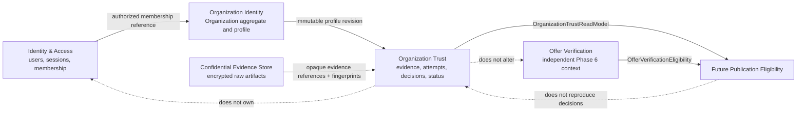

Organization Identity and Organization Trust may initially be deployed in the
same application. They remain distinct modules, transactions, repositories,
aggregate ownership, and tests.

## 8. Domain Model

### 8.1 Organization aggregate

Aggregate root: `Organization`

Authoritative fields include:

- Organization ID;
- legal name;
- optional trading names;
- legal form;
- registration jurisdiction;
- registration identifiers;
- incorporation/registration date where applicable;
- registered address reference;
- parent Organization ID where applicable;
- organization-unit relationships;
- current Profile Revision;
- Organization Lifecycle;
- created/updated audit metadata.

Organization identity changes create a new Organization Profile Revision.
Historical identity facts are never overwritten without an audit record.

### 8.2 Organization Trust Profile aggregate

Aggregate root: `OrganizationTrustProfile`

It owns:

- Organization ID reference;
- current verification draft reference;
- current submitted revision reference;
- effective decision reference;
- trust invalidation/suspension facts;
- trust-status projection version;
- re-verification schedule;
- trust history references.

The aggregate does not store a mutable authoritative Boolean such as
`verified = true`.

### 8.3 Supporting entities and immutable records

| Model | Kind | Mutability |
|---|---|---|
| Organization | Aggregate root | Controlled lifecycle/profile pointer changes |
| Organization Profile Revision | Immutable entity | Insert-only |
| Organization Trust Profile | Aggregate root | Coordinates current references; history remains append-only |
| Verification Submission | Entity | Draft until submitted; submitted form immutable |
| Verification Revision | Immutable entity | Insert-only |
| Verification Attempt | Entity | Operational fields advance; completed form immutable |
| Organization Snapshot | Value record | Immutable |
| Trust Evidence identity | Entity | Metadata evolves only through explicit append-only events |
| Evidence Snapshot | Immutable record | Insert-only |
| Extracted Fact | Immutable observation | Insert-only; never silently corrected |
| Evidence Assessment | Immutable record | Insert-only |
| Organization Finding | Immutable record | Insert-only |
| Organization Trust Decision | Immutable record | Written once by engine completion |
| Organization Trust Event | Append-only record | Insert-only |
| Workflow Transition | Append-only record | Insert-only |
| Trust Status Change | Append-only derivation fact | Insert-only |

### 8.4 Derived read models

- current Organization Trust Status;
- current effective trust decision;
- trust validity/expiry;
- owner-safe verification progress;
- reviewer work projection;
- privacy-safe audit projection;
- Organization Trust Integration Contract.

Read models are rebuildable. They are not evidence or decision authority.

### 8.5 Legacy recovery adaptation

The approved recovery baseline proves:

- no authoritative Organization table exists;
- `users.company_name` is display data only;
- `users.verified` is not Organization Trust or KYB proof;
- the approved legacy user schema has no authoritative KYB lifecycle;
- `verification_documents` has no approved legacy records;
- per-offer seller-organization fields are absent from the approved legacy
  database;
- demo, seed, UI, and marketing claims are not evidence.

A future `LegacyOrganizationAdapter` may create recovery candidates only:

```text
legacy user ID
legacy company-name display value
legacy offer-owner links
source schema/version
recovery provenance
mapping confidence = unknown
```

Candidate rules:

- A matching company-name string does not prove that users belong to the same
  legal entity.
- One user's company name does not prove a legal Organization.
- `users.verified`, roles, ratings, or active offers do not become trust.
- Legacy KYB-looking columns, if present in another environment, remain
  unclassified until their authority and history are proven.
- A legacy document may become an `unassessed` Evidence artifact only after
  subject ownership, file integrity, access rights, and provenance are
  verified.
- No legacy status is backfilled as `verified`, `rejected`, or `trusted`.
- Existing offers are not rewritten with Organization IDs during architecture
  recovery.

Creating an authoritative Organization requires a separately approved
reconciliation workflow that establishes legal identity, authorized
membership, and provenance. The adapter preserves source references so every
future mapping is auditable and reversible without corrupting legacy rows.

## 9. Aggregate and Entity Ownership

### 9.1 Organization aggregate owns

- legal identity;
- profile revision identity;
- lifecycle;
- group/branch relationships;
- organization/member references.

### 9.2 Organization Trust Profile owns

- submission and revision coordination;
- attempts and current applicability;
- evidence associations;
- effective trust derivation;
- invalidation and re-verification facts.

### 9.3 Attempt owns

- exact snapshot/fingerprint;
- process state;
- recorded versions;
- findings;
- decision and confidence;
- attempt events.

### 9.4 Evidence aggregate owns

- evidence identity;
- subject;
- artifact reference;
- issuer and source metadata;
- content fingerprint;
- issue/expiry dates;
- supersession, withdrawal, and revocation events;
- assessments.

Evidence does not own trust decisions.

## 10. Organization Lifecycle

Proposed minimal states:

```text
registered
active
suspended
closed
```

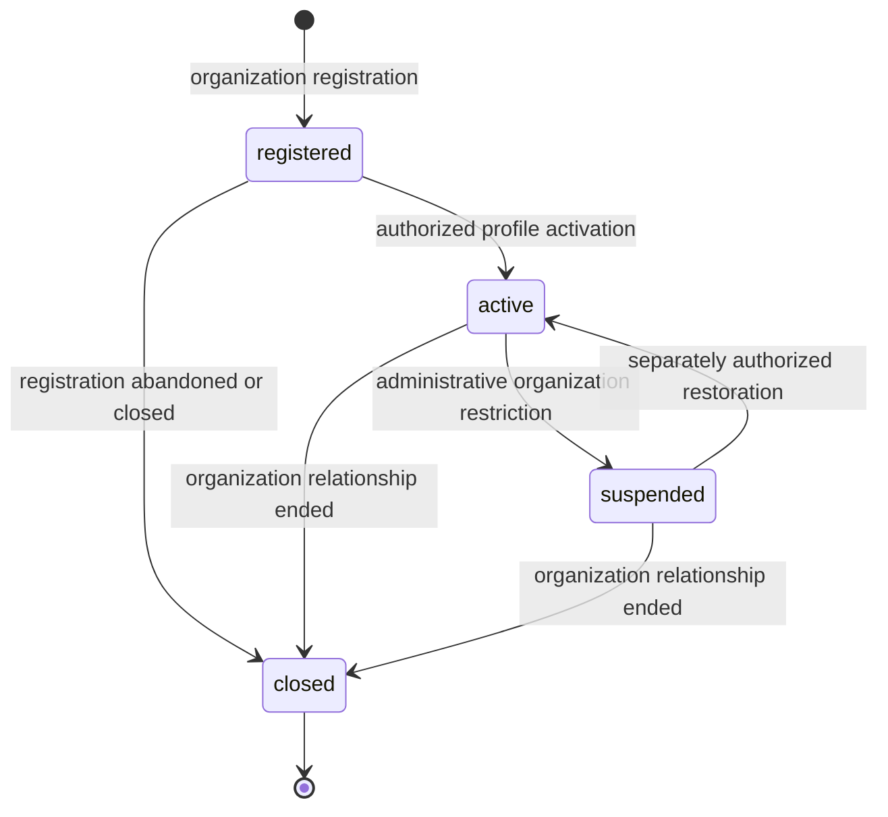

| Lifecycle | Meaning | Owner | Must not imply |
|---|---|---|---|
| `registered` | Organization identity exists but is not operationally activated | Organization Identity Coordinator | trust, pending verification, eligibility |
| `active` | Authorized members may maintain the Organization profile and use permitted platform features | Organization Identity Coordinator | trusted or published |
| `suspended` | Organization-level platform access is administratively restricted | Separate administrative authority through coordinator | rejected trust decision or sanctions result |
| `closed` | Organization relationship is terminally closed | Organization Identity Coordinator | deletion of trust history |

Verification process conditions are not lifecycle states. No Offer Lifecycle
state is reused.

## 11. Verification Process

### 11.1 Submission preparation

Draft preparation is a submission state, not an attempt process state:

```text
draft → submitted → superseded
```

Draft data may be edited by authorized Organization members. Successful
submission atomically:

1. validates Organization membership and submission authority;
2. freezes the current Organization Profile Revision;
3. freezes the selected evidence set;
4. creates the next Organization Verification Revision;
5. creates an immutable Organization Snapshot;
6. creates one queued Verification Attempt;
7. creates one durable platform-owned command;
8. commits all records together.

### 11.2 Attempt process

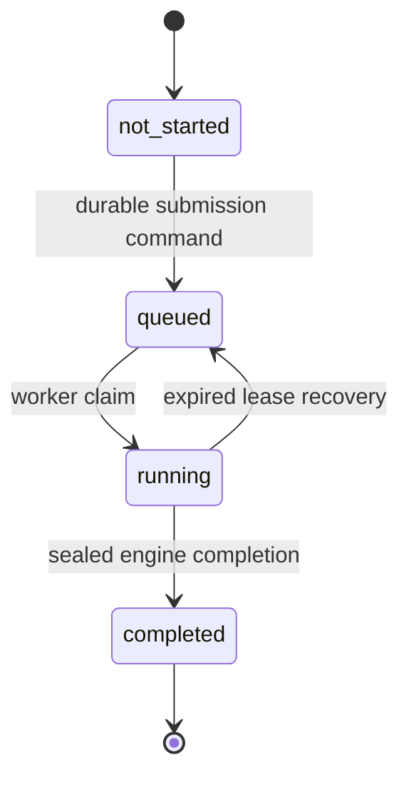

Process state does not communicate verification success or failure.

### 11.3 Revision and attempt rules

- Owner changes to submitted profile or evidence create:
  - a new Verification Revision;
  - a new Organization Snapshot;
  - a new Verification Attempt.
- Resubmission therefore creates all three.
- Transport retry reuses the same Attempt and Snapshot.
- Lease recovery reuses the same Attempt and Snapshot.
- A reviewer assessment that changes no owner-submitted data creates a new
  attempt sequence for the same Revision, referencing the immutable review
  assessment.
- Time-triggered expiry re-evaluation may create a new attempt sequence for the
  same Revision with a new evaluation timestamp.
- Historical revisions and attempts are never rewritten.

### 11.4 Stale-result prevention

A result is applicable only when:

- Organization ID matches;
- Verification Revision matches the Trust Profile's current submitted revision;
- attempt sequence is current;
- snapshot fingerprint matches;
- evidence snapshot set matches;
- Organization Profile Revision matches;
- recorded versions match;
- the claim remains valid.

A stale completion cannot create trust or change current status.

## 12. Decision Model

### 12.1 Allowed decisions

```text
verified
revision_required
manual_review
rejected
```

No route, repository, worker, coordinator, reviewer, external provider, or
administrator may create these values as a decision.

### 12.2 Decision definitions

| Decision | Exact meaning | Required disposition pattern | Confidence | Coordinator implication |
|---|---|---|---|---|
| `verified` | The exact Organization Snapshot satisfies every required policy under recorded versions | No blocking findings | Governed deterministic confidence, initially `HIGH` | Record effective verified reference and validity; derive `trusted` if no other invalidation |
| `revision_required` | Owner-correctable submitted data or evidence prevents trust | At least one `owner_correctable`; no rejection or platform-review precedence | Initially `HIGH` | Return submission preparation to draft; preserve history |
| `manual_review` | Deterministic authority cannot safely decide | At least one `requires_platform_review` or integrity/system finding | Initially `LOW` | Keep current submission private and non-trusted; create no reviewer decision |
| `rejected` | Authoritative findings establish that this submission cannot establish trust under recorded policy | At least one `rejects_current_submission` finding | Initially `HIGH` for deterministic rejection; otherwise manual review | Mark this submission terminally rejected; no permanent organization ban |

### 12.3 Decision assurance requirements

#### `verified`

- Producing authority: Decision Engine only.
- Required inputs: intact current Snapshot, complete required evidence
  assessments, exact resolvable versions, and no blocking finding.
- Allowed findings: informational/non-blocking findings explicitly permitted
  by recorded Decision Policy.
- Confidence: deterministic recorded model; initially `HIGH`.
- Organization Lifecycle: unchanged.
- Trust Status: may derive `trusted` only while validity and applicability hold.
- Resubmission: required after material invalidation or expiry policy.
- Reversibility: decision never reverses; later facts supersede applicability.
- Audit: record every version, finding set, validity window, fingerprint, and
  sealed completion identity.

#### `revision_required`

- Producing authority: Decision Engine only.
- Required inputs: one or more owner-correctable findings and no higher
  precedence disposition.
- Allowed findings: owner-correctable plus non-blocking findings.
- Confidence: initially `HIGH` because the correction need is deterministic.
- Organization Lifecycle: unchanged.
- Trust Status: no new trust; an independently still-effective earlier trust
  remains only when the submitted change was not invalidating.
- Resubmission: owner change creates a new Revision, Snapshot, and Attempt.
- Reversibility: immutable historical decision; new decision may supersede.
- Audit: preserve requested correction Reason Codes without exposing raw
  evidence or reviewer prose.

#### `manual_review`

- Producing authority: Decision Engine only.
- Required inputs: insufficient deterministic authority, conflict, unsupported
  context, integrity problem, or qualifying reviewer-needed finding.
- Allowed findings: at least one `requires_platform_review`.
- Confidence: initially `LOW`.
- Organization Lifecycle: unchanged.
- Trust Status: no new trust. A material integrity/invalidation condition
  terminates earlier effectiveness.
- Resubmission: structured review input permits a new Attempt; changed owner
  input requires a new Revision.
- Reversibility: immutable; reviewer cannot edit it.
- Audit: record review-case reference, but reviewer identity/evidence stays in
  its protected history rather than the decision finding.

#### `rejected`

- Producing authority: Decision Engine only.
- Required inputs: authoritative deterministic finding with
  `rejects_current_submission` under the exact Decision Policy.
- Allowed findings: at least one rejection disposition; integrity ambiguity
  takes precedence as manual review.
- Confidence: `HIGH` only for deterministic, reproducible rejection.
- Organization Lifecycle: unchanged; rejection is not account suspension or
  closure.
- Trust Status: derives `not_trusted` while this remains the current applicable
  conclusion.
- Resubmission: requires materially changed facts/evidence and any governed
  waiting or appeal requirements.
- Reversibility: not permanent; immutable for this submission.
- Audit: record exact rejection policy/version and safe Reason Codes. Never
  record a sanctions, AML, or permanent-ban interpretation.

### 12.4 Deterministic reduction

Proposed precedence:

1. Any system-integrity or insufficient-authority finding produces
   `manual_review`.
2. Otherwise, any `rejects_current_submission` finding produces `rejected`.
3. Otherwise, any `owner_correctable` finding produces `revision_required`.
4. Otherwise, the decision is `verified`.

Severity does not participate in reduction.

### 12.5 Reversibility and resubmission

- A decision is immutable and never reversed.
- Its effective applicability may be superseded by a later Revision/Attempt.
- `revision_required` permits a corrected new Revision.
- `manual_review` permits a new Attempt only after structured review input or
  other authorized new evidence exists.
- `rejected` applies to the evaluated submission and policy versions.
- A future submission after rejection requires a material change, new evidence,
  or a separately governed waiting/appeal rule.
- Permanent platform exclusion is a separate authority and is not defined
  here.

### 12.6 Decision flow

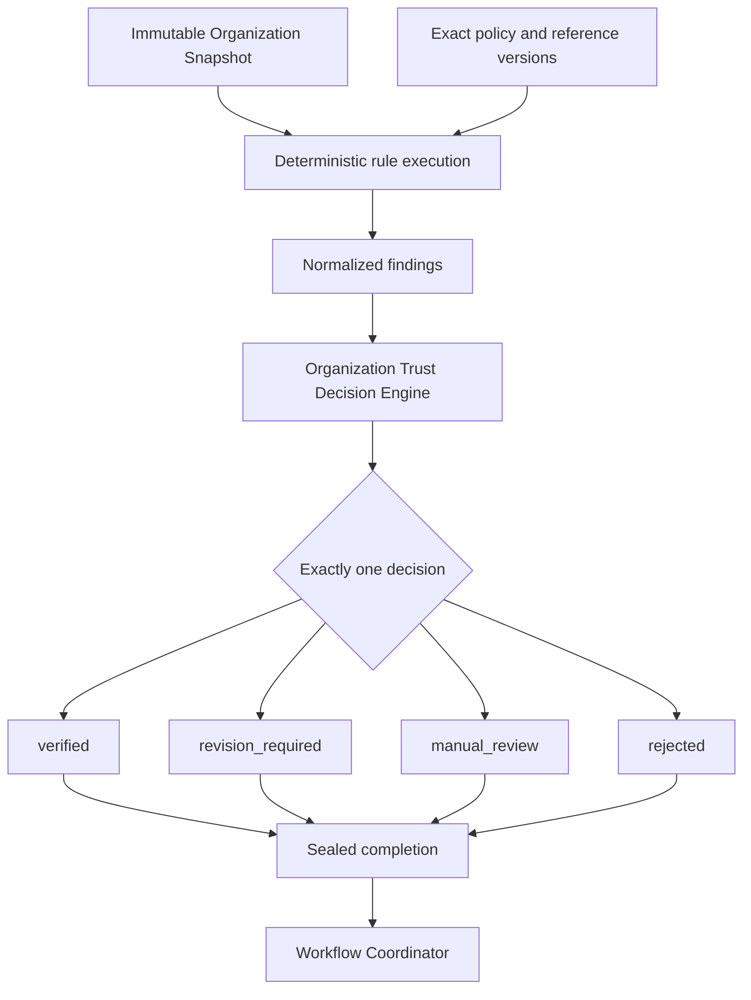

## 13. Trust Status Model

### 13.1 Architectural decision

Organization Trust Status is a **derived projection**, not a durable source of
truth.

Authoritative inputs are:

- immutable decisions;
- current applicable Revision and Attempt;
- decision validity window;
- evidence expiry/revocation/withdrawal events;
- material Organization Profile Revision changes;
- explicit trust invalidation events;
- explicit administrative trust-suspension facts.

A materialized status may be stored for efficient reads, but it must contain
source references and be rebuildable.

### 13.2 Proposed status values

```text
unestablished
trusted
not_trusted
expired
invalidated
suspended
```

| Status | Derivation |
|---|---|
| `unestablished` | No current valid verified or rejected trust conclusion applies |
| `trusted` | Current applicable `verified` decision is within validity and has no invalidation or suspension |
| `not_trusted` | Current applicable `rejected` decision applies |
| `expired` | A formerly effective verified decision or required evidence has expired |
| `invalidated` | Material profile/evidence change, withdrawal, revocation, or governed invalidation superseded prior trust |
| `suspended` | A separate authorized administrative trust suspension is active |

Queued/running, `revision_required`, and `manual_review` are not Trust Status
values. Without an independently still-effective earlier verified decision,
they derive to `unestablished`.

### 13.3 Status derivation

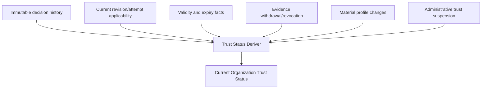

### 13.4 Invalidation scenarios

- **Document or license expiry:** derive `expired` at the governed instant and
  enqueue re-verification. No history rewrite.
- **Material profile change:** append invalidation, derive `invalidated`, and
  require new Revision.
- **Ownership change:** always material; invalidate current trust and require
  new Revision.
- **Evidence withdrawal or revocation:** invalidate any effective decision that
  depended on it.
- **Policy change:** never retroactively rewrites a decision. A separately
  governed policy-activation rule may schedule re-verification.
- **Routine re-verification:** an existing verified decision may remain
  effective until its expiry unless the trigger is an invalidating event.
- **Administrative suspension:** derive `suspended` without changing the
  historical engine decision.
- **Later decision:** supersedes current applicability by immutable reference;
  it does not mutate the earlier decision.

## 14. Policy Architecture

### 14.1 Proposed policy families

| Policy family | Responsibility |
|---|---|
| Organization Identity Policy | Required identity fields and identity consistency |
| Legal Registration Policy | Registration identifiers, legal existence evidence, and validity |
| Corporate Documentation Policy | Required corporate documents by organization type/context |
| Ownership Disclosure Policy | Required ownership/declaration completeness; not individual KYC |
| Business Activity Policy | Supported declared business-activity integrity |
| Jurisdiction Support Policy | Whether Tutela has governed support for the submitted jurisdiction; not sanctions |
| Evidence Sufficiency Policy | Required evidence set and coverage |
| Evidence Validity Policy | issue, expiry, issuer, source, fingerprint, revocation, and reuse rules |
| Manual Review Input Policy | Which structured reviewer assessments are authoritative inputs |
| Decision Policy | Finding-disposition precedence and confidence mapping |

Final family names and detailed business rules require separate approval.

### 14.2 Family independence

Every family has:

- an independent interface;
- immutable version identifier;
- governed static registry;
- exact recorded-version resolution;
- stable Rule IDs;
- owned Reason Code metadata;
- no silent fallback;
- no access to another family's private configuration.

### 14.3 Neutral providers

Shared canonical reference providers may expose:

- jurisdiction identifiers;
- organization legal-form catalogs;
- evidence-type definitions;
- issuer registries;
- date/time rules;
- identifier format catalogs;
- language/country metadata;
- public registration-authority identifiers.

Every reference dataset used in a decision is versioned and recorded.

### 14.4 Policy-family architecture

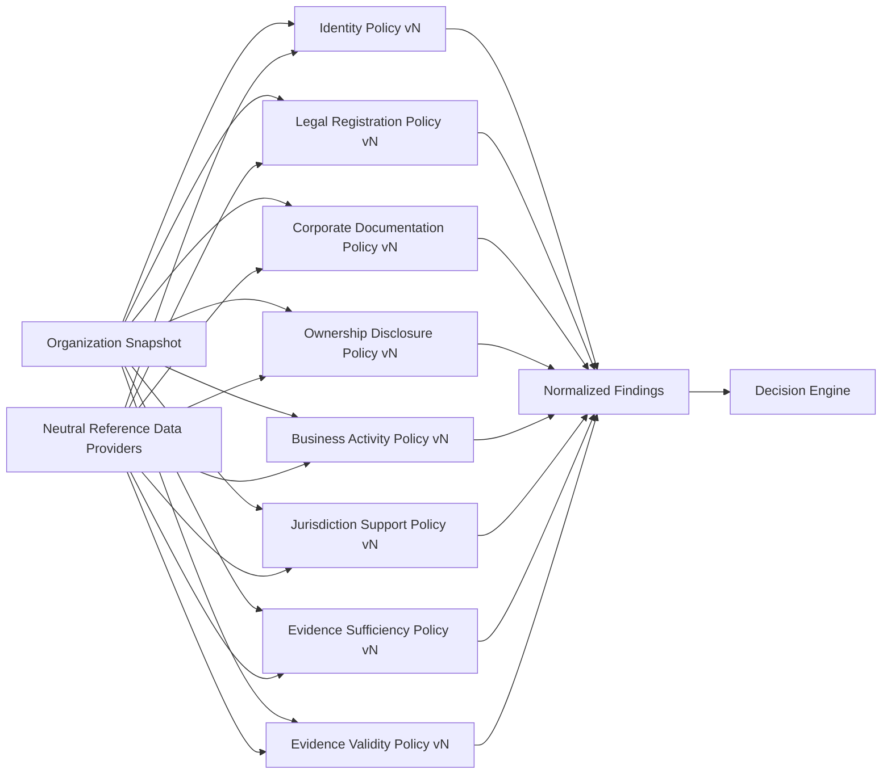

### 14.5 Separation of concerns

- Validation rules evaluate assertions.
- Policy configuration defines governed requirements.
- Reference data supplies neutral canonical facts.
- External evidence supplies versioned assertions or artifacts.
- Decision logic reduces normalized dispositions.
- None substitutes for another.

### 14.6 Rule and Reason Code ownership

Organization Trust owns its identifiers. They are never shared with Offer
Verification.

Proposed Rule ID namespaces:

```text
ORG-IDENTITY-NNN
ORG-LEGAL-NNN
ORG-DOCUMENT-NNN
ORG-OWNERSHIP-NNN
ORG-ACTIVITY-NNN
ORG-JURISDICTION-NNN
ORG-EVIDENCE-NNN
ORG-SYSTEM-NNN
```

Reason Codes use stable capability-owned machine identifiers, for example:

```text
ORGANIZATION_IDENTITY_INCOMPLETE
LEGAL_REGISTRATION_UNRESOLVED
REQUIRED_EVIDENCE_MISSING
EVIDENCE_EXPIRED
EVIDENCE_CONFLICT
SNAPSHOT_INTEGRITY_FAILURE
POLICY_VERSION_UNAVAILABLE
```

These examples establish naming boundaries only; they do not authorize a
final catalog or business disposition. Every future catalog entry must declare
severity, disposition, policy family, introduction version, and safe
localization key. Retired identifiers are never reused.

## 15. Trust Evidence Architecture

### 15.1 Generic evidence model

`TrustEvidence` includes:

- evidence ID;
- stable Evidence Type ID;
- Organization subject ID;
- optional related person/organization/unit subject reference;
- issuer identity and issuer type;
- jurisdiction;
- issue date;
- expiry date or explicit no-expiry assertion;
- validity period;
- evidence source;
- acquisition method;
- verification method;
- opaque file/artifact reference;
- content fingerprint;
- structured extracted-data reference;
- status events;
- supersedes/superseded-by references;
- revocation/withdrawal facts;
- retention classification;
- created actor/time.

It does not include a trust decision.

### 15.2 Separate evidence concepts

| Concept | Meaning | Authority |
|---|---|---|
| Uploaded Document | Raw confidential artifact supplied by an actor | Evidence only |
| Extracted Data | Observed structured values derived from an artifact | Non-authoritative until assessed |
| Verified Fact | Structured fact supported under a governed assessment | Input to rules, not decision |
| External Assertion | Versioned claim by an external source | Evidence with source authority limits |
| Reviewer Note | Confidential human context | Never a finding or decision by itself |
| Evidence Assessment | Structured conclusion about an evidence item | Engine input under policy |
| Trust Decision | Capability conclusion | Decision Engine only |

### 15.3 Evidence status

Evidence operational status is independent from trust:

```text
received
active
superseded
expired
withdrawn
revoked
```

Assessment outcomes are separate:

```text
supported
not_supported
indeterminate
unassessed
```

Neither status set directly produces a Trust Decision.

### 15.4 Evidence flow

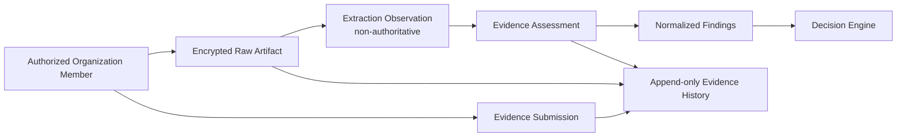

No OCR, extraction, provider, or upload implementation is authorized.

### 15.5 Evidence reuse

Evidence may be reused only when:

- Organization subject identity is exact;
- content fingerprint is exact;
- issuer and source remain acceptable;
- evidence remains active and unexpired;
- the target policy version permits reuse;
- a new Evidence Snapshot records the reused reference.

Reuse never moves a prior decision to a new revision.

### 15.6 Evidence supersession and revocation

- New evidence appends a supersession relationship.
- Old evidence remains in history.
- Withdrawal is an actor event, not deletion.
- Revocation is a source/authority event with provenance.
- Effective decisions dependent on withdrawn/revoked evidence are invalidated
  through the status deriver and re-verification coordinator.

## 16. Manual Review Boundary

Manual Review is a separate future service. It is not a second Decision Engine.

### 16.1 Reviewer input

A reviewer may receive:

- Organization identity summary;
- exact Verification Revision and Snapshot fingerprint;
- allowlisted submitted fields;
- evidence artifacts for which the reviewer has permission;
- extracted observations;
- engine findings and safe policy explanations;
- historical attempt references;
- conflict indicators.

A reviewer may not receive unrelated accounts, credentials, sessions, offers,
payment data, or another Organization's evidence.

### 16.2 Reviewer output

A reviewer submits an immutable `ManualReviewAssessment` containing:

- assessment ID;
- attempt/revision/snapshot reference;
- reviewer identity and authority;
- evidence item references;
- structured evidence-assessment outcomes;
- cataloged recommendation codes;
- optional confidential rationale;
- timestamp and correlation ID.

The reviewer cannot submit:

- Organization Trust Decision;
- Trust Status;
- Organization Lifecycle target;
- confidence;
- publication or participation authority.

### 16.3 Return through the engine

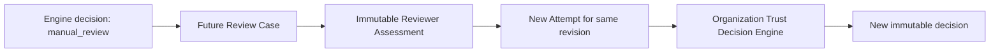

Conflicting reviewer assessments create a cataloged conflict finding and
remain `manual_review` unless an approved policy defines required corroboration.
There is no ad hoc majority rule or administrator override.

## 17. Workflow Coordinator Responsibilities

The Organization Trust Workflow Coordinator may:

- validate permitted submission transitions;
- create durable evaluation commands through a trigger port;
- consume only persisted sealed decisions;
- lock the current Organization Trust Profile and Revision;
- reject stale decisions;
- apply decision-to-workflow mappings;
- return `revision_required` submissions to draft preparation;
- preserve `manual_review` as non-trusted and private;
- mark a rejected submission terminal;
- record effective verified-decision references and validity;
- append workflow transitions and status-derivation facts;
- coordinate new revisions, re-evaluation, expiry, and recovery.

It must not:

- evaluate rules or policies;
- create or change findings;
- create, reinterpret, replace, or mutate decisions;
- assign confidence;
- alter snapshots;
- read Offer Verification internals;
- alter Offer Lifecycle;
- publish an offer;
- grant action-specific participation.

Decision mapping is explicit:

| Decision | Coordinator effect |
|---|---|
| `verified` | Record current effective decision/validity; status may derive `trusted` |
| `revision_required` | Reopen a new draft derived from the submitted revision |
| `manual_review` | Preserve submitted revision and create no trust |
| `rejected` | Mark this submission terminal; status derives `not_trusted` if current |

## 18. Decision Engine Responsibilities

The Organization Trust Decision Engine:

- consumes immutable normalized findings;
- validates finding catalog/version integrity;
- applies the deterministic reduction algorithm;
- produces exactly one allowed decision;
- derives confidence only through the recorded Confidence Model;
- issues an opaque completion bound to Attempt ID and Snapshot fingerprint;
- fails closed on unknown or inconsistent authority;
- performs no I/O or lifecycle mutation.

### 18.1 Fail-closed mapping

| Condition | Required engine behavior |
|---|---|
| Missing policy version | `manual_review` with policy-configuration finding |
| Unknown evidence type | `manual_review` unless recorded policy explicitly classifies it owner-correctable |
| Corrupted snapshot/fingerprint | `manual_review` with integrity finding |
| Conflicting authoritative facts | `manual_review` with evidence-conflict finding |
| Incomplete correctable data | `revision_required` |
| Expired required evidence | `revision_required` if replaceable; otherwise policy-governed rejection |
| Unsupported jurisdiction | `manual_review` unless an explicit recorded support policy deterministically rejects the current submission |
| System integrity failure | `manual_review` |
| Execution or current-state conflict | `manual_review` or no completion until engine evaluates the cataloged conflict |
| Definitively invalid current submission | `rejected` only through an approved rejection disposition |

Raw errors, reviewer prose, document contents, and personal data never become
Reason Codes.

## 19. Snapshot Strategy

### 19.1 Snapshot contents

An Organization Snapshot includes only authoritative inputs required to
reproduce the decision:

- Organization ID;
- Organization Profile Revision;
- legal identity fields;
- organization type and jurisdiction context;
- declared business activities;
- ownership disclosure facts required by policy;
- Evidence Snapshot IDs and fingerprints;
- normalized assessed facts;
- issuer/source references;
- evidence issue/expiry/revocation state as of capture;
- Verification Revision and attempt sequence;
- snapshot schema version;
- engine/ruleset version;
- each policy-family version;
- each reference-data version;
- evidence-assessment model version;
- confidence-model version;
- canonical evaluation timestamp.

Raw file bytes and reviewer prose are referenced, not embedded.

### 19.2 Canonicalization and integrity

- Allowlisted fields only.
- Explicit stable property order.
- Stable array sorting by identity, never input order.
- Explicit null representation.
- Canonical timestamps and identifier casing.
- Decimal/string rules where applicable.
- UTF-8 canonical serialization.
- SHA-256 fingerprint of canonical bytes.
- runtime deep immutability;
- database guards for immutable fields and completed history;
- fingerprint revalidation before evaluation and completion.

### 19.3 Snapshot and history

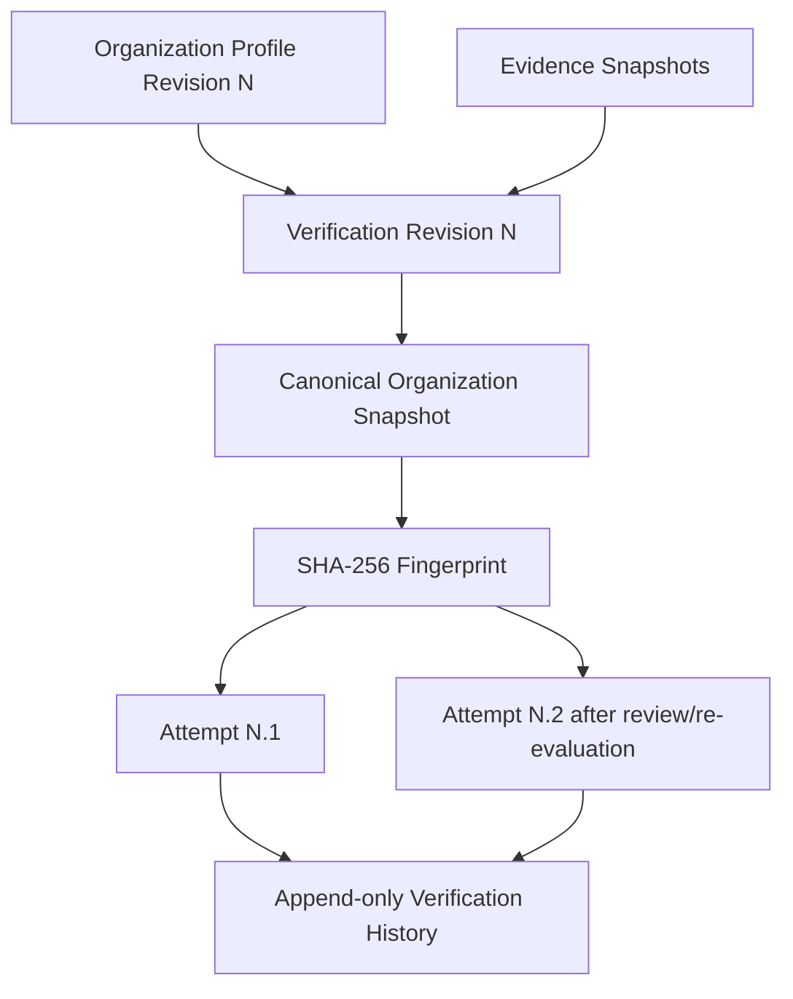

### 19.4 Replay and supersession

Historical replay resolves exact recorded serializers, policies, rules,
reference data, and clock. A new Revision supersedes applicability but never
deletes the old Snapshot. If a historical dependency cannot be resolved,
replay reports unavailable; it never substitutes a newer version.

## 20. History and Audit Strategy

Append-only history covers:

- Organization registration and lifecycle transitions;
- Profile Revisions;
- Verification Submissions and Revisions;
- Snapshot creation and fingerprint;
- commands, claims, expiry, recovery, and completion;
- attempts;
- findings and decisions;
- evidence submissions and snapshots;
- extraction observations;
- evidence assessments;
- manual-review assessments;
- evidence supersession/withdrawal/revocation;
- workflow transitions;
- Trust Status derivation changes;
- administrative suspension/restoration;
- recovery operations.

### 20.1 Historical fact versus current state

| Concept | Nature |
|---|---|
| Completed decision | Immutable historical fact |
| Evidence assessment | Immutable historical fact |
| Current effective decision | Derived reference |
| Trust Status | Derived current-effective projection |
| Reviewer queue | Administrative projection |
| Owner progress | Derived read model |
| Integration contract | Narrow authoritative projection with source references |

No `is_latest` Boolean is authoritative. Applicability derives from exact
Organization ID, Revision, attempt sequence, fingerprint, validity, and
supersession/invalidation events.

## 21. Recovery Strategy

| Failure | Recovery behavior |
|---|---|
| Interrupted evaluation | Lease expires; same logical attempt returns to queued |
| Abandoned claim | Clear operational claim fields, append recovery event, reuse snapshot |
| Duplicate submission | Idempotency key returns existing Revision/Attempt |
| Concurrent evaluation | One valid claim/completion; duplicates cannot write a second decision |
| Stale completion | No lifecycle/status effect; append stale transition fact |
| Missing policy version | Decision Engine produces fail-closed manual review |
| Corrupted snapshot | Engine-owned integrity finding and manual review |
| Missing evidence | Revision required if owner-correctable; otherwise manual review |
| External provider unavailable | Existing verified fact may be used only if policy permits and remains valid; otherwise manual review |
| Unsupported format | Revision required if replacement is possible; otherwise manual review |
| Partial extraction | Remains non-authoritative; manual review or revision under policy |
| Database conflict | Roll back atomically; retry without inventing trust |

Recovery never:

- approves by timeout;
- treats absence as verification;
- changes a completed decision;
- edits a Snapshot;
- elevates legacy rows;
- substitutes a newer policy;
- reuses another Organization's evidence.

## 22. Security and Authority Boundaries

### 22.1 Server authority

The server owns:

- Organization and Revision identity;
- membership/ownership authorization result;
- command and idempotency keys;
- Snapshot and fingerprint;
- policy/reference/ruleset versions;
- findings, decision, and confidence;
- workflow transition targets;
- effective-status derivation.

### 22.2 Actor boundaries

- **Organization member:** may edit a draft only within authorized membership
  and delegated scope.
- **Submitter:** requires explicit Organization submission authority.
- **Worker:** may claim a platform-created command; it cannot originate trust
  authority.
- **Reviewer:** may create structured assessments under separate privilege; it
  cannot decide.
- **Administrator:** may suspend access through a separate audited authority;
  it cannot replace the engine decision.
- **External provider:** may supply signed/versioned assertions only.

### 22.3 Evidence security

- Raw evidence is private by default.
- Artifact access is purpose-limited and time-limited.
- Evidence metadata and files use separate storage/access boundaries.
- Document paths, raw bytes, extracted personal data, and reviewer notes are
  excluded from public DTOs and general logs.
- Ownership disclosure is field-level restricted.
- Another Organization's existence or evidence is not disclosed.

### 22.4 Decision sealing and replay protection

- Engine completions are opaque and runtime-authenticated.
- Completion binds Attempt ID, Snapshot fingerprint, recorded versions, and
  normalized findings.
- Claim tokens are random, short-lived, and stored as hashes.
- Commands and submissions use globally unique idempotency keys.
- Repositories reject fabricated or stale completion objects.
- Audit identity records system actor, authenticated actor, correlation ID,
  and source command without storing secrets.

## 23. Data Retention and Privacy Boundaries

### 23.1 Retention categories

- Organization identity data;
- raw evidence artifacts;
- structured extracted observations;
- verified facts;
- ownership disclosures;
- reviewer notes;
- immutable decision/audit history;
- operational logs and metrics.

Each category requires a separate retention schedule.

### 23.2 Superseded and expired evidence

- Superseded/expired evidence is removed from current-effective projections.
- Historical references remain while a lawful retention basis applies.
- Raw artifacts may have a shorter or separately governed retention period
  than decision/audit metadata.
- Deleting raw bytes must preserve a tombstone, fingerprint, deletion reason,
  authority, and affected decision references where legally permitted.

### 23.3 Deletion requests and audit history

A deletion request does not directly erase immutable trust history.

Required future procedure:

1. authenticate request authority;
2. determine legal/contractual retention obligations;
3. minimize or erase data not subject to retention;
4. cryptographically or physically delete eligible raw artifacts;
5. preserve the minimum audit fact where required;
6. append the deletion/redaction event;
7. rebuild projections.

### 23.4 Legal review required

Future legal/compliance review must determine:

- jurisdiction-specific document retention;
- beneficial ownership privacy;
- reviewer-note discoverability;
- cross-border storage;
- deletion and legal-hold behavior;
- external provider data rights;
- acceptable audit minimization.

This specification makes no country-specific legal conclusion.

## 24. Trust Domain Integration Contracts

### 24.1 Organization Trust output

Proposed internal `OrganizationTrustReadModel`:

```text
organization_id
organization_identity_revision
trust_status
effective_decision_id | null
effective_verification_revision | null
effective_attempt_id | null
decision_timestamp | null
trust_valid_from | null
trust_valid_until | null
trust_expiry | null
status_reason_codes[]
status_as_of
projection_version
```

Optional public organization display identity is a separate disclosure
projection. It is not embedded automatically.

The contract excludes:

- raw evidence;
- document paths;
- ownership details;
- reviewer identity/notes;
- findings not approved for disclosure;
- policy internals;
- user objects;
- credentials or sessions.

### 24.2 Offer Verification integration

Offer Verification:

- does not import Organization Trust internals;
- does not execute its policies;
- does not read its evidence;
- does not change its status;
- does not copy its decision into an offer.

Organization Trust:

- does not execute Offer Verification rules;
- does not validate quantity, unit, price, currency, or offer terms;
- does not alter Offer Lifecycle;
- does not publish offers.

### 24.3 Future publication integration

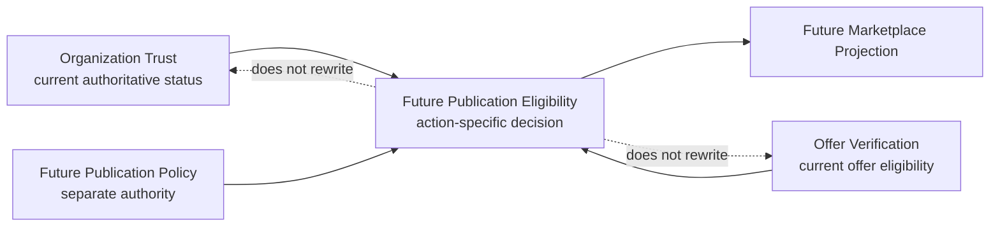

## 25. Relationship with Phase 6 Offer Verification

### 25.1 Safely shareable

- architectural conventions;
- immutable-value and canonicalization primitives;
- hashing utilities;
- append-only infrastructure patterns;
- generic severity vocabulary;
- generic disposition mechanics where semantics match;
- command/lease/idempotency patterns;
- sealed completion pattern;
- audit and testing conventions;
- recovery safety tooling.

Shared utilities must be stateless, capability-neutral, and versioned.

### 25.2 Must remain separate

- decisions;
- lifecycles and statuses;
- policies and providers;
- findings;
- Rule IDs and Reason Codes;
- snapshots and schema versions;
- attempts and commands;
- histories and events;
- workflow transitions;
- repositories;
- Decision Engines;
- integration read models.

A universal Verification Engine is rejected because it would centralize
decision ownership and create hidden policy/data coupling.

## 26. Participation Eligibility Boundary

Organization Trust answers:

> Is this Organization currently trusted?

A later action-specific capability answers:

> Does this trusted Organization satisfy every current condition for this
> specific platform action?

Therefore:

- `trusted` does not publish an offer;
- `trusted` does not enable negotiation;
- `trusted` does not approve an order or contract;
- `trusted` does not authorize payment;
- `trusted` does not guarantee transaction success;
- `trusted` is necessary only where a future action policy explicitly requires
  it.

## 27. Extensibility Strategy

### New evidence types

Add a stable Evidence Type, serializer, policy mapping, and rule metadata. Do
not alter historical snapshots.

### New jurisdictions

Add versioned neutral reference data and explicit policy versions. Never
silently reinterpret old jurisdiction decisions.

### New policy families

Add an independent family contract/version and snapshot reference. The
Decision Engine continues to consume normalized findings.

### External registries/providers

Adapters produce signed/versioned External Assertions or evidence assessments.
They never produce Trust Decisions.

### Re-verification and expiry

Append triggers/events, create a new Attempt or Revision according to whether
inputs changed, and preserve prior decisions.

### Group structures, branches, and subsidiaries

- Each legal entity receives a distinct Organization ID and Trust Profile.
- A subsidiary never inherits a parent's trust.
- A parent never inherits a subsidiary's trust.
- Group relationships are versioned identity edges, not trust edges.
- A non-legal branch is an Organization Unit under its legal Organization and
  cannot possess independent trust.
- A branch that is a separate legal entity is modeled as a separate
  Organization.

### Future Trust capabilities

They consume narrow Organization Trust outputs and implement their own engines,
policies, histories, and decisions.

## 28. Architectural Diagrams

The specification includes the required diagrams:

1. Trust Domain capability map — Section 3.
2. Organization Trust bounded-context diagram — Section 7.
3. Organization Lifecycle — Section 10.
4. Verification Process — Section 11.
5. Decision flow — Section 12.
6. Trust Status derivation — Section 13.
7. Evidence flow — Section 15.
8. Policy-family architecture — Section 14.
9. Snapshot and history — Section 19.
10. Organization Trust + Offer Verification → Publication Eligibility —
    Section 24.

### Complete execution sequence

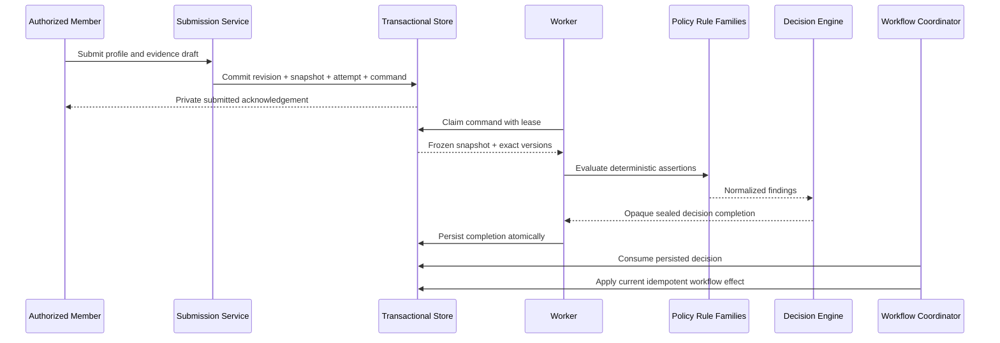

## 29. Risks and Trade-offs

| Risk/trade-off | Treatment |
|---|---|
| Rich evidence model increases initial complexity | Implement incrementally; preserve generic identity and immutable evidence core |
| Derived Trust Status requires reliable projection rebuilds | Store source references, deterministic derivation version, and append-only status events |
| Many independent policy versions increase registry burden | Require governed static registries and retirement without deletion |
| Manual review can become an override path | Reviewer outputs assessments only; all outcomes return through engine |
| Legacy user/company fields invite unsafe backfill | Recovery adapter marks them non-authoritative and creates no trust |
| Time-based expiry can change current status without a new decision | Expiry is an authoritative derivation fact recorded by a versioned status deriver |
| Rejection may be misread as permanent exclusion | Scope rejection explicitly to submission/policy; permanent exclusion stays separate |
| Evidence retention conflicts with deletion requests | Separate raw artifacts from minimal audit facts and require legal review |
| Parent/subsidiary relationships invite trust inheritance | Prohibit inheritance; every legal entity has independent trust |
| Shared Phase 6 utilities may create hidden framework coupling | Share only stateless primitives and infrastructure patterns |
| External provider output may be over-trusted | Treat as versioned evidence/assertion under policy, never as decision |
| Administrative suspension can be confused with engine rejection | Preserve separate event authority and derived status |

## 30. Open Questions

### 30.1 Resolved architectural questions

1. **Is Trust Status durable or derived?** Derived and rebuildable from
   immutable authority; an optional materialization is a cache.
2. **What becomes immutable at submission?** Profile Revision, selected
   evidence set/snapshots, canonical Organization Snapshot, fingerprint,
   recorded versions, Verification Revision, attempt identity, and durable
   command identity.
3. **What requires revision versus re-evaluation?** Owner/profile/evidence
   content changes create a new Revision/Snapshot/Attempt. Reviewer assessment,
   retry, or time-based re-evaluation without input change uses a new attempt
   sequence for the same Revision.
4. **How does expiry affect verified status?** An append-only expiry fact makes
   the status `expired` at the governed instant and schedules re-verification;
   the old decision remains immutable.
5. **Is rejection permanent?** No. It applies to one submission under recorded
   policies. Permanent exclusion is outside this capability.
6. **How is Manual Review prevented from becoming a second engine?** Reviewers
   submit structured assessments only; a new engine attempt produces the next
   decision.
7. **How are branches/subsidiaries represented?** Each legal entity is a
   separate Organization. Non-legal branches are units. Trust never inherits.
8. **Which data belongs to Organization versus Organization Trust?**
   Organization owns legal identity/profile/lifecycle; Trust owns evidence,
   verification, decisions, status derivation, and history.
9. **How are legacy records adapted?** Through non-authoritative candidate
   mappings; no legacy Boolean/status/document presence becomes trust.
10. **What does Publication Eligibility consume?** The narrow versioned
    OrganizationTrustReadModel plus independent Offer Verification and
    publication-policy outputs.
11. **What utilities may be shared with Phase 6?** Stateless immutable,
    canonicalization, fingerprint, append-only, lease, audit, and test
    primitives—not capability semantics or mutable state.
12. **How is the Trust Domain unified but decentralized?** Shared principles,
    vocabulary, and integration standards; independent operational ownership.

### 30.2 Business/policy questions requiring later approval

- Initial supported Organization legal forms and jurisdictions.
- Exact required evidence matrix by Organization type and jurisdiction.
- Initial trust validity duration and renewal window.
- Which findings are owner-correctable versus rejection-worthy.
- Whether deterministic rejection is enabled in the first implementation or
  initially routes to manual review.
- Reviewer quorum and conflict-resolution policy.
- Organization registration/activation authority.
- Evidence retention and deletion schedules.
- Public organization-name disclosure policy.
- Rules for appeals or resubmission after rejection.
- Administrative trust-suspension authority and restoration criteria.
- Whether existing verified trust remains effective during routine renewal.

These questions block detailed implementation rules but do not change the
ownership architecture.

## 31. Explicit Out-of-Scope Boundaries

Version 1 does not design or implement:

- marketplace or offer publication;
- negotiation;
- orders;
- contracts;
- payments;
- escrow;
- blockchain;
- sanctions;
- AML;
- individual KYC;
- transaction monitoring;
- compliance case management;
- risk scoring;
- notifications or email;
- AI decisions or AI document approval;
- OCR or extraction implementation;
- external provider integration;
- manual-review UI or workflow;
- administrative policy editing;
- future Trust capability engines.

It also authorizes no:

- code;
- migration;
- schema;
- database write;
- route or API;
- frontend;
- runtime change;
- production access.

## 32. Summary of Proposed Architecture

The Tutela Trust Domain is one conceptual family of independently owned trust
capabilities.

Organization Trust contains:

- a distinct Organization identity boundary;
- an Organization Trust Profile aggregate;
- immutable submissions, revisions, evidence snapshots, and Organization
  Snapshots;
- durable attempts with independent process state;
- independent versioned policy families;
- stable Rule IDs, Reason Codes, severity, and dispositions;
- one deterministic Decision Engine;
- one sealed evaluation/completion boundary;
- one Workflow Coordinator;
- append-only history;
- a derived current Trust Status;
- a narrow downstream integration read model.

The architecture makes these guarantees:

- only the Organization Trust Decision Engine decides;
- reviewers and administrators cannot decide;
- repositories cannot accept fabricated decisions;
- evidence never directly decides;
- trust never inherits between legal entities;
- legacy fields never become trust by inference;
- `verified` does not grant publication or transaction authority;
- Offer Verification remains independent;
- future Publication Eligibility composes outputs without reproducing them;
- failures cannot elevate trust;
- history remains auditable and replayable.

Version 1 stops at architecture. Implementation requires explicit approval
after architecture review and resolution of the identified business-policy
questions.
