# Phase 7A — Organization Verification Domain Architecture Specification

## Version 2

Date: 2026-07-28

Status: **Candidate for Formal Architecture Approval**

Authority: candidate authoritative architecture for the Tutela Organization
Verification capability

Scope: domain architecture and documentation only

Implementation status: not authorized

## 1. Document Status and Authority

This document supersedes Version 1 as the candidate architecture presented for
formal approval. It does not modify, delete, or retroactively approve Version
1.

Version 2 incorporates every required revision from:

`docs/recovery/phase-7a/phase-7a-architecture-review.md`

The architecture becomes authoritative for implementation only after explicit
formal approval. Until then, it authorizes no code, schema, migration, API,
route, frontend, database, or runtime change.

The authoritative naming decisions in this candidate are:

- **Organization Verification** is the capability and bounded-context name.
- **Organization Trust Status** is a current-effective derived output.
- **Organization Registry** is the independent authority for Organization
  identity, profile revisions, relationships, and lifecycle.
- **Tutela Trust Domain** is a non-operational governance framework, not a
  runtime domain owner.

The former Version 1 capability label `Organization Trust` is retired. The
phrase may appear only when discussing the general business concept of
organizational trust or recording the retired term; it is not an ownership
label.

## 2. Executive Summary

Organization Verification answers one precise question:

> Does this immutable Organization Verification Revision satisfy the approved
> organization-verification policies under the exact recorded versions?

The answer is an immutable **Organization Verification Decision** produced
only by the **Organization Verification Decision Engine**. The decision is
specific to one Organization Verification Revision, its frozen evidence and
profile inputs, and the exact policy and reference-data versions evaluated.

The decision set is:

```text
approved
revision_required
manual_review
rejected
```

Decision, process state, Organization Lifecycle, Trust Status, and future
Participation Eligibility are independent state dimensions.

Organization Trust Status is a rebuildable current-effective projection with
the initial vocabulary:

```text
unestablished
trusted
not_trusted
expired
invalidated
```

Immutable decisions and append-only applicability, expiry, revocation,
withdrawal, material-change, and invalidation facts are authoritative. A
stored status is only a versioned cache with source references.

Organization Verification does not own Organization identity. It consumes an
immutable, versioned Organization Profile Revision published by Organization
Registry. It references raw confidential evidence through opaque artifact
references owned by Confidential Evidence Storage.

Offer Verification remains an independent Phase 6 capability. A future
Participation or Publication Eligibility capability may compose narrow
outputs from both verification capabilities with its own action-specific
policy. Neither verification capability grants permission to publish,
negotiate, transact, order, contract, pay, or settle.

The governing principle is:

> Unified trust philosophy, decentralized capability authority.

## 3. Architecture Review Resolution Summary

The accepted Domain Architecture Review required twelve revisions. Version 2
resolves all twelve:

1. renames the capability to Organization Verification;
2. separates Organization Registry as an upstream bounded context;
3. defines the Tutela Trust Domain as non-operational governance;
4. adopts precise terminal decision names and semantics;
5. reduces and isolates Organization Trust Status;
6. separates raw evidence artifact ownership from verification semantics;
7. includes reviewer-assessment identity in reproducible snapshots;
8. rationalizes initial policy families;
9. minimizes and versions the downstream status contract;
10. makes legacy adaptation an explicit Anti-Corruption Layer;
11. separates pre-attempt request validation from engine decisions; and
12. uses capability-specific Rule ID, Reason Code, event, and contract
    namespaces.

No required review item is deferred or rejected. Business-policy questions
that do not alter these ownership boundaries remain explicitly unresolved in
Section 38.

## 4. Tutela Trust Architecture Governance Framework

### 4.1 Classification

The **Tutela Trust Domain** is a non-operational architectural governance
framework. It is a taxonomy and standards authority only.

It may own:

- shared terminology;
- architecture principles;
- capability-governance rules;
- integration conventions;
- audit conventions;
- fail-closed standards;
- privacy expectations;
- interoperability standards;
- capability-isolation rules; and
- architecture compliance review criteria.

It must not own:

- runtime services or workers;
- mutable data, repositories, databases, or transactions;
- decisions or decision engines;
- business policies or policy versions;
- lifecycle states or workflow coordination;
- evidence, snapshots, findings, or history;
- a shared Trust Status;
- cross-capability overrides;
- a universal verification engine; or
- a shared mutable runtime kernel.

It is not a DDD bounded context, platform service, persistence layer, shared
kernel, common aggregate model, or universal verification framework.

### 4.2 Governance relationship

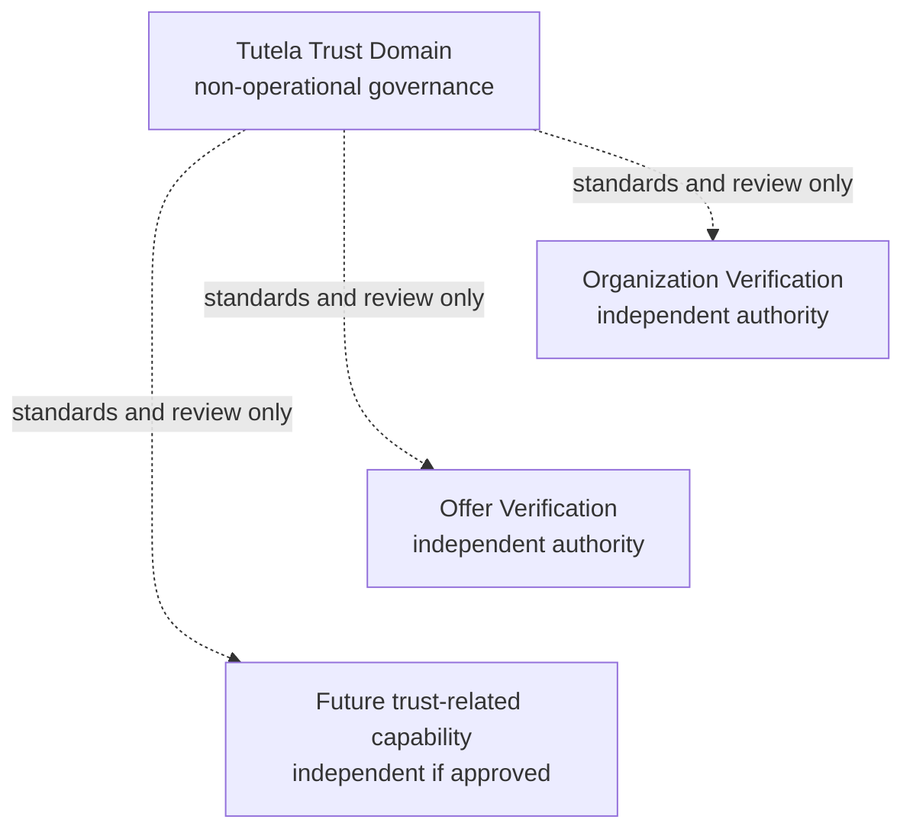

Governance may require compatible audit or integration conventions, but it
cannot call an engine, mutate a state, resolve a policy, or reinterpret a
capability decision.

## 5. Capability and Context Map

Version 2 recognizes these distinct bounded contexts or future contexts:

| Context | Authoritative purpose |
|---|---|
| Identity and Access | Authenticated users, sessions, roles, membership authority, and delegated access |
| Organization Registry | Organization identity, immutable profile revisions, legal-entity relationships, and Organization Lifecycle |
| Organization Verification | Submissions, frozen verification revisions, evidence semantics, attempts, findings, decisions, history, and Trust Status derivation |
| Confidential Evidence Storage | Raw encrypted artifact bytes, protected retrieval, storage lifecycle, and retention execution |
| Offer Verification | Independent Phase 6 offer-verification capability |
| Future Participation Eligibility | Action-specific permission decision composed from authoritative upstream outputs and its own policy |

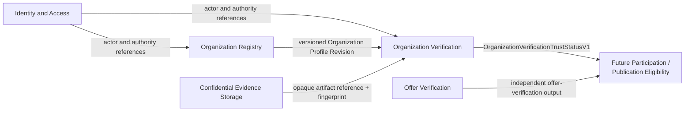

There is no shared mutable kernel between these contexts. Every arrow is a
versioned integration contract, not permission to read another context's
tables or import its domain internals.

## 6. Architectural Principles

1. **Single decision authority.** Only the Organization Verification Decision
   Engine creates Organization Verification Decisions.
2. **Coordinator owns workflow effects.** The Workflow Coordinator applies
   persisted sealed decisions to verification workflow state.
3. **Separate state dimensions.** Lifecycle, submission, process, decision,
   Trust Status, and eligibility are never merged.
4. **Registry identity authority.** Organization Registry alone owns
   Organization identity, profile revisions, relationships, and lifecycle.
5. **Immutable evaluation inputs.** Every attempt evaluates a reproducible
   frozen input set.
6. **Append-only authority.** Submissions, revisions, attempts, findings,
   decisions, assessments, transitions, and status facts are never rewritten.
7. **Fail closed.** Missing, unknown, stale, corrupt, or inconsistent
   authority cannot produce approval or trusted status.
8. **Deterministic policy resolution.** Exact recorded versions are required;
   silent fallback is prohibited.
9. **Evidence never decides.** Evidence becomes governed findings; only the
   engine reduces findings to a decision.
10. **No trust inheritance.** Legal entities are verified independently.
11. **Narrow integration.** Downstream contexts consume safe versioned
    projections, not raw evidence or internal models.
12. **Privacy by boundary.** Raw artifacts, reviewer rationale, and sensitive
    facts stay behind restricted contracts.
13. **Recovery first.** Legacy ambiguity remains unknown and cannot be
    promoted by inference.
14. **Capability isolation.** Shared reuse is limited to stateless technical
    primitives and infrastructure patterns.
15. **Server authority.** Clients may request operations but cannot assert
    decisions, confidence, status, authority, or eligibility.

## 7. Core Domain Vocabulary

| Term | Authoritative meaning |
|---|---|
| Tutela Trust Domain | Non-operational architecture-governance framework for independent trust-related capabilities |
| Trust Architecture Governance | Standards, terminology, isolation, audit, privacy, and integration rules without runtime ownership |
| Trust Capability | Independently owned capability with its own business question, model, decisions, policies, history, and contracts |
| Organization Registry | Bounded context authoritative for Organization identity, profile revisions, relationships, and lifecycle |
| Organization | Stable registry identity for one legal or commercial entity represented in Tutela |
| Legal Organization | Organization corresponding to one legally distinct entity |
| Organization Unit | Non-independent subdivision that belongs to one Legal Organization |
| Branch | Organization Unit unless it is itself a distinct legal entity, in which case it has its own Organization ID |
| Subsidiary | Legally distinct Organization related to a parent; never inherits verification or Trust Status |
| Parent Organization | Organization connected through a versioned legal-entity relationship; not a trust authority for a subsidiary |
| Organization Profile | Current editable registry representation of an Organization |
| Organization Profile Revision | Immutable, versioned registry snapshot of authoritative profile data |
| Organization Registration | Registry process that establishes an authoritative Organization identity |
| Organization Lifecycle | Registry-owned platform-relationship state independent from verification |
| Organization Verification | Capability that evaluates one immutable Organization Verification Revision |
| Organization Verification Draft | Editable preparation state before a frozen submission |
| Organization Verification Submission | Owner-authorized act that freezes a new Verification Revision |
| Organization Verification Revision | Immutable submitted profile-reference, evidence-association, and declared-input set |
| Organization Verification Process | Operational execution state of one Attempt, independent from its Decision |
| Organization Verification Attempt | One execution against one reproducible input identity |
| Organization Snapshot | Canonical immutable evaluation input assembled for an Attempt |
| Organization Verification Finding | Normalized deterministic output of one rule under a recorded version |
| Organization Verification Decision | Immutable terminal conclusion for one Attempt, created only by the Decision Engine |
| Organization Verification Decision Engine | Pure capability authority that reduces normalized findings to exactly one allowed Decision |
| Organization Verification Workflow Coordinator | Authority that applies persisted sealed Decisions to verification workflow transitions |
| Organization Evidence | Verification-owned semantic association and governed interpretation of referenced evidence |
| Evidence Artifact | Raw confidential file or provider payload owned by Confidential Evidence Storage |
| Evidence Reference | Opaque artifact identifier, fingerprint, source metadata, and access classification |
| Evidence Snapshot | Immutable capture of reference, integrity, validity, and assessment state used by an Attempt |
| Extracted Observation | Non-authoritative observation derived from an artifact or provider payload |
| Normalized Fact | Structured candidate fact normalized for comparison and policy evaluation |
| Verified Fact | Scope-limited fact accepted by an approved immutable Evidence Assessment; not universal truth and never a Decision |
| External Assertion | Versioned statement from an external source, evaluated as evidence rather than adopted as Tutela authority |
| Evidence Assessment | Immutable governed assessment of an evidence item, observation, fact, or assertion |
| Reviewer Assessment | Immutable structured manual input that may be evaluated by a later Attempt |
| Rule | Deterministic test owned by one policy family |
| Rule ID | Stable machine identifier namespaced to Organization Verification and never reused with changed meaning |
| Reason Code | Stable machine-readable explanation produced from governed findings or status derivation |
| Severity | Metadata for presentation, prioritization, and audit; never decision precedence |
| Disposition | Machine-readable decision-reduction category assigned by recorded policy |
| Policy | Versioned rules and configuration for one defined responsibility |
| Policy Family | Independently owned policy boundary that produces normalized findings |
| Policy Version | Immutable exact identifier resolving historical rules and approved configuration |
| Organization Trust Status | Current-effective derived projection from authoritative verification and validity history |
| Trust Status Deriver | Pure versioned reducer that reconstructs Trust Status from immutable sources |
| Trust Status History | Append-only derivation facts and projection transitions with source references |
| Verification History | Append-only record of revisions, snapshots, attempts, findings, decisions, and workflow transitions |
| Participation Eligibility | Future action-specific capability deciding whether an Organization may perform one action now |
| Publication Eligibility | Future action-specific eligibility decision for publication |
| Trust Integration Contract | Narrow versioned contract exposing safe current-effective status without verification internals |

`Verified Fact` is deliberately narrower than “truth.” It means that an
approved assessment accepted the fact for a recorded scope, evidence identity,
time, and policy version. It can expire, be superseded, conflict, or be
invalidated without rewriting history.

## 8. Identity and Access Boundary

Identity and Access owns:

- user identity and authentication;
- sessions and session invalidation;
- user roles;
- delegated access authority;
- membership authority references;
- authenticated actor identity; and
- authorization claims with issuance/version metadata.

It supplies Organization Registry and Organization Verification a narrow
Published Language for authenticated actor and authority references.

It does not own:

- Organization legal identity or profile;
- Organization Verification submissions or evidence;
- Decisions or Trust Status;
- Organization Lifecycle; or
- Participation Eligibility.

An actor reference proves only who is making a request and which recorded
authority is claimed. Each consuming context validates the required authority
for its own command. A role name alone never establishes Organization
membership, evidence validity, approval, or trust.

## 9. Organization Registry Bounded Context

### 9.1 Responsibility

Organization Registry is the authoritative bounded context for:

- creation and stability of Organization ID;
- legal identity;
- registered and trading names;
- organization type and jurisdiction;
- registration identifiers;
- editable Organization Profile;
- immutable Organization Profile Revisions;
- parent, subsidiary, branch, and Organization Unit relationships;
- Organization Lifecycle; and
- Organization-to-member references.

It does not own verification submissions, attempts, evidence assessments,
findings, Decisions, Trust Status, or action-specific eligibility.

### 9.2 Registry model

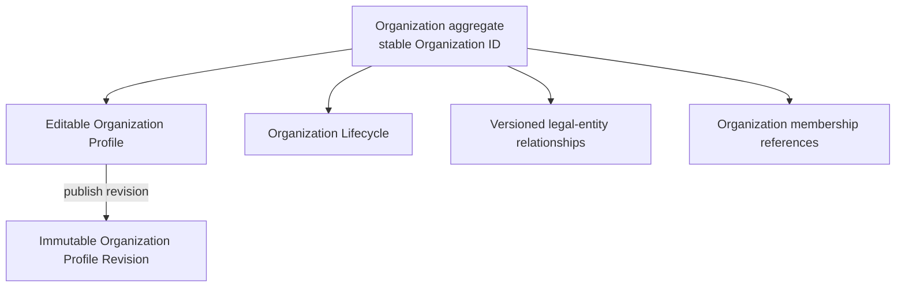

The Organization aggregate protects stable identity and registry invariants.
An immutable Organization Profile Revision is the only profile input that
Organization Verification may freeze into a Verification Revision.

Every legally distinct subsidiary has its own Organization ID. A non-legal
branch is an Organization Unit under its Legal Organization. Registry
relationships do not convey verification, Trust Status, or eligibility.

## 10. Organization Verification Bounded Context

Organization Verification owns:

- verification drafts;
- submitted immutable Verification Revisions;
- frozen Organization Snapshots;
- semantic evidence associations and Evidence Snapshots;
- Verification Attempts and process state;
- normalized findings;
- immutable Decisions;
- policy and reference-version references;
- verification workflow coordination;
- Verification History;
- status-derivation inputs;
- Trust Status History; and
- the current Organization Trust Status projection.

It does not own or duplicate Organization identity. Its subject is the stable
Organization ID published by Registry, and its evaluated profile is a specific
immutable Organization Profile Revision.

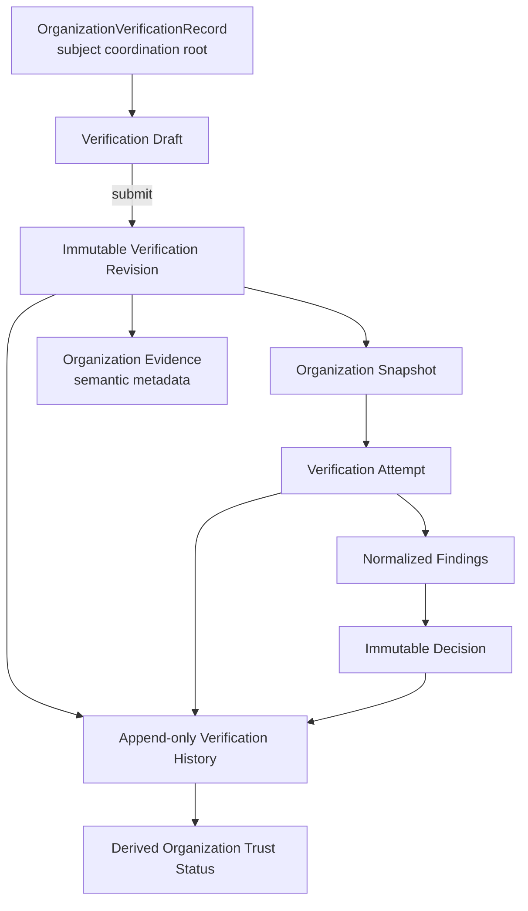

No route, worker, repository, reviewer, administrator, Registry component, or
downstream consumer may bypass the Decision Engine, Workflow Coordinator,
Snapshot, or History boundaries.

## 11. Context Map and Integration Relationships

| Upstream | Downstream | DDD relationship | Contract and protection |
|---|---|---|---|
| Identity and Access | Organization Registry | Customer/Supplier + Published Language | Versioned actor, membership-authority, and delegation references |
| Identity and Access | Organization Verification | Customer/Supplier + Published Language | Versioned actor and command-authority references |
| Organization Registry | Organization Verification | Customer/Supplier + Open Host Service + Published Language | Versioned Organization identity and immutable Profile Revision contract; verification-side Anti-Corruption Layer |
| Confidential Evidence Storage | Organization Verification | Customer/Supplier + Open Host Service | Opaque artifact reference, cryptographic fingerprint, media classification, and integrity/availability metadata |
| Organization Verification | Future Participation Eligibility | Supplier + Open Host Service + Published Language | `OrganizationVerificationTrustStatusV1` |
| Offer Verification | Future Participation Eligibility | Supplier + Open Host Service + Published Language | Independent Phase 6 verification output |

Organization Verification must not write Registry aggregates or read Registry
tables directly. Its Anti-Corruption Layer maps the Registry contract into a
frozen verification input without acquiring identity ownership.

Confidential Evidence Storage does not interpret evidence and Organization
Verification does not own raw bytes. Artifact retrieval is a separately
authorized operation; evaluation snapshots use opaque references and
fingerprints.

No Shared Kernel is used for domain vocabulary, decisions, policies, or
mutable state. Stateless technical primitives may be shared only as described
in Section 31.

## 12. Ownership Matrix

| Concept | Sole authority | Explicit non-owners |
|---|---|---|
| User authentication and session | Identity and Access | Registry, Verification |
| Actor/delegated authority | Identity and Access | Verification engine, evidence store |
| Organization ID and legal identity | Organization Registry | Organization Verification, legacy adapter |
| Editable Organization Profile | Organization Registry | Organization Verification |
| Organization Profile Revision | Organization Registry | Organization Verification |
| Organization relationships and units | Organization Registry | Verification and eligibility contexts |
| Organization Lifecycle | Organization Registry | Verification engine and coordinator |
| Verification Draft/Submission/Revision | Organization Verification | Registry, reviewers, eligibility |
| Organization Snapshot | Organization Verification | Registry and evidence store |
| Raw artifact bytes and storage lifecycle | Confidential Evidence Storage | Organization Verification |
| Evidence association and reference use | Organization Verification | Registry |
| Observations, facts, assertions, assessments | Organization Verification | Raw storage and eligibility |
| Reviewer Assessment | Organization Verification manual-input boundary | Reviewer as decision authority |
| Rule ID and Reason Code catalogs | Owning Organization Verification policy family | Offer Verification and governance framework |
| Policies and versions | Owning Organization Verification policy family | Governance framework, reviewers, providers |
| Findings | Owning Organization Verification rule execution | Reviewers, routes, repositories |
| Decision and governed confidence | Organization Verification Decision Engine | Every other actor/component |
| Attempt process transitions | Organization Verification execution boundary | Decision Engine as workflow owner |
| Verification workflow transitions | Organization Verification Workflow Coordinator | Decision Engine, routes, repositories |
| Verification/Trust Status history | Organization Verification append-only history | Projection writers as source of truth |
| Current Trust Status | Organization Verification Trust Status Deriver/projection | Registry, eligibility, administrators |
| Participation/Publication Eligibility | Future eligibility context | Registry and both verification capabilities |

## 13. Aggregate and Entity Model

### 13.1 Organization Registry aggregates

**Organization** is the Registry aggregate root. It protects stable identity,
relationship classification, profile-publication sequencing, and Lifecycle
invariants.

**Organization Profile Revision** is an immutable published record associated
with the Organization. Editing occurs in the current profile; publication
creates a new revision rather than changing an old one.

Legal-entity relationship edges are versioned Registry records. Whether they
belong inside the Organization aggregate transaction or a dedicated Registry
relationship aggregate is an implementation detail that must preserve single
Registry authority and avoid cross-aggregate trust inheritance.

### 13.2 Organization Verification aggregates

**OrganizationVerificationRecord** is the subject-level coordination root. It
owns:

- stable reference to one Organization ID;
- current draft/submitted revision references;
- monotonically increasing Verification Revision sequence;
- current applicable Attempt/Decision references;
- status projection identity and sequence; and
- concurrency invariants for submission and workflow effects.

It does not copy the editable Organization Profile or own Registry lifecycle.

**OrganizationVerificationSubmission** owns one draft-to-submitted boundary.
On submission it produces one immutable **OrganizationVerificationRevision**.
The revision binds:

- Organization ID;
- Organization Profile Revision ID and fingerprint;
- declared verification inputs;
- selected evidence associations;
- submission actor/authority reference;
- submission timestamp; and
- revision sequence.

**OrganizationEvidence** owns semantic metadata and immutable Evidence
Snapshots, not artifact bytes. It records provenance, fingerprints,
observations, normalized or Verified Facts, assertions, assessments,
validity/revocation state, and supersession references.

**OrganizationVerificationAttempt** owns one execution identity, process
state, lease/claim metadata, Snapshot identity, normalized findings, sealed
completion, and Decision reference. Completed Attempt authority is immutable.

These aggregates avoid a single giant history aggregate. Append-only history
records reference their authoritative roots and can be projected without
granting the projection mutation authority over them.

### 13.3 Invariants

- An Organization ID must resolve through the versioned Registry contract.
- A submitted Verification Revision is immutable.
- One revision sequence is unique per OrganizationVerificationRecord.
- An Attempt references exactly one reproducible Snapshot identity.
- Transport retry and lease recovery cannot create a second Attempt.
- Exactly one sealed Decision may complete an Attempt.
- Only the Decision Engine completion type can carry a Decision.
- A completed Attempt, Decision, finding set, or snapshot cannot be updated.
- A projection cannot become the source of truth.
- No Organization relationship causes trust inheritance.

## 14. Organization Lifecycle

Organization Lifecycle is owned exclusively by Organization Registry.

Initial architectural vocabulary:

```text
registered
active
suspended
closed
```

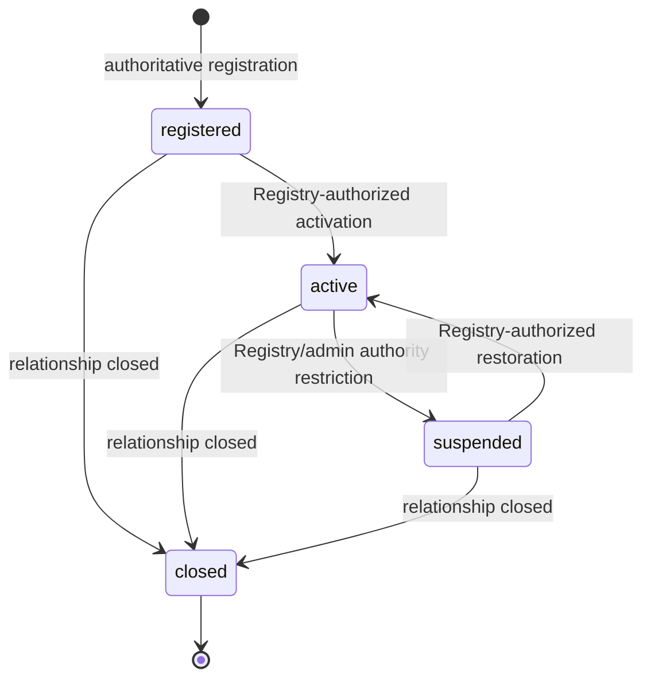

| State | Registry meaning | Does not mean |
|---|---|---|
| `registered` | An authoritative Organization identity exists | verification started, trusted, or eligible |
| `active` | Registry permits normal profile/membership operations | approved, trusted, or authorized for an action |
| `suspended` | Administrative platform relationship is restricted | rejected, invalidated, sanctioned, or AML-failed |
| `closed` | Platform relationship is terminally closed | verification history deleted or decision rewritten |

Organization Verification may consume Lifecycle only through the Registry
contract when a formally approved verification policy requires it. It cannot
transition Lifecycle. A future eligibility context may combine Lifecycle with
Trust Status; the Trust Status Deriver cannot silently fold suspension into
its own status.

## 15. Verification Submission Lifecycle

Submission preparation is independent from Attempt process:

```text
draft → submitted → superseded
```

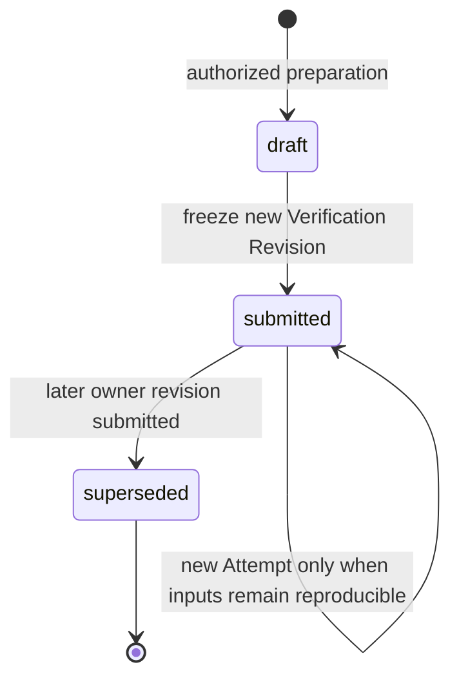

Submission performs one atomic domain operation:

1. validate actor and submission authority;
2. validate the Registry Organization/Profile Revision contract;
3. freeze declared owner inputs and evidence associations;
4. create the next immutable Verification Revision;
5. create the canonical Snapshot and fingerprint;
6. create one queued Attempt;
7. create one durable evaluation command; and
8. append submission/history facts.

Owner data, evidence-set, or Organization Profile changes require a new
Verification Revision. A new Registry Profile Revision is never substituted
inside an already submitted Verification Revision.

Pre-attempt request, authorization, or schema rejection is not an Organization
Verification Decision. It creates no Attempt and no Decision. Once an Attempt
exists, only the Decision Engine may terminate it with an allowed Decision.

## 16. Verification Process

Process describes execution only:

```text
not_started
queued
running
completed
```

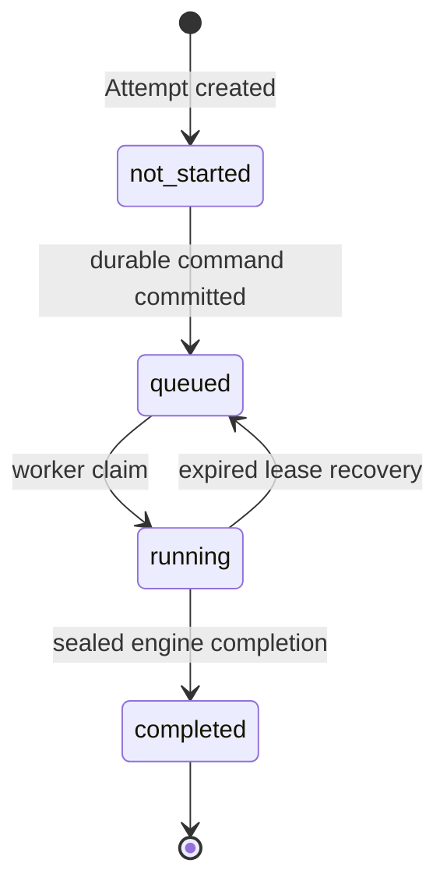

- Process state communicates neither approval nor failure.
- Transport retries reuse the same Attempt and idempotency identity.
- Lease recovery reuses the same Attempt and Snapshot.
- Owner-input or evidence-set changes create a new Revision/Snapshot/Attempt.
- Reviewer input without owner-input changes may create a new Attempt for the
  same Revision, but the reviewer assessment becomes part of the new Snapshot
  identity.
- Time-based re-evaluation may use the same Revision only when every evaluated
  input, version, reference, assessment, and temporal fact remains
  reproducible in a new Snapshot.
- Completed Attempts are immutable and never reopened.

Claim identity, lease epoch, Attempt identity, Snapshot fingerprint, and
completion token are checked atomically. A stale worker cannot complete or
elevate status.

## 17. Verification Decision Model

### 17.1 Allowed terminal Decisions

Every created Attempt ends with exactly one immutable Decision:

| Decision | Precise meaning | Required next input | Trust Status effect |
|---|---|---|---|
| `approved` | The evaluated Revision satisfies all mandatory policies under exact recorded versions | None for this Attempt | May support `trusted` while applicable and valid |
| `revision_required` | Owner-correctable information or evidence prevents approval | New owner draft and new immutable Revision | No new trusted standing |
| `manual_review` | Deterministic authority is insufficient to issue another result | Governed immutable reviewer/evidence input and new Attempt | No new trusted standing |
| `rejected` | Deterministic rejection findings prevent approval of this Revision under recorded policies | Materially changed future Revision and any later-approved resubmission rules | Current applicable rejection derives `not_trusted` |

All four are terminal for one Attempt. “Terminal” does not mean permanent for
the Organization.

### 17.2 Decision semantics

`approved` does not mean indefinite trust, active Registry Lifecycle,
publication permission, participation permission, compliance completion, or
commercial reliability.

`revision_required` is an engine Decision, not an editable lifecycle state. It
causes the Coordinator to prepare a new draft while preserving the submitted
Revision, findings, and Decision.

`manual_review` is an engine Decision, not a queue state or reviewer Decision.
It records insufficient deterministic authority. A reviewer can only supply
structured inputs to a later Attempt.

`rejected` is scoped to the exact Revision, evidence set, and policy versions.
It is not a permanent ban, Organization closure, sanctions action, AML
determination, or irreversible exclusion. Initial policies may choose not to
produce deterministic rejection and instead produce `manual_review`; that
business choice remains unresolved.

### 17.3 Deterministic reduction

The recorded Decision Policy maps normalized dispositions with this
architectural precedence:

1. integrity failure, missing authority, unresolved conflict, or required
   platform assessment → `manual_review`;
2. deterministic `rejects_current_revision` finding → `rejected`;
3. deterministic `owner_correctable` finding → `revision_required`;
4. otherwise, when every mandatory policy completed authoritatively and no
   blocking finding exists → `approved`.

Severity is metadata only. It cannot change precedence or manufacture a
Decision.

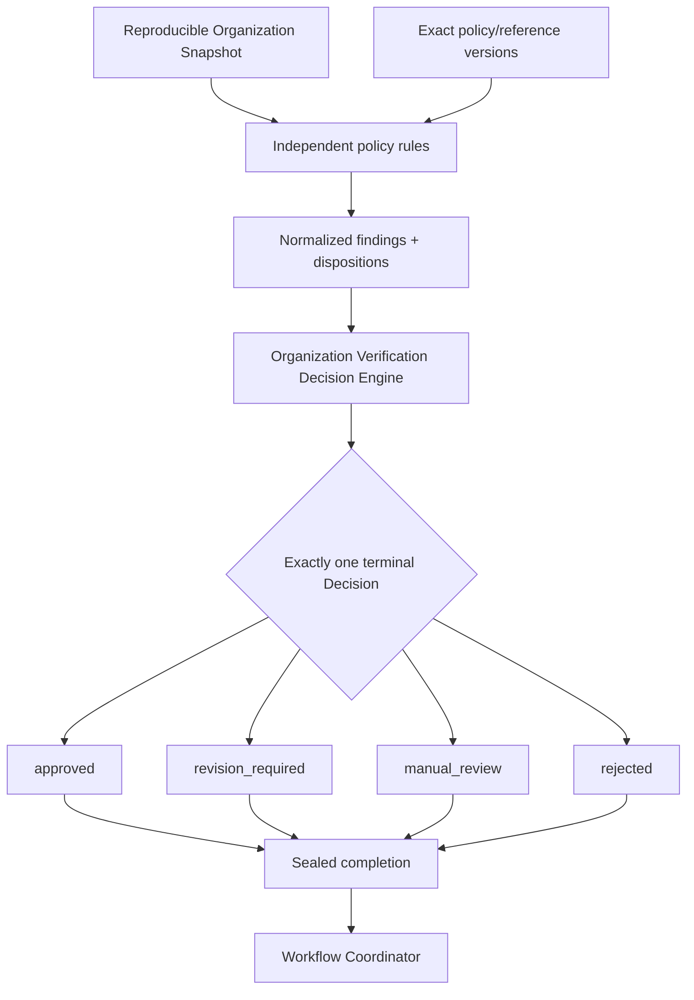

### 17.4 Immutability and supersession

A Decision is never edited, reversed, or reinterpreted. A later Attempt may
produce another Decision, and a later Revision may supersede applicability.
History preserves both. Any appeal or waiting-period rules govern creation of
new inputs; they never mutate the old Decision.

## 18. Organization Trust Status Model

Organization Trust Status is:

- derived from immutable authority;
- current-effective rather than historical truth;
- rebuildable and replayable;
- source-referenced;
- versioned by a Trust Status Deriver;
- independent from Verification Process, Decision, and Lifecycle; and
- not an action permission.

Initial values:

| Status | Exact standing |
|---|---|
| `unestablished` | No current applicable approved or rejected conclusion establishes standing |
| `trusted` | A current applicable approved Decision remains within validity, all required evidence remains valid, and no material invalidation applies |
| `not_trusted` | A current applicable rejected Decision applies |
| `expired` | A previously trusted Decision ceased to be effective because its validity window or required evidence expired |
| `invalidated` | A previously trusted Decision ceased to be effective because a material identity/evidence change, withdrawal, revocation, or explicit verification invalidation applies |

`suspended` is not a Trust Status. It belongs to Organization Lifecycle or a
future administrative/eligibility condition. `approved`,
`revision_required`, `manual_review`, and `rejected` are Decisions and are not
status values. `queued`, `running`, and `completed` are process states.

A materialized Trust Status column, if later authorized, is a cached
projection only. It must record source references, `status_revision`,
`status_as_of`, `status_deriver_version`, and `projection_version`.

## 19. Trust Status Derivation

### 19.1 Authoritative inputs

The Trust Status Deriver consumes only:

- completed immutable Decisions and their validity;
- applicable Verification Revision and Attempt sequence;
- applicable Organization Profile Revision sequence;
- evidence expiry, revocation, and withdrawal facts;
- material profile-change events;
- explicit verification invalidation events;
- decision applicability/supersession facts; and
- exact policy-governed validity windows.

Administrative access restrictions, action policies, marketplace state,
sanctions, AML, compliance, or payment conditions are not derivation inputs.

### 19.2 Deterministic algorithm

For the requested `status_as_of` time:

1. resolve the latest applicable source chain by Organization, Verification
   Revision sequence, Attempt sequence, and append-only applicability facts;
2. if a previously effective approved Decision has a material invalidation,
   withdrawal, revocation, or identity-change fact, derive `invalidated`;
3. otherwise, if that approved Decision or any required evidence is outside
   its validity window, derive `expired`;
4. otherwise, if the current applicable Decision is `rejected`, derive
   `not_trusted`;
5. otherwise, if it is `approved`, every required input is current, and no
   invalidation exists, derive `trusted`;
6. otherwise derive `unestablished`.

`revision_required` and `manual_review` normally derive `unestablished`.
Whether an older approved Decision remains independently effective during
renewal is a business-policy question. Until explicitly approved, derivation
must fail closed and must not assume continued trust.

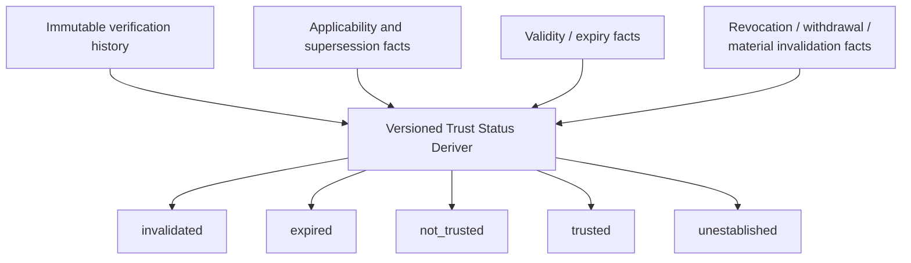

Expiry or invalidation changes current status without creating or altering an
engine Decision. The status transition and its source fact are append-only.
Replaying the same ordered inputs through the recorded deriver version must
reconstruct the same status.

## 20. Evidence Architecture

### 20.1 Layered evidence model

| Layer | Authority and ownership |
|---|---|
| Evidence Artifact | Raw confidential bytes/provider payload owned by Confidential Evidence Storage |
| Evidence Reference | Opaque identifier, fingerprint, source metadata, and access classification consumed by Organization Verification |
| Extracted Observation | Non-authoritative extraction result with method/version/provenance |
| Normalized Fact | Structured candidate fact normalized for evaluation |
| Verified Fact | Fact accepted for a recorded scope by an approved Evidence Assessment |
| External Assertion | Versioned external-source assertion treated as evidence |
| Evidence Assessment | Immutable governed assessment of an item/assertion/fact |
| Organization Verification Finding | Deterministic rule output under exact policy version |
| Organization Verification Decision | Engine-only conclusion |

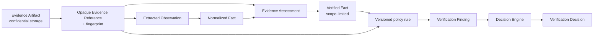

No evidence layer directly elevates Trust Status. Provider output never becomes
a Tutela Decision. Document existence alone proves nothing.

### 20.2 Evidence lifecycle and confidentiality

Evidence may be current, expired, withdrawn, revoked, superseded, unavailable,
or integrity-failed. These are evidence facts, not Decisions.

Raw bytes remain encrypted and access-controlled by Confidential Evidence
Storage. Organization Verification stores only the minimum semantic metadata
and immutable fingerprints needed for policy evaluation and audit. An
Evidence Reference does not imply that every caller may retrieve the artifact.

Evidence reuse requires a recorded policy allowing the exact evidence type,
scope, subject, fingerprint, source, assessment, and validity period. Reuse
creates a new association/snapshot; it never rewrites an old one.

## 21. Manual Review Boundary

A reviewer may create only constrained immutable inputs:

- Evidence Assessment;
- Verified Fact assertion within an authorized and recorded scope;
- conflict classification;
- source-authenticity assessment;
- cataloged recommendation code; and
- confidential rationale stored separately under restricted access.

A Reviewer Assessment records:

- assessment ID and immutable fingerprint;
- reviewer actor and authority references;
- target Organization, Revision, Attempt, Snapshot, and evidence references;
- assessment-policy version;
- structured outcomes and recommendation codes;
- creation timestamp;
- supersession relationship, if any; and
- correlation/audit identity.

The reviewer may not create or edit:

- a Verification Decision or confidence;
- Trust Status;
- Organization Lifecycle;
- Participation or Publication Eligibility;
- publication authority; or
- an unrestricted override.

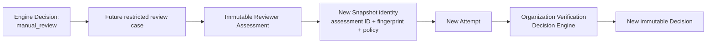

Reviewer output returns through a new Attempt and the Decision Engine. Direct
administrator approval, direct reviewer rejection, Decision editing, status
editing, and undocumented override paths are explicitly prohibited.

The architecture defines this input boundary only. Reviewer UI, assignment,
queues, quorum, escalation, and full case workflow are out of scope.

## 22. Policy Architecture

### 22.1 Rationalized initial families

Version 2 uses the smallest non-overlapping initial architecture:

| Policy family | Sole responsibility |
|---|---|
| Organization Profile Integrity Policy | Required profile structure and internal identity/business-activity consistency; not legal existence |
| Legal Existence and Registration Policy | Registration identifiers and authoritative legal-existence evidence |
| Evidence Requirements Policy | Required evidence coverage by approved organization type/context, including corporate-document and any authorized ownership-disclosure requirements |
| Evidence Validity Policy | Source, fingerprint, issue/expiry, assessment, revocation, withdrawal, and reuse validity |
| Jurisdiction Support Policy | Whether Tutela has an approved verification policy set for the jurisdiction; not sanctions or compliance |
| Manual Review Input Policy | Which structured reviewer assessments and Verified Facts are admissible inputs |
| Decision Policy | Finding dispositions, precedence, confidence metadata, and terminal Decision reduction |

Candidate Version 1 families are rationalized as follows:

| Candidate family | Version 2 resolution |
|---|---|
| Organization Identity Policy | Folded into Organization Profile Integrity |
| Legal Registration Policy | Renamed Legal Existence and Registration |
| Corporate Documentation Policy | Configuration/rules within Evidence Requirements |
| Ownership Disclosure Policy | Optional rule module within Evidence Requirements until independently authorized |
| Business Activity Policy | Profile Integrity rules initially; may split only when distinct rules justify it |
| Jurisdiction Support Policy | Retained independently |
| Evidence Sufficiency Policy | Renamed/consolidated as Evidence Requirements |
| Evidence Validity Policy | Retained independently |
| Manual Review Input Policy | Retained independently |
| Decision Policy | Retained independently |

No sanctions, AML, individual KYC, broad regulatory-compliance, risk-scoring,
or action-eligibility policy is included.

### 22.2 Independence and versioning

Each family:

- owns its Rule IDs, safe Reason Codes, configuration contract, and versions;
- consumes only the allowlisted Snapshot view declared by its contract;
- cannot inspect another family's private configuration;
- produces normalized findings, never Decisions;
- resolves exact immutable versions with no silent fallback;
- is retired by preventing new selection, never by deleting historical
  versions; and
- records neutral reference-data versions separately from policy versions.

Shared jurisdiction codes, organization-type catalogs, date rules, and issuer
registries are neutral versioned reference providers. Providers expose facts;
they do not decide and do not own policy meaning.

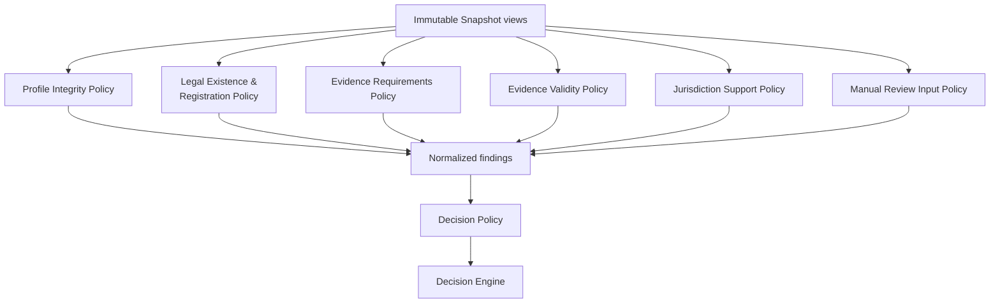

Rules and configuration are separate: a Rule is stable executable semantics;
a Policy Version selects approved Rules and immutable configuration/reference
versions. Reusing a Rule ID with changed meaning is forbidden.

## 23. Decision Engine Responsibilities

The Organization Verification Decision Engine:

- accepts only a sealed evaluation input with immutable Snapshot identity;
- validates complete policy/finding catalog and version integrity;
- consumes normalized findings rather than raw artifacts;
- applies the recorded Decision Policy deterministically;
- produces exactly one allowed Decision;
- derives confidence metadata only from recorded policy;
- produces an opaque sealed completion bound to Attempt ID, claim epoch,
  Snapshot fingerprint, finding-set fingerprint, and engine/ruleset version;
- performs no I/O and mutates no lifecycle, workflow, repository, or status;
- fails closed on unknown or inconsistent authority.

Only the engine may create `approved`, `revision_required`, `manual_review`, or
`rejected`.

The architecture requires conceptual type-level and persistence boundaries so
a fabricated Decision-shaped object cannot be persisted as an engine
completion. Exact implementation mechanisms remain for Phase 7B after formal
approval.

| Condition | Required fail-closed conclusion |
|---|---|
| Missing policy/reference version | `manual_review` with configuration-authority finding |
| Unknown evidence type or assessment authority | `manual_review`, unless exact policy classifies a correctable omission |
| Corrupt Snapshot/fingerprint | `manual_review` integrity finding or no completion until cataloged safely |
| Conflicting authoritative facts | `manual_review` |
| Correctable missing owner input | `revision_required` |
| Expired replaceable required evidence | `revision_required` |
| Unsupported jurisdiction | `manual_review` unless recorded policy explicitly permits deterministic rejection |
| Definitively rejected current Revision | `rejected` only through recorded rejection disposition |
| All mandatory policies authoritatively pass | `approved` |

Raw exceptions, personal data, artifact contents, and reviewer prose never
become Reason Codes.

## 24. Workflow Coordinator Responsibilities

The Organization Verification Workflow Coordinator may:

- validate permitted draft/submission/workflow transitions;
- create durable evaluation commands through a trigger port;
- consume only persisted sealed Decisions;
- lock/check current record, Revision, Attempt, claim, and Snapshot identity;
- reject stale, duplicate, or mismatched completions;
- apply Decision-to-workflow mappings idempotently;
- create a new draft after `revision_required`;
- preserve `manual_review` as a terminal Attempt with no new trust;
- mark the current Revision rejected after `rejected`;
- record approved applicability/validity references after `approved`;
- append workflow, applicability, expiry, invalidation, and status-derivation
  facts through their proper authorities; and
- coordinate recovery and re-evaluation commands.

It must not:

- execute rules or policies;
- create or change findings or Decisions;
- assign confidence;
- alter Snapshots or completed history;
- transition Organization Lifecycle;
- read Offer Verification internals; or
- grant action-specific eligibility.

| Decision | Coordinator effect |
|---|---|
| `approved` | Record Decision applicability and validity sources; request status projection |
| `revision_required` | Preserve submitted history and create/permit a new editable draft |
| `manual_review` | Preserve Revision/Decision; permit only governed new input and later Attempt |
| `rejected` | Mark this Revision's verification workflow terminal and record applicability |

## 25. Snapshot and Fingerprint Strategy

### 25.1 Authoritative Snapshot inputs

Each Organization Snapshot contains:

- Organization ID;
- Registry contract version;
- Organization Profile Revision ID, sequence, and fingerprint;
- allowlisted legal identity, organization type, jurisdiction, declared
  activity, and authorized ownership-disclosure facts;
- Verification Revision ID and sequence;
- Evidence Snapshot IDs, opaque references, and artifact fingerprints;
- evidence source/issuer, validity, expiry, revocation, withdrawal, and
  supersession state as of capture;
- Extracted Observation/Normalized Fact/Verified Fact identities and
  fingerprints used by policy;
- Evidence Assessment identities, fingerprints, policy versions, timestamps,
  and supersession references;
- External Assertion source/version/fingerprint and validity;
- Reviewer Assessment identity, fingerprint, authority reference,
  assessment-policy version, timestamp, and supersession reference when used;
- Snapshot schema/canonicalizer version;
- engine and ruleset versions;
- every policy-family and neutral reference-data version;
- confidence-metadata model version;
- Trust-independent canonical evaluation timestamp; and
- correlation/provenance references required for audit.

Raw artifact bytes and reviewer rationale are not embedded.

### 25.2 Canonicalization and integrity

- allowlisted fields only;
- stable property order and explicit null representation;
- arrays sorted by stable identity, never arrival order;
- canonical timestamp, identifier, decimal, and text normalization;
- UTF-8 canonical serialization;
- cryptographic fingerprint of canonical bytes;
- runtime deep immutability;
- persistence guards for immutable/completed records;
- fingerprint validation before evaluation and again at completion.

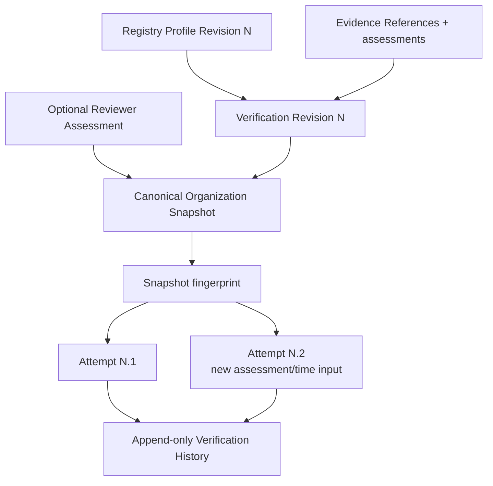

An Attempt with new reviewer or temporal inputs receives a new Snapshot
identity even if it references the same Verification Revision. Historical
replay resolves the exact recorded canonicalizer, policies, reference data,
assessments, and time. Missing historical authority causes replay to report
unavailable; it never substitutes newer data.

## 26. History and Audit Strategy

The following are append-only:

- Verification Submissions and Revisions;
- Organization Snapshots and fingerprints;
- Evidence associations, snapshots, assessments, validity, revocation,
  withdrawal, and supersession facts;
- Reviewer Assessments and supersession records;
- Attempts, claims, leases, and recovery facts;
- normalized findings and their catalog/version identities;
- sealed completions and Decisions;
- workflow transitions;
- Decision applicability and supersession facts;
- Trust Status derivation facts and projection transitions;
- policy/reference resolution records; and
- authorized recovery operations.

Current Trust Status is not read from a mutable historical row. The source of
truth is the ordered append-only Decision, applicability, validity, and
invalidation history. A projection stores:

- source high-water mark/sequence;
- source references;
- status value;
- `status_as_of`;
- status revision;
- Status Deriver version; and
- projection schema version.

Replay orders records by authoritative per-aggregate sequence and stable event
identity, not wall-clock arrival alone. The same history and exact deriver
version must reconstruct the same status. A mismatch is an integrity failure
and cannot elevate trust.

History access is separated into:

- operational history with minimum safe identifiers;
- owner-safe history with approved Reason Code summaries;
- reviewer/auditor history with controlled evidence metadata;
- raw artifact access through Confidential Evidence Storage only.

## 27. Recovery Strategy

Recovery never creates approval or trusted status by inference.

| Failure scenario | Required recovery behavior |
|---|---|
| Incomplete draft/submission request | Reject before Attempt creation; preserve no Decision |
| Interrupted atomic submission | Commit all Revision/Snapshot/Attempt/command facts or none |
| Duplicate submission command | Idempotency returns the existing result; no duplicate Revision |
| Duplicate evaluation delivery | Same Attempt/claim identity; one sealed completion |
| Concurrent evaluation claim | Lease/epoch permits one current claimant |
| Abandoned claim | Lease recovery requeues the same Attempt |
| Stale completion | Reject atomically; append safe audit fact; no status change |
| Corrupt Snapshot/fingerprint | No approval; integrity finding/`manual_review` through engine when safely representable |
| Missing policy/reference version | No fallback; `manual_review` through engine |
| Unknown evidence or provider result | No trust; governed finding and `manual_review` unless exact policy says correctable |
| Partial extraction | Observation remains non-authoritative; no approval if required fact is absent |
| Expired evidence | Append expiry fact; derive `expired` or require new Revision according to approved policy |
| Revoked/withdrawn evidence | Append fact; derive `invalidated` when it affected trusted standing |
| Policy upgrade | Preserve old Decision; new version applies only to new/re-evaluation selection under approved activation rules |
| Database/concurrency conflict | Roll back the operation; retry idempotently; never accept partial authority |
| Projection unavailable/corrupt | Rebuild from history; downstream fails closed while freshness cannot be proven |
| External dependency unavailable | No inferred pass; cataloged insufficient-authority behavior |

Recovery commands have explicit authorization, idempotency keys, correlation
IDs, and append-only audit records. They may resume or rebuild; they may not
edit Decisions, Snapshots, or history.

## 28. Security and Authority Boundaries

### 28.1 Command authority

- Every command is authenticated server-side.
- Actor identity, membership, delegation, and command scope are validated
  against versioned authoritative references.
- Draft ownership is not Decision authority.
- Client-submitted role, Organization ID, status, confidence, policy version,
  or Decision values are untrusted input.
- Cross-Organization access is denied by Organization-scoped authorization,
  not by UI visibility.

### 28.2 Decision and workflow authority

- Policies produce findings only.
- The Decision Engine alone produces Decisions and governed confidence.
- The Workflow Coordinator alone applies verification workflow effects.
- The Trust Status Deriver alone calculates current status.
- Repositories persist authorized domain objects but cannot manufacture them.
- Administrators and reviewers have constrained commands, never direct
  Decision/status mutation.

### 28.3 Integration authority

- Registry contracts are validated and fingerprinted through the
  verification-side Anti-Corruption Layer.
- Artifact access uses opaque identifiers, least privilege, short-lived
  retrieval authority, and separate audit.
- External assertions retain source, signature/integrity, version, time, and
  scope; provider claims are never copied as Tutela Decisions.
- Downstream eligibility has read-only access to the narrow status contract
  and cannot mutate upstream state.

### 28.4 Namespace isolation

Organization Verification owns capability-specific namespaces, for example:

```text
org_verification.rule.*
org_verification.reason.*
org_verification.event.*
org_verification.policy.*
org_verification.contract.*
```

Offer Verification identifiers are not reused. Generic `trust.*` runtime
identifiers are prohibited because the governance framework owns no runtime
semantics.

## 29. Privacy and Retention Boundaries

Privacy follows data authority:

| Data class | Boundary | Default disclosure |
|---|---|---|
| Raw evidence artifact/provider payload | Confidential Evidence Storage | None |
| Evidence Reference/fingerprint | Organization Verification restricted operations | Opaque internal reference only |
| Legal/ownership facts | Registry or Verification restricted domain | Minimum required for authorized evaluation |
| Reviewer identity/rationale | Restricted review/audit boundary | Never in downstream status contract |
| Findings/private Reason Codes | Verification audit boundary | Safe summaries only when explicitly classified |
| Decision/status references | Versioned integration projection | Minimum fields in Section 33 |
| User/session data | Identity and Access | Never in verification output |

Raw artifact retention and deletion are executed by Confidential Evidence
Storage under a later approved legal/retention policy. Verification retains
the minimum fingerprint, provenance, assessment, Decision, and audit facts
required to explain historical authority. Deleting or making raw bytes
unavailable does not rewrite history and must be recorded as an append-only
availability/retention fact.

Retention periods, legal holds, data-subject rights, jurisdictional storage,
and public disclosure require legal/product approval. The architecture does
not invent them. Until defined, implementations must minimize collection and
fail closed rather than broaden access.

## 30. Legacy Recovery Adaptation

Legacy data enters through a dedicated **Legacy Organization
Anti-Corruption Layer**, outside the Organization Registry and Organization
Verification core aggregates.

The following are non-authoritative:

- `users.company_name`;
- `users.verified`;
- legacy roles or seller flags;
- document-presence fields;
- demo or seed data;
- UI labels/claims;
- offer ownership/status; and
- inferred account relationships.

They cannot automatically become:

- an Organization identity;
- Organization membership;
- a Registry Profile Revision;
- Verification evidence or a Verified Fact;
- an approved Decision; or
- trusted status.

The adapter may produce only:

- reversible candidate mappings;
- source/provenance references;
- explicit unknown-confidence classification;
- candidate duplicate/conflict flags; and
- reconciliation inputs for a separately approved workflow.

Authoritative Organization creation, identity matching, membership
reconciliation, and evidence adoption require explicit future business
authorization. No automatic backfill is permitted.

## 31. Offer Verification Relationship

Organization Verification and Offer Verification are sibling capabilities.
They share architecture conventions, not domain authority.

Safely shareable stateless or infrastructure patterns:

- immutable-value helpers;
- canonicalization and cryptographic hashing primitives;
- append-only persistence patterns;
- durable command, lease, and idempotency mechanisms;
- sealed-completion mechanics;
- generic severity vocabulary as metadata;
- audit conventions; and
- architecture/testing conventions.

Must remain separate:

- Decisions and Decision Engines;
- policies and reference registries;
- findings, Rule IDs, and Reason Codes;
- snapshots and fingerprints;
- attempts, process, and lifecycle models;
- repositories and mutable state;
- workflow coordinators;
- histories and integration contracts.

A universal verification engine or shared mutable verification framework is
explicitly rejected.

## 32. Participation Eligibility Boundary

Organization Verification answers:

> Does this immutable Organization Verification Revision satisfy the recorded
> organization-verification policies?

Organization Trust Status answers:

> What is the Organization's current effective verification-derived standing
> at the requested time?

Future Participation Eligibility answers:

> May this Organization perform this specific platform action at this specific
> time under the action policy then in force?

Therefore, `trusted` never directly means:

- may publish an offer;
- may negotiate or transact;
- may create an order;
- may sign a contract;
- may use escrow;
- may send or receive payment; or
- may perform any other platform action.

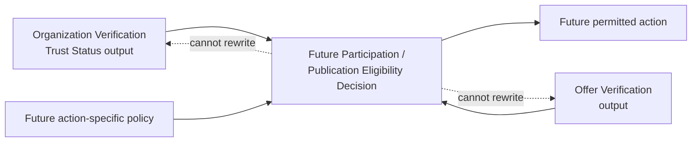

Eligibility owns the action decision and its own history. It consumes upstream
outputs without executing or copying verification logic.

## 33. Integration Contracts

### 33.1 Registry input

A versioned Registry-to-Verification contract publishes only the fields
approved for verification:

```text
organization_id
organization_profile_revision_id
organization_profile_revision_sequence
organization_profile_fingerprint
legal_identity_projection
organization_type
jurisdiction
declared_activity_projection
approved_disclosure_projection
registry_contract_version
published_at
```

Each projection is allowlisted and versioned. The Anti-Corruption Layer maps
it into the Organization Snapshot. Verification cannot request arbitrary
Registry internals.

### 33.2 Evidence input

Confidential Evidence Storage exposes:

```text
artifact_reference
artifact_fingerprint
artifact_media_class
integrity_state
availability_state
storage_contract_version
```

Retrieval authorization is separate and not implied by the reference.

### 33.3 Downstream status output

The authoritative minimum contract is:

```text
OrganizationVerificationTrustStatusV1

organization_id
organization_identity_revision
trust_status
effective_decision_id | null
effective_verification_revision_id | null
decision_timestamp | null
valid_from | null
valid_until | null
status_as_of
status_revision
status_deriver_version
projection_version
safe_status_reason_codes[]
```

Justification:

- identity and revision prevent subject/profile ambiguity;
- Decision and Verification Revision references make the projection auditable;
- validity and `status_as_of` prevent timeless interpretation;
- status/projection/deriver versions support ordering and deterministic replay;
- safe Reason Codes explain expiry/invalidation without exposing internals.

The contract does not expose raw evidence, paths, ownership details, reviewer
identity/notes, internal policy configuration, full findings, private Reason
Codes, users, credentials, or sessions. Full policy-resolution and finding
records are restricted audit contracts, not default eligibility inputs.

Freshness is proven by `status_as_of`, `status_revision`, source references,
and version compatibility. A vague mutable `is_fresh` Boolean is not
authoritative.

## 34. Extensibility Strategy

### New jurisdictions and legal forms

Add versioned neutral reference data and explicit policy versions. Existing
Snapshots and Decisions retain their recorded versions.

### New evidence types and external providers

Add stable evidence-type contracts, canonicalizers, assessment policies, and
provider Anti-Corruption Layers. Provider output remains an External
Assertion, never a Decision.

### New policy families

Split or add a family only when it has distinct responsibility, inputs,
version ownership, and Rule namespace. The Decision Engine remains unchanged
because it consumes normalized findings.

### Re-verification, renewal, and expiry

Append applicability/time facts and create a new Attempt or Revision according
to input identity. Renewal rules can change without changing Decision
ownership or Trust Status semantics.

### Group structures

Registry may add relationship types. Every Legal Organization remains an
independent verification subject. Non-legal units cannot receive independent
Trust Status.

### Future trust-related capabilities

Counterparty, Payment, Logistics, Shipment, Settlement, or External Provider
capabilities may be introduced only as separately approved bounded contexts
with their own business questions, Decisions, policies, histories, and
contracts. The Tutela Trust Domain provides governance, not a reusable engine.

### AI recommendations

If later authorized, AI may produce non-authoritative observations or
recommendations with model/version/provenance. AI cannot issue Decisions,
Verified Facts, Trust Status, or eligibility. The existing evidence/policy
input boundary admits it without changing the Decision Engine.

## 35. Architectural Diagrams

The required diagrams are located as follows:

1. Trust Architecture Governance map — Section 4.
2. Full Context Map — Section 5.
3. Organization Registry bounded context — Section 9.
4. Organization Verification bounded context — Section 10.
5. Organization Lifecycle — Section 14.
6. Verification Submission lifecycle — Section 15.
7. Verification Process — Section 16.
8. Decision flow — Section 17.
9. Trust Status derivation — Section 19.
10. Evidence flow — Section 20.
11. Manual Review return-through-engine — Section 21.
12. Policy-family architecture — Section 22.
13. Snapshot and history — Section 25.
14. Verification outputs to future eligibility — Section 32.

### 35.1 Complete execution sequence

```mermaid
sequenceDiagram
    participant Actor as Authorized Organization Member
    participant Registry as Organization Registry
    participant Submit as Verification Submission Boundary
    participant Store as Transactional Verification Store
    participant Evidence as Confidential Evidence Storage
    participant Worker as Evaluation Worker
    participant Policies as Independent Policy Families
    participant Engine as Decision Engine
    participant Coordinator as Workflow Coordinator
    participant Deriver as Trust Status Deriver

    Actor->>Submit: Submit draft + Profile Revision + evidence references
    Submit->>Registry: Resolve versioned immutable Profile Revision
    Registry-->>Submit: Published profile contract + fingerprint
    Submit->>Evidence: Resolve opaque reference integrity metadata
    Evidence-->>Submit: Reference + fingerprint + availability
    Submit->>Store: Atomically append Revision + Snapshot + Attempt + command
    Store-->>Actor: Private submitted acknowledgement
    Worker->>Store: Claim Attempt with lease/epoch
    Store-->>Worker: Frozen Snapshot + exact versions
    Worker->>Policies: Evaluate allowlisted Snapshot views
    Policies-->>Engine: Normalized findings + dispositions
    Engine-->>Worker: Sealed immutable Decision completion
    Worker->>Store: Persist completion atomically
    Coordinator->>Store: Consume current persisted sealed Decision
    Coordinator->>Store: Append idempotent workflow/applicability effects
    Deriver->>Store: Rebuild current status from authoritative history
```

## 36. Risks and Trade-offs

| Risk/trade-off | Severity | Architectural treatment |
|---|---|---|
| Tutela Trust Domain becomes a god domain | High | It owns governance only and has no runtime/data/policy authority |
| Duplicate Organization identity ownership | High | Registry is sole authority; Verification consumes versioned revisions through an ACL |
| Trust Status becomes an uncontrolled state machine | High | Five verification-derived values, deterministic versioned derivation, no suspension/eligibility state |
| Manual Review becomes a second engine | High | Structured immutable input only; all outcomes return through engine |
| Evidence/document presence becomes proof | High | Layered evidence model; only policies create findings and engine decides |
| Permanent rejection semantics | High | Rejection scoped to Revision/evidence/policy versions |
| Legacy model contaminates new authority | High | Explicit Anti-Corruption Layer; candidates only; no inferred trust |
| Policy-family fragmentation | Medium | Seven rationalized families with explicit sole responsibilities |
| Snapshot misses mutable reviewer/provider inputs | High | Assessment/assertion IDs, fingerprints, versions, time, and supersession are frozen |
| Generic framework couples Offer and Organization verification | High | Share stateless primitives only; separate all domain semantics/state |
| Parent/subsidiary trust leakage | High | Independent Organization IDs and status; no relationship inheritance |
| Policy upgrade changes history | High | Exact version replay and retirement without deletion |
| Derived projection is stale or unavailable | Medium | Source sequence/version contract; rebuild from history; downstream fails closed |
| Raw evidence retention conflicts with privacy | High | Separate artifact ownership; minimum semantic audit facts; later legal policy |
| Narrow contracts omit a future consumer need | Low | Add a versioned contract field only through architecture review; audit remains separate |
| More boundaries increase initial implementation work | Medium | Recovery-first phased implementation; boundaries prevent dangerous coupling |

## 37. Required Revision Traceability Matrix

| Review item | Classification | Resolution | Version 2 evidence |
|---|---|---|---|
| R1 — Rename capability to Organization Verification | HIGH | **RESOLVED** | Status, Sections 1–3, 7, 10, 17, and all diagrams use the approved capability name |
| R2 — Separate upstream Organization Registry | HIGH | **RESOLVED** | Sections 5, 9, 11–14 define Registry authority and upstream contract/ACL |
| R3 — Trust Domain is non-runtime governance | HIGH | **RESOLVED** | Section 4 assigns no runtime, data, decision, policy, or lifecycle ownership |
| R4 — Finalize Decision names and semantics | HIGH | **RESOLVED** | Section 17 uses `approved`, `revision_required`, `manual_review`, `rejected`, all terminal per Attempt |
| R5 — Reduce and isolate Trust Status | HIGH | **RESOLVED** | Sections 18–19 use five derived values, remove suspension, and version the deriver |
| R6 — Exact Evidence Artifact ownership | MEDIUM | **RESOLVED** | Sections 5, 11, 20, 29, and 33 separate raw storage from semantic evidence |
| R7 — Reviewer assessments in Snapshot identity | MEDIUM | **RESOLVED** | Sections 21 and 25 freeze ID, fingerprint, policy, time, authority, and supersession |
| R8 — Rationalize policy families | MEDIUM | **RESOLVED** | Section 22 consolidates the candidate list into seven independent families |
| R9 — Minimize/version downstream contract | MEDIUM | **RESOLVED** | Section 33 defines `OrganizationVerificationTrustStatusV1` and excludes internals |
| R10 — Legacy adapter as Anti-Corruption Layer | MEDIUM | **RESOLVED** | Section 30 permits candidates/provenance only and forbids inferred authority |
| R11 — Pre-attempt validation vs Decisions | LOW | **RESOLVED** | Section 15 states rejection before Attempt creation is not a Decision |
| R12 — Capability-specific namespaces | LOW | **RESOLVED** | Section 28 defines `org_verification.*` namespaces and prohibits generic runtime trust identifiers |

Traceability result:

- RESOLVED: 12
- INTENTIONALLY DEFERRED: 0
- REJECTED WITH JUSTIFICATION: 0

All HIGH and MEDIUM review requirements are explicitly resolved. Optional
future refinements from the review remain non-blocking and do not change the
required ownership model.

## 38. Deferred Business-Policy Questions

These questions are intentionally unanswered because architecture cannot
invent business, legal, or operational rules.

| Question | Blocks | Does not block because |
|---|---|---|
| Initially supported jurisdictions | Policy catalog and production rollout | Jurisdiction Policy boundary and fail-closed unsupported handling are defined |
| Supported legal forms | Policy catalog | Registry type contract and versioned policy input are defined |
| Required evidence matrix by type/jurisdiction | Policy catalog and production rollout | Evidence Requirements Policy owns the future matrix |
| Trust validity duration and renewal window | Implementation detail and rollout | Status validity sources and expiry semantics are defined |
| Whether old approval remains during routine renewal | Trust derivation policy/rollout | Default architecture fails closed to `unestablished` without approval |
| Evidence retention/deletion periods | Production rollout and legal controls | Storage/verification ownership and minimum-audit separation are defined |
| Exact owner-correctable versus rejection dispositions | Policy catalog | Decision vocabulary and precedence are fixed |
| Whether initial policy enables deterministic rejection | Policy catalog | `manual_review` is the safe alternative; Decision model remains stable |
| Appeal/resubmission/waiting rules | Workflow implementation detail | New input creates new immutable Revision/Attempt; old history stays fixed |
| Reviewer quorum/conflict resolution | Manual-review implementation | Reviewers remain input providers only |
| Public organization/status disclosure | API/UI production rollout | Default integration contract is internal and privacy-minimized |
| Organization registration/activation authority | Registry implementation/policy | Registry ownership and Lifecycle boundary are fixed |
| Evidence source/issuer allowlists | Policy catalog | Neutral versioned reference-provider boundary is defined |

Blocking classification:

- **Implementation architecture:** none of the listed business questions;
  Version 2 defines the required ownership and authority boundaries.
- **Implementation details:** validity/renewal behavior, appeal/resubmission,
  reviewer quorum, and Registry activation authority.
- **Policy catalog creation:** jurisdictions, legal forms, evidence matrices,
  dispositions, rejection enablement, issuer/source allowlists, and renewal
  policy.
- **Production rollout:** every policy-catalog item plus privacy disclosure,
  evidence retention/deletion, legal review, and operational review controls.

Architecture implementation may begin only after formal approval of Version 2.
Any implementation slice that requires one of these business rules must stop
at that rule boundary and obtain explicit approval. Production rollout remains
blocked until jurisdiction, evidence, validity, privacy, retention, and
operational review policies are approved.

## 39. Explicit Out-of-Scope Boundaries

Version 2 does not design or implement:

- Marketplace or Offer Publication;
- negotiation, orders, contracts, payments, escrow, or blockchain;
- sanctions, AML, individual KYC, transaction monitoring, compliance case
  management, or risk scoring;
- external provider integrations;
- OCR or document-extraction implementation;
- reviewer UI or full manual-review case workflow;
- notifications or email;
- administrative policy editing;
- action-specific Participation or Publication Eligibility implementation;
- future trust-related capability engines; or
- AI Decisions.

It authorizes no:

- runtime or application-source change;
- schema or migration;
- database access or write;
- API or route;
- frontend change;
- repository implementation;
- policy catalog/business-rule invention; or
- Phase 7B work.

## 40. Final Proposed Architecture

```text
Tutela Trust Domain
└── non-operational architecture governance
    ├── shared principles and terminology
    ├── audit, privacy, fail-closed, and integration standards
    └── capability-isolation rules

Identity and Access
└── authenticated actors and delegated authority references

Organization Registry
├── Organization identity
├── Organization Profile Revisions
├── legal-entity relationships and units
└── Organization Lifecycle

Confidential Evidence Storage
└── raw protected artifacts and storage lifecycle

Organization Verification
├── Verification Drafts, Submissions, and immutable Revisions
├── Organization Evidence semantics and Evidence Snapshots
├── immutable Organization Snapshots and Attempts
├── independent versioned policy families
├── stable Rule IDs, Reason Codes, severity, and dispositions
├── Organization Verification Decision Engine
├── Organization Verification Workflow Coordinator
├── append-only Verification and Trust Status History
└── derived Organization Trust Status

Offer Verification
└── independent Phase 6 capability

Future Participation / Publication Eligibility
└── action-specific composition of narrow authoritative outputs
```

The architecture guarantees:

- Organization Registry is the sole Organization identity/profile/lifecycle
  authority;
- Organization Verification evaluates immutable Revision inputs without
  duplicating Registry ownership;
- only its Decision Engine creates its four terminal Decisions;
- only its Workflow Coordinator applies verification workflow effects;
- evidence, reviewers, administrators, providers, routes, repositories, and
  downstream consumers cannot decide;
- Trust Status is derived, rebuildable, source-referenced, and never an action
  permission;
- raw artifacts stay in a separate confidential boundary;
- decisions, snapshots, assessments, and history remain immutable or
  append-only;
- missing or ambiguous authority fails closed;
- legacy ambiguity never becomes identity, evidence, approval, or trust;
- Offer Verification remains operationally independent;
- future eligibility composes outputs without reproducing verification logic;
  and
- the Tutela Trust Domain unifies governance without centralizing capability
  authority.

Status remains:

**Candidate for Formal Architecture Approval**

No implementation is authorized by this document.
