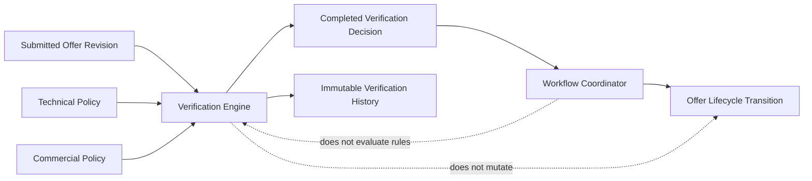
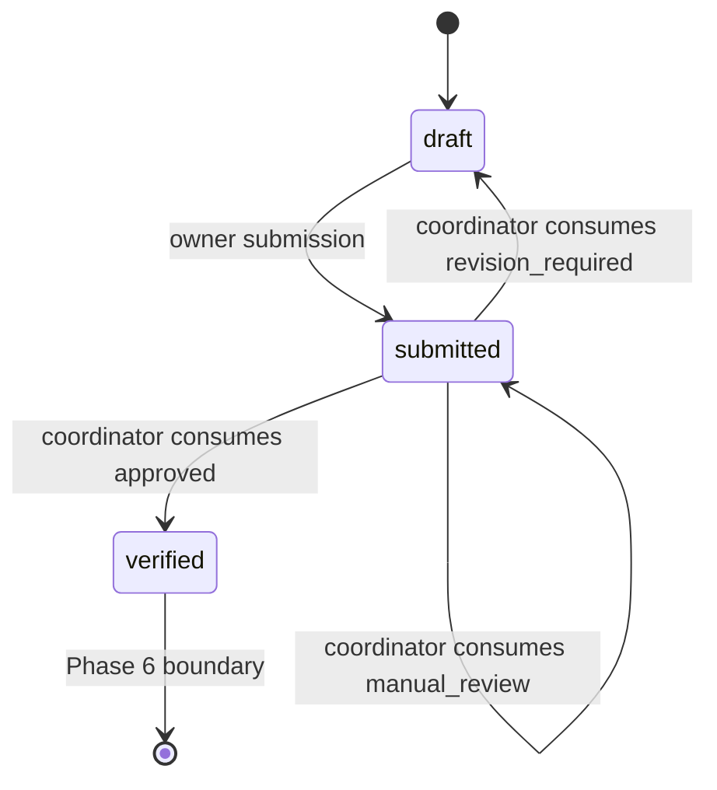
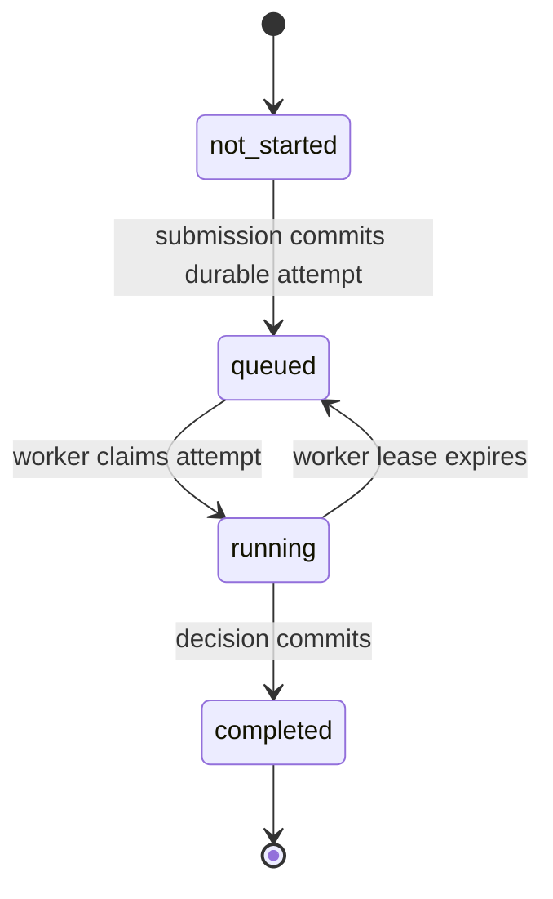
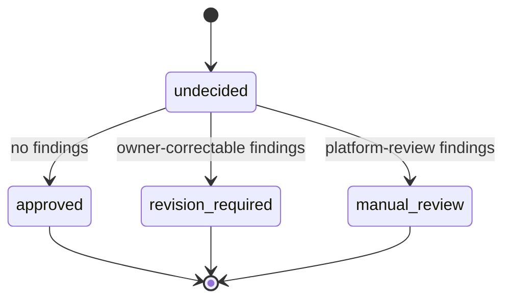
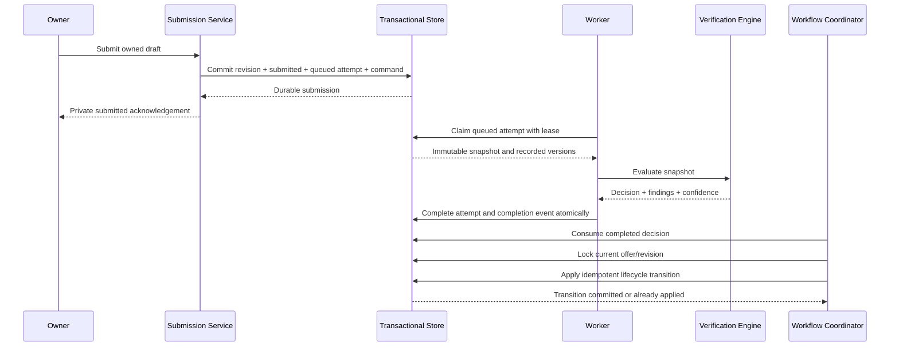
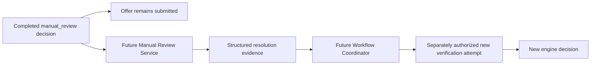
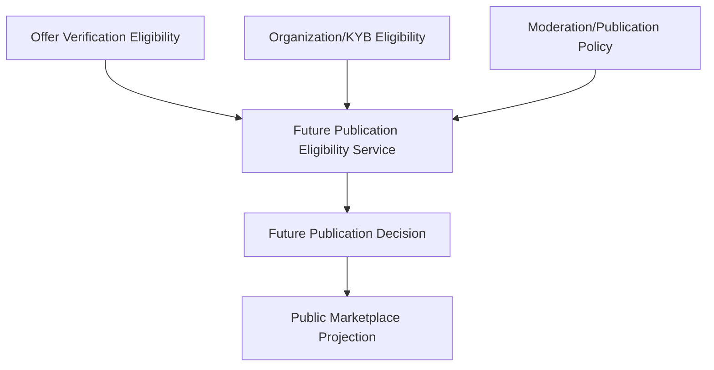

# Phase 6A Verification Engine Architecture Specification

## Version 2

Date: 2026-07-28

Status: approved; authoritative architecture

Authority: official Tutela Offer Verification Engine reference

Scope: documentation and architecture only

## 1. Purpose

Tutela's Offer Verification Engine determines whether one immutable submitted
offer revision is technically and commercially eligible to continue.

The engine owns verification only:

- it evaluates an immutable submitted-offer snapshot;
- it records structured findings;
- it produces exactly one verification decision;
- it persists immutable verification history.

The engine does not own an offer's lifecycle. A separate Workflow Coordinator
consumes the completed decision and applies the corresponding lifecycle
transition.

The engine does not determine KYB, organization trust, compliance, moderation,
publication, trading, transaction success, contracts, payment, settlement, or
blockchain outcomes.

This specification introduces no implementation, schema, migration, enum,
route, API, frontend, database write, or runtime change.

## 2. Version 2 architecture changes

The following sections are new or materially revised from Version 1:

| Version 2 change | Architectural effect |
|---|---|
| Decision ownership separated from lifecycle ownership | The Verification Engine produces decisions; the Workflow Coordinator alone changes offer lifecycle |
| Severity classification | Every reason code has descriptive `INFO`, `WARNING`, `ERROR`, or `CRITICAL` metadata |
| Stable rule identity | Every finding identifies the stable rule that produced it independently from the reason code |
| Independent policy families | Technical and commercial policies have separate versions |
| Internal confidence | Every completed attempt records `HIGH`, `MEDIUM`, or `LOW` confidence independently from decision and lifecycle |
| Core Domain Vocabulary | One authoritative language is defined for code, tests, APIs, documentation, and future integrations |
| Durable automatic trigger | Successful submission creates one platform-owned verification command for a worker |
| Explicit history model | Attempt, finding, event, current-result, and historical-result semantics are separated |
| Decoupled downstream consumption | Manual review, KYB, AI advice, workflow, and publication integrate through ports/read models |

All Phase 5A, Phase 5B, Phase 5C, strict fail-closed marketplace, and protected
legacy-data decisions remain unchanged.

## 3. Updated architectural principles — new in Version 2

1. **Verification Engine owns decisions only.** It evaluates and records
   verification; it never mutates offer lifecycle.
2. **Workflow Coordinator owns lifecycle only.** It consumes an immutable
   decision and applies an idempotent transition; it never evaluates rules.
3. **State dimensions remain independent.** Offer Lifecycle Status,
   Verification Process State, Verification Decision, Eligibility, Severity,
   and Confidence never substitute for one another.
4. **Server-owned authority.** Clients, administrators, workers, and schedulers
   cannot submit or override decisions, reasons, rules, confidence, versions,
   or lifecycle targets.
5. **Pure deterministic decision core.** Rules receive immutable input,
   explicit policy versions, and an injected clock. They perform no database,
   network, AI, or lifecycle operation.
6. **Fail closed.** Missing authority, stale revisions, policy failure, reference
   failure, and unexpected errors can never approve.
7. **Immutable evidence.** Submitted snapshots, completed attempts, findings,
   decisions, confidence, and history are never rewritten.
8. **Independent versioning.** Engine, snapshot schema, Technical Policy,
   Commercial Policy, and confidence model evolve independently.
9. **Severity is descriptive only.** It never influences the Phase 6 decision
   algorithm or workflow.
10. **Durable asynchronous execution.** Successful submission atomically queues
    verification; retries never create duplicate logical decisions.
11. **Downstream anti-coupling.** Manual review, KYB, AI advice, workflow, and
    publication consume stable ports/read models rather than engine internals.
12. **Recovery before expansion.** The architecture preserves Phase 5 behavior,
    existing business logic, strict marketplace policy, and legacy data.

## 4. Core Domain Vocabulary

These definitions are authoritative for future implementation and
documentation.

### Offer

A private or public commercial proposition stored by Tutela. An offer contains
customer-entered commercial values such as type, commodity, quantity, unit,
price, currency, location, and validity.

An offer's lifecycle status describes where the offer is in the platform
workflow. Lifecycle status is not verification evidence.

### Submission

The authenticated owner's act of declaring the current private draft complete
for platform processing.

Submission freezes the current commercial values, changes the offer from
`draft` to `submitted`, creates a new Submission Revision, and durably requests
verification. Submission itself provides no approval, trust, moderation, or
publication authority.

### Submission Revision

A monotonic identity for one immutable set of submitted commercial values.

Returning an offer to draft does not alter the historical revision. Editing and
resubmitting creates a new revision. Verification results are applicable only
to the exact revision they evaluated.

### Verification Attempt

One logical execution of the Verification Process against one immutable
Submission Revision with recorded engine and policy versions.

Transport retries reuse the same attempt. A corrected and resubmitted offer
creates a new attempt for a new Submission Revision. Completed attempts are
immutable.

### Verification Process

The operational progress of an attempt:

```text
not_started → queued → running → completed
```

Process state never communicates business approval or failure.

### Verification Decision

The business conclusion produced by a completed attempt:

```text
approved
revision_required
manual_review
```

A decision is absent until the process is completed. There are no other
verification decisions in this architecture.

### Workflow Coordinator

The application component that consumes a completed Verification Decision,
confirms that it applies to the current Submission Revision, and owns the
resulting offer lifecycle transition.

The coordinator does not evaluate verification rules and cannot rewrite a
verification decision.

### Eligibility

The narrow interpretation of a current verification result for downstream
workflow composition.

`approved` means eligible to continue beyond offer verification. It does not
mean eligible for marketplace publication, trading, contracting, payment, or
settlement.

### Reason Code

A stable machine-readable identifier describing what a finding means, for
example `INVALID_QUANTITY`.

A reason code has catalog metadata including severity and default disposition.
It contains no customer value, human sentence, personal information, or raw
exception.

### Rule

A single technical or commercial business assertion that evaluates input and
may produce a finding.

Every rule has a stable Rule ID, for example `COMMERCIAL-014`. Rule identity
answers which rule produced a finding. The reason code answers what the finding
means.

### Policy

A versioned, immutable configuration governing a family of rules.

Technical Policy and Commercial Policy are independent families. Changing one
does not force a version change in the other.

### Technical Validation

Deterministic validation of stored structure, required values, data types,
precision, references, and temporal consistency.

### Commercial Validation

Deterministic validation of the submitted commercial proposition against the
current supported commodity, offer-model, unit, currency, and platform-entry
rules.

Commercial Validation does not normalize or replace customer-entered values.

### Manual Review

A completed automated decision indicating that Tutela cannot safely decide
using the current deterministic authority.

Manual Review is not failure, rejection, a process state, an administrator
override, or publication permission. The offer remains private and
`submitted`.

### Verification History

The immutable collection of attempts, findings, process events, decisions,
versions, confidence metadata, and timestamps for all Submission Revisions of
an offer.

History is never rewritten when an offer returns to draft or is resubmitted.

## 5. Responsibility boundaries

### 5.1 Verification Engine owns

- immutable submitted-offer input validation;
- technical rule execution;
- commercial rule execution;
- structured findings;
- deterministic decision reduction;
- internal confidence metadata;
- engine and policy version attribution;
- immutable attempt completion;
- verification history and completion event production.

### 5.2 Workflow Coordinator owns

- consuming a completed decision;
- confirming attempt, offer, and Submission Revision identity;
- idempotently applying the approved lifecycle mapping;
- recording workflow-transition history;
- retrying a transition without rerunning the Verification Engine;
- rejecting stale or conflicting results;
- exposing future workflow events through a separate boundary.

### 5.3 Neither component owns

- seller-organization verification;
- KYB, AML, PEP, sanctions, identity, or compliance;
- moderation;
- marketplace publication;
- activation;
- orders, negotiations, contracts, or trading;
- Stripe, payment, escrow, or settlement;
- blockchain or external audit;
- AI decision making;
- notifications or email.

### 5.4 Responsibility diagram — updated in Version 2



The engine and coordinator may initially run in the same application process.
They remain separate services/modules, interfaces, transactions, and test
boundaries.

## 6. Three independent state dimensions

### 6.1 Offer Lifecycle Status

```text
draft
submitted
verified
```

Only these Phase 6 lifecycle meanings are specified:

| Status | Meaning |
|---|---|
| `draft` | Private and owner-editable |
| `submitted` | Private, frozen, queued/running/manual-review pending |
| `verified` | Private and eligible to continue after a current approved verification decision |

`verified` is not `active`, public, published, traded, contracted, paid, or
settled.

### 6.2 Verification Process State

```text
not_started
queued
running
completed
```

Process state answers only how far the attempt has progressed.

### 6.3 Verification Decision

```text
approved
revision_required
manual_review
```

Decision answers only the result of a completed Verification Process.

### 6.4 Separation matrix

| Concept | Owner | Changes when | Must never imply |
|---|---|---|---|
| Offer Lifecycle Status | Workflow Coordinator, except owner submission | A valid workflow transition is committed | Decision, process progress, or publication |
| Verification Process State | Verification orchestration/persistence | A durable attempt is queued, claimed, recovered, or completed | Approval or rejection |
| Verification Decision | Verification Engine | Exactly once at successful attempt completion | Lifecycle transition or publication |
| Verification Confidence | Verification Engine metadata | Exactly once with decision | Decision, lifecycle, or business outcome |

## 7. State-transition diagrams

### 7.1 Offer lifecycle — coordinator-owned



The Verification Engine produces the decision labels on these transitions but
never executes the transitions.

### 7.2 Verification process



Lease recovery reuses the same logical attempt and immutable input.

### 7.3 Verification decision



Severity and confidence do not add transitions or decisions.

### 7.4 Complete transition matrix

| Current lifecycle | Current process | Decision | Coordinator result |
|---|---|---|---|
| `draft` | any | any | No engine/coordinator transition is allowed |
| `submitted` | `not_started`/`queued`/`running` | none | Remain `submitted` |
| `submitted` | `completed` | `approved` | Move to private `verified` |
| `submitted` | `completed` | `revision_required` | Return to private `draft` |
| `submitted` | `completed` | `manual_review` | Remain private `submitted` |
| `submitted` | `completed` | stale result from older revision | No transition |
| `verified` | any | duplicate completed result | No transition |
| any | any | administrator-selected value | No transition |
| any | any | `approved` without independent publication proofs | Never move to `active` or public |

No additional lifecycle state or verification decision is introduced.

## 8. Verification trigger ownership

### 8.1 Who starts verification

Tutela starts verification automatically after successful owner submission.

The submission application service atomically:

1. validates the authenticated owner and editable draft;
2. creates the next Submission Revision;
3. changes `draft → submitted`;
4. creates one queued Verification Attempt;
5. creates one durable platform-owned verification command;
6. commits the submission, attempt, and command together.

The browser supplies no verification state, decision, reason, rule, confidence,
or lifecycle target.

### 8.2 Actors that do not start ordinary verification

- An administrator does not initiate or decide normal verification.
- A scheduler only wakes workers and recovers expired claims.
- A worker executes an existing durable command; it does not originate
  authority.
- A future workflow engine may replace transport by invoking the same
  `VerificationTrigger` port with the same revision and idempotency key.

### 8.3 Why verification is asynchronous

“Immediately after submission” means a durable command is committed immediately
and claimed as soon as possible. It does not mean running verification inside
the owner HTTP request.

This prevents lost work, isolates retries, keeps submission deterministic, and
allows future workflow orchestration without changing the engine.

## 9. Verification execution flow



### 9.1 Engine stages

1. Validate snapshot schema version.
2. Load the exact Technical Policy Version.
3. Load the exact Commercial Policy Version.
4. Execute registered technical rules.
5. Execute registered commercial rules.
6. Produce structured findings.
7. Reduce finding dispositions to one decision.
8. Derive internal confidence metadata.
9. Persist completion and an immutable completion event.

### 9.2 Decision reduction

Each finding has a disposition:

```text
owner_correctable
requires_platform_review
```

Reduction is deterministic:

1. Any `requires_platform_review` finding produces `manual_review`.
2. Otherwise, any `owner_correctable` finding produces `revision_required`.
3. Otherwise, the decision is `approved`.

Severity does not participate in this algorithm.

Unexpected errors fail closed as `manual_review` with
`UNKNOWN_VALIDATION_ERROR`. Raw exception text is never stored as a reason.

### 9.3 Coordinator mapping

The coordinator maps only current completed decisions:

| Decision | Lifecycle command |
|---|---|
| `approved` | `submitted → verified` |
| `revision_required` | `submitted → draft` |
| `manual_review` | no lifecycle mutation |

In the initial Phase 6 implementation, the coordinator may execute immediately
after completion in the same application process. It still consumes the
persisted decision through its own interface and owns a separate idempotent
transaction.

## 10. Technical and commercial validation

### 10.1 Authoritative input

The engine evaluates a server-created immutable snapshot containing only:

- offer ID;
- Submission Revision;
- stored record version;
- offer type;
- commodity ID, name, and category;
- quantity;
- unit;
- price per unit;
- currency;
- location;
- validity date;
- submitted lifecycle assertion.

It contains no user profile, authentication data, sessions, KYB, organization
trust, documents, moderation, payments, contracts, or publication data.

### 10.2 Technical Validation

Technical rules validate:

- required field presence;
- recognized stored offer type;
- resolvable commodity reference;
- exact supported decimal precision;
- positive quantity;
- positive price;
- recognized unit identifier;
- recognized currency identifier;
- location presence and storage limits;
- parseable validity;
- non-expired validity where applicable;
- schema and reference consistency;
- exact submitted revision identity.

### 10.3 Commercial Validation

Commercial rules validate:

- commodity supported by the active Commercial Policy;
- offer type/model supported by the active Commercial Policy;
- unit allowed for that commodity;
- currency allowed by the active temporary policy;
- any other approved offer-integrity rule.

The Phase 5B USD and commodity-unit policy may be the first Commercial Policy.
It remains explicitly temporary and does not become a permanent Tutela
currency or measurement constraint.

The engine stores and evaluates the original submitted commercial values. It
does not convert, normalize, infer, or replace them.

## 11. Stable Rule Identity

### 11.1 Rule ID format

Rule IDs are stable opaque identifiers:

```text
TECHNICAL-NNN
COMMERCIAL-NNN
SYSTEM-NNN
```

Examples:

| Rule ID | Rule responsibility | Default reason code |
|---|---|---|
| `TECHNICAL-001` | Required stored fields are present | `MISSING_REQUIRED_FIELD` |
| `TECHNICAL-002` | Offer type is recognized | `INVALID_OFFER_TYPE` |
| `TECHNICAL-003` | Commodity reference resolves | `INVALID_COMMODITY` |
| `TECHNICAL-004` | Quantity is valid and positive | `INVALID_QUANTITY` |
| `TECHNICAL-005` | Unit identifier is recognized | `INVALID_UNIT` |
| `TECHNICAL-006` | Price is valid and positive | `INVALID_PRICE` |
| `TECHNICAL-007` | Currency identifier is recognized | `INVALID_CURRENCY` |
| `TECHNICAL-008` | Location is structurally valid | `INVALID_LOCATION` |
| `TECHNICAL-009` | Validity can be interpreted | `INVALID_VALIDITY` |
| `TECHNICAL-010` | Validity has not expired | `EXPIRED_VALIDITY` |
| `TECHNICAL-011` | Stored schema invariants agree | `SCHEMA_INCONSISTENCY` |
| `COMMERCIAL-001` | Commodity is supported | `UNSUPPORTED_COMMODITY` |
| `COMMERCIAL-002` | Commercial model is supported | `UNSUPPORTED_COMMERCIAL_MODEL` |
| `COMMERCIAL-014` | Unit is allowed for the commodity | `UNIT_NOT_ALLOWED_FOR_COMMODITY` |
| `COMMERCIAL-015` | Currency is allowed by current policy | `CURRENCY_NOT_ALLOWED_BY_CURRENT_POLICY` |
| `SYSTEM-001` | Required policy families are available | `POLICY_CONFIGURATION_UNAVAILABLE` |
| `SYSTEM-002` | Required reference data is available | `VALIDATION_DATA_UNAVAILABLE` |
| `SYSTEM-003` | Offer/revision remains current | `OFFER_STATE_CONFLICT` |
| `SYSTEM-999` | Unexpected failure is handled fail-closed | `UNKNOWN_VALIDATION_ERROR` |

### 11.2 Stability rules

- A Rule ID never contains a policy version.
- Threshold or catalog changes use a new Policy Version, not a renamed Rule ID.
- A materially different rule receives a new Rule ID.
- A retired Rule ID is never reused.
- Multiple rules may emit the same Reason Code.
- One rule may emit different cataloged Reason Codes for distinct findings.
- Every finding persists Rule ID, Reason Code, policy family/version, and
  evaluation order.
- Human copy is not part of rule identity.

## 12. Reason-code architecture

### 12.1 Finding model

#### Rule execution outcome contract

Each Rule has one configured failure disposition. Runtime execution permits
exactly two outcomes:

- `satisfied`: the Rule passed and Runtime emits no failure Finding. An explicit,
  Rule-bound Finding ID may be reserved in the caller-supplied Execution
  Artifacts for that Rule's possible failure path, but it is not emitted or
  treated as a Finding when the Rule passes;
- the Rule's configured failure disposition: the Rule failed and at least one
  authentic Finding bound to that exact Rule ID/version is required.

Any other disposition, a failure without its required Finding, or a
`satisfied` result accompanied by a contradictory failure Finding fails
closed. This correction does not transfer Decision authority to Policy
Runtime: Runtime still emits only Rule Results, Findings, and Policy Evaluation
Completion for the Decision Engine to consume.

The caller must not pre-execute a Rule to decide whether to allocate artifacts.
Runtime is the sole Rule execution point and evaluates each bound implementation
exactly once. Reserved failure artifacts keep ID and clock generation explicit
without making the caller a second Rule executor.

Every finding contains:

```text
rule_id
reason_code
severity
disposition
policy_family
policy_version
evaluation_order
```

Findings contain no human sentence or submitted customer value.

### 12.2 Severity classification — new in Version 2

Allowed severity metadata:

| Severity | Meaning |
|---|---|
| `INFO` | Informational diagnostic metadata |
| `WARNING` | Condition requiring operational attention but not inherently critical |
| `ERROR` | Deterministic technical/commercial rule violation |
| `CRITICAL` | Authority, consistency, or internal safety failure |

Severity is descriptive metadata only. In Phase 6 it:

- does not influence decision reduction;
- does not change finding disposition;
- does not change confidence;
- does not change lifecycle;
- does not publish or block independently.

Future dashboards, analytics, AI assistance, and operational reporting may use
severity without changing engine decisions.

### 12.3 Initial reason-code catalog

| Reason Code | Default severity | Default disposition |
|---|---|---|
| `MISSING_REQUIRED_FIELD` | `ERROR` | owner correctable |
| `INVALID_OFFER_TYPE` | `ERROR` | owner correctable |
| `INVALID_COMMODITY` | `ERROR` | owner correctable |
| `INVALID_QUANTITY` | `ERROR` | owner correctable |
| `INVALID_UNIT` | `ERROR` | owner correctable |
| `INVALID_PRICE` | `ERROR` | owner correctable |
| `INVALID_CURRENCY` | `ERROR` | owner correctable |
| `INVALID_LOCATION` | `ERROR` | owner correctable |
| `INVALID_VALIDITY` | `ERROR` | owner correctable |
| `EXPIRED_VALIDITY` | `ERROR` | owner correctable |
| `SCHEMA_INCONSISTENCY` | `CRITICAL` | platform review |
| `UNSUPPORTED_COMMODITY` | `ERROR` | owner correctable |
| `UNSUPPORTED_COMMERCIAL_MODEL` | `ERROR` | owner correctable |
| `UNIT_NOT_ALLOWED_FOR_COMMODITY` | `ERROR` | owner correctable |
| `CURRENCY_NOT_ALLOWED_BY_CURRENT_POLICY` | `ERROR` | owner correctable |
| `COMMERCIAL_POLICY_FAILED` | `ERROR` | owner correctable |
| `POLICY_CONFIGURATION_UNAVAILABLE` | `CRITICAL` | platform review |
| `VALIDATION_DATA_UNAVAILABLE` | `WARNING` | platform review |
| `OFFER_STATE_CONFLICT` | `CRITICAL` | platform review |
| `UNKNOWN_VALIDATION_ERROR` | `CRITICAL` | platform review |

Catalog rules:

- Reason codes are stable machine identifiers.
- Renaming or reinterpreting a code is a breaking contract change.
- New codes are additive and must declare severity and disposition.
- `approved` has no reason findings.
- `revision_required` and `manual_review` require at least one finding.
- Reason details never contain PII, secrets, raw exceptions, or documents.
- Localization maps Reason Code to human copy outside the engine.

## 13. Independent policy versioning

### 13.1 Version dimensions

Every attempt records:

```text
engine_version
snapshot_schema_version
technical_policy_version
commercial_policy_version
confidence_model_version
```

These dimensions evolve independently.

### 13.2 Technical Policy

Technical Policy governs:

- required fields;
- decimal precision and parse rules;
- structural limits;
- validity/time interpretation;
- schema/reference assertions;
- technical Rule ID enablement.

### 13.3 Commercial Policy

Commercial Policy governs:

- supported commodities;
- supported offer models;
- commodity-specific unit catalogs;
- currently accepted currencies;
- commercial Rule ID enablement;
- commercial reason/disposition mapping.

### 13.4 Version rules

- A policy version is immutable after an attempt uses it.
- The exact recorded versions must be resolvable for retry/audit.
- Invalid or missing policy fails closed.
- A Technical Policy change does not change the Commercial Policy Version.
- A Commercial Policy change does not change the Technical Policy Version.
- Future policy families are additive fields or a versioned family map; they do
  not replace existing historical values.
- The current Phase 5B USD/unit policy is one Commercial Policy version, not a
  permanent platform declaration.

## 14. Verification confidence

### 14.1 Confidence model

Every completed attempt records internal confidence:

```text
HIGH
MEDIUM
LOW
```

Confidence is metadata. It is not:

- an Offer Lifecycle Status;
- a Verification Process State;
- a Verification Decision;
- a publication decision;
- a business outcome;
- a risk score.

### 14.2 Deterministic Phase 6 mapping

The initial `deterministic-v1` confidence model is:

| Decision | Confidence |
|---|---|
| `approved` | `HIGH` |
| `revision_required` | `HIGH` |
| `manual_review` | `LOW` |

`MEDIUM` is reserved for future governed confidence models and is not produced
by the initial deterministic mapping.

Severity does not alter confidence in Phase 6. Confidence does not alter the
decision or coordinator transition.

### 14.3 Future compatibility

The attempt records `confidence_model_version`, allowing future analytics,
risk, or AI-assisted confidence calculation without changing historical
attempts or the three decision values.

Confidence remains internal and is not included in public marketplace DTOs.

## 15. Updated domain and persistence model — Version 2

This section defines a conceptual future model only. No schema is authorized.

### 15.1 Verification Attempt

Recommended future relation: `offer_verification_attempts`.

| Field | Purpose |
|---|---|
| `id` | Immutable attempt identity |
| `offer_id` | Restricted offer reference |
| `submission_revision` | Exact immutable revision evaluated |
| `attempt_sequence` | Monotonic sequence within the revision |
| `idempotency_key` | Platform-generated command deduplication key |
| `submitted_record_version` | Stored offer version at snapshot creation |
| `input_snapshot` | Allowlisted evaluated commercial data |
| `input_fingerprint` | SHA-256 of canonical snapshot |
| `snapshot_schema_version` | Canonical serializer version |
| `process_state` | `queued`, `running`, or `completed` |
| `decision` | Null before completion; one terminal decision after |
| `confidence` | Null before completion; internal terminal metadata after |
| `confidence_model_version` | Confidence mapping/model identity |
| `engine_version` | Engine implementation identity |
| `technical_policy_version` | Exact technical policy |
| `commercial_policy_version` | Exact commercial policy |
| `claim_token_hash` | Internal worker lease protection |
| `claim_expires_at` | Retry/recovery boundary |
| `queued_at` | Queue timestamp |
| `started_at` | First execution timestamp |
| `completed_at` | Terminal completion timestamp |
| `created_at` | Record timestamp |

### 15.2 Verification Findings

Recommended future relation or immutable structured collection:
`offer_verification_findings`.

| Field | Purpose |
|---|---|
| `id` | Finding identity |
| `attempt_id` | Parent attempt |
| `evaluation_order` | Stable deterministic order |
| `rule_id` | Stable producing rule |
| `reason_code` | Machine-readable meaning |
| `severity` | Descriptive catalog metadata snapshot |
| `disposition` | Decision-reduction input |
| `policy_family` | `technical`, `commercial`, or `system` |
| `policy_version` | Exact family version |
| `created_at` | Finding timestamp |

No finding stores human copy, raw customer values, personal data, or raw
exceptions.

### 15.3 Process Events

Recommended append-only history: `offer_verification_events`.

Initial events:

```text
verification_queued
verification_claimed
verification_claim_expired
verification_completed
```

Each event contains event ID, attempt ID, event type, occurred-at timestamp,
system actor type, correlation ID, and allowlisted safe metadata.

### 15.4 Workflow Transition History

Workflow Coordinator history is separate from Verification History. A future
transition record contains:

- coordinator operation ID;
- attempt ID;
- offer ID;
- Submission Revision;
- consumed decision;
- lifecycle from/to values;
- transition result (`applied`, `already_applied`, or `stale`);
- timestamp.

This separation proves that the engine decided and the coordinator transitioned
without assigning lifecycle ownership to the engine.

### 15.5 Existing table isolation

The existing `offer_verifications` table remains a legacy pending
document-manifest workflow. It must not be renamed, repurposed, or interpreted
as engine attempts, findings, decisions, or history.

No document, note, pending value, user flag, active status, or missing value is
verification evidence.

## 16. Verification history and immutability

### 16.1 Attempt immutability

From creation, these fields never change:

- identity;
- offer/revision/attempt sequence;
- idempotency key;
- input snapshot/fingerprint;
- snapshot schema version;
- engine version;
- Technical Policy Version;
- Commercial Policy Version.

While queued/running, operational lease fields and process state may advance.
Decision, findings, confidence, and completion timestamp are written exactly
once. After completion, the entire attempt is immutable.

### 16.2 Revision Required history

The sequence is:

```text
attempt completed revision_required
→ completion history remains immutable
→ Workflow Coordinator returns current offer to draft
→ owner edits draft
→ owner resubmits
→ new Submission Revision
→ new queued Verification Attempt
```

No edit or resubmission mutates the earlier attempt or its findings.

### 16.3 Current versus historical result

The current applicable attempt:

1. matches the offer ID;
2. matches the offer's current Submission Revision;
3. has the highest attempt sequence for that revision;
4. has a matching input fingerprint;
5. is not superseded by a later attempt for the same revision.

Older revisions and lower attempt sequences are historical.

No historical row receives a mutable `is_current` or `is_latest` flag. A
repository/read-model projection derives applicability from immutable keys.

## 17. Concurrency, retries, and duplicate execution

### 17.1 Can verification execute twice?

Physical execution may occur more than once because durable delivery is
at-least-once. Only one logical attempt may complete for its identity.

Transport retry:

- reuses the same attempt;
- evaluates the same immutable snapshot;
- uses the same engine and policy versions;
- cannot write a second decision.

New business attempt:

- requires correction and owner resubmission;
- uses a new Submission Revision;
- receives a new attempt identity.

A future explicit re-evaluation of an unchanged revision requires separate
business approval and uses `attempt_sequence + 1`. It is not implicit
administrator or worker authority.

### 17.2 Concurrency controls

- globally unique idempotency key;
- unique `(offer_id, submission_revision, attempt_sequence)`;
- one non-completed attempt per Submission Revision;
- worker row claim with skip-locked semantics;
- random lease token stored only as a hash;
- lease expiry and atomic recovery;
- conditional `running → completed` compare-and-set;
- terminal decision written once;
- coordinator operation idempotency keyed by attempt ID;
- coordinator row lock and Submission Revision comparison.

Duplicate engine completion returns the existing result. Duplicate coordinator
consumption returns the existing transition result.

### 17.3 Interrupted work

An interrupted `running` attempt is never approved by absence or timeout.

After lease expiry, a recovery worker returns the same attempt to `queued` and
records `verification_claim_expired`. If the recorded engine or policy versions
cannot be safely resolved, the attempt completes `manual_review` with a
cataloged fail-closed reason.

Retry limits and lease durations are operational configuration, not business
decisions.

## 18. Manual-review architecture

`manual_review` completes the automated Verification Process and leaves the
offer private `submitted`.



The future Manual Review Service:

- has separate RBAC and authority;
- references the immutable attempt and Submission Revision;
- cannot edit or replace the engine decision;
- cannot directly set offer lifecycle;
- cannot publish;
- stores reviewer identity/evidence outside verification findings;
- produces structured resolution evidence only;
- rejects stale cases for earlier Submission Revisions.

Only a separately authorized new Verification Attempt may produce the next
engine decision. Only the Workflow Coordinator may then apply its lifecycle
mapping.

No manual-review implementation is authorized by this document.

## 19. Security boundaries

- The client supplies only the normal owner submission request.
- Verification command identity, versions, rules, findings, decision,
  confidence, and lifecycle targets are server-owned.
- Verification inputs are allowlisted and loaded from authoritative storage.
- The engine never loads password hashes, sessions, identity-provider IDs,
  contact data, KYB, organization documents, payments, contracts, or secrets.
- Snapshots and findings are internal and excluded from public DTOs.
- Owner-safe projections expose only approved fields, safe reason codes, and
  safe timestamps under ownership authorization.
- Another owner's existence is not disclosed.
- Workers receive attempt identity, not credentials or customer payloads.
- Claim tokens are random, short-lived, and stored only as hashes.
- Logs contain correlation/attempt/offer IDs, process state, decision, rule IDs,
  reason codes, versions, and timing only.
- Logs never contain snapshots, commercial raw values, personal data, secrets,
  database URLs, raw exceptions, documents, or reviewer evidence.
- Unexpected failures map to `UNKNOWN_VALIDATION_ERROR`.
- Database deletion of offers with verification history is restricted.
- Completed attempts/findings/events are immutable through application
  permissions and persistence APIs.
- Engine approval grants no access, publication, trading, payment, or contract
  authority.

## 20. Configuration boundaries

### 20.1 Immutable providers

The engine depends on:

- `TechnicalPolicyProvider`;
- `CommercialPolicyProvider`;
- `VerificationRuleRegistry`;
- `ReferenceDataProvider`;
- `SnapshotSerializerRegistry`;
- injected `Clock`;
- `ConfidenceModel`.

Each provider resolves an exact recorded version. Invalid, unavailable, or
ambiguous configuration fails closed.

### 20.2 Configuration ownership

- Policy changes are reviewed configuration/code changes, not client input.
- Used versions remain resolvable for audit and safe retry.
- Rule IDs are registered once and never reused.
- Reason Code severity/disposition metadata is versioned with its policy family
  where behavior must be reproduced.
- Human localization is outside the engine.
- Operational lease/retry values cannot alter verification decisions.
- Phase 5B USD/unit constraints remain isolated behind Commercial Policy.

## 21. Downstream integration without coupling

### 21.1 Eligibility read model

The Verification Engine publishes a stable internal projection:

```text
offer_id
submission_revision
attempt_id
process_state
decision
eligibility = eligible | not_eligible | pending
completed_at
engine_version
technical_policy_version
commercial_policy_version
input_fingerprint
```

Only `completed + approved` for the current Submission Revision maps to
`eligible`.

Queued, running, absent, stale, revision-required, and manual-review results
never map to eligible.

### 21.2 Future KYB

KYB does not integrate into the Verification Engine.

A future downstream eligibility coordinator composes independent facts:

```text
current offer verification eligibility
AND
current seller-organization/KYB eligibility
AND
separately approved moderation/publication eligibility
```

Each domain owns its authority, history, timestamps, expiry, and fail-closed
behavior. KYB changes require no engine rule or decision change.

### 21.3 Future AI recommendations

AI integrates through an `AdvisoryAnalysisPort`:

- AI output is stored separately;
- it references attempt ID and input fingerprint;
- it cannot emit or modify a Verification Decision;
- it cannot change findings, lifecycle, or publication;
- it may assist future reviewers, analytics, or risk monitoring;
- AI absence/failure does not change deterministic verification.

Any future authoritative AI use requires separate explicit approval. A governed
adapter could emit the existing finding contract without changing the engine
interface, but it may never silently auto-approve.

### 21.4 Future Marketplace Publication

Publication consumes `VerificationEligibilityReadModel`; it does not query
verification tables, import engine rules, read offer lifecycle as proof, or use
legacy Booleans.



Offer verification is necessary but insufficient. Publication remains a
separate future business decision.

## 22. Future extension points

The following stable ports prevent redesign:

| Extension point | Responsibility |
|---|---|
| `VerificationTrigger` | Create one platform-owned attempt for a Submission Revision |
| `VerificationCommandQueue` | Durable dispatch, lease, retry, acknowledgement |
| `VerificationAttemptRepository` | Attempt identity, immutable snapshot, process, write-once completion |
| `VerificationFindingRepository` | Stable rule/reason/severity findings |
| `VerificationHistoryRepository` | Append-only process events and history projections |
| `WorkflowCoordinator` | Consume decisions and own lifecycle transitions |
| `WorkflowTransitionRepository` | Idempotent coordinator transition history |
| `OfferSnapshotProvider` | Load current authoritative submitted values |
| `SnapshotSerializerRegistry` | Preserve historical snapshot compatibility |
| `TechnicalPolicyProvider` | Resolve independent technical policy versions |
| `CommercialPolicyProvider` | Resolve independent commercial policy versions |
| `VerificationRuleRegistry` | Resolve stable Rule IDs and implementations |
| `ReferenceDataProvider` | Govern commodity/commercial reference data |
| `ReasonCodeCatalog` | Resolve machine reason metadata |
| `ReasonLocalizationCatalog` | Map reasons to human copy outside engine |
| `ConfidenceModel` | Derive independently versioned internal confidence |
| `ManualReviewPort` | Create separate future cases from manual-review decisions |
| `AdvisoryAnalysisPort` | Attach non-authoritative AI/risk recommendations |
| `VerificationEligibilityReadModel` | Decouple downstream workflow/publication |
| `OperationalMetricsPort` | Privacy-safe process/decision metrics |
| `AuditExportPort` | Optional future external audit/blockchain export |
| `CommercialMeasurementPort` | Future original/normalized currency and unit model |

New adapters may implement these ports. They must not expand the Verification
Engine's business responsibility.

## 23. Recovery compatibility

### Phase 5A

- Offer authority remains server-owned.
- Legacy generic write paths remain outside the recovered workflow.
- No client trust/status field becomes authoritative.

### Phase 5B

- Drafts remain private, owner-scoped, editable, and deletable under existing
  rules.
- Submitted commercial values remain exact customer-entered values.
- USD and the current unit list remain temporary recovery policy.
- No normalization, conversion, extra currency, or extra unit is introduced.

### Phase 5C

- Submission remains private and owner-authorized.
- `submitted` remains frozen and provides no trust/publication claim.
- No verification executes inside the submission HTTP request.
- The new architecture extends the next platform-processing step without
  invalidating Phase 5C semantics.

### Strict marketplace policy

- Offer status alone is never proof.
- Legacy `users.verified` is never proof.
- Missing values are never approved or rejected by inference.
- Verification approval alone never publishes.
- Existing legacy offers and users remain unchanged.
- Public marketplace remains fail-closed until separately approved independent
  proofs exist.

## 24. Acceptance criteria for a future implementation

A later Phase 6 implementation must prove:

- successful owner submission queues exactly one logical attempt;
- only the platform-owned trigger can start verification;
- process, decision, lifecycle, eligibility, severity, and confidence remain
  distinct concepts;
- the engine never mutates offer lifecycle;
- the Workflow Coordinator never evaluates rules or rewrites decisions;
- every finding contains stable Rule ID, Reason Code, severity, disposition,
  and policy family/version;
- severity does not influence Phase 6 decisions;
- Technical and Commercial Policy versions evolve independently;
- confidence follows the recorded confidence model and changes no decision;
- completed attempts, findings, and events are immutable;
- Revision Required history survives draft editing and resubmission;
- current result selection uses exact Submission Revision and attempt sequence;
- duplicate delivery and concurrency cannot produce contradictory decisions or
  lifecycle transitions;
- manual review remains private submitted;
- no KYB, compliance, moderation, publication, order, contract, payment,
  blockchain, AI decision, email, or notification side effect occurs;
- no legacy user or offer changes;
- public marketplace behavior remains unchanged;
- TypeScript checking, production build, and controlled runtime regressions
  pass.

## 25. Version 1 to Version 2 summary

Version 2 preserves Version 1's three decisions, process states, private
lifecycle, fail-closed behavior, immutable revisions, concurrency controls,
reason codes, policy isolation, security, manual-review separation, and
downstream boundaries.

It strengthens Version 1 by:

1. moving all lifecycle ownership to an explicit Workflow Coordinator;
2. adding descriptive severity metadata to every Reason Code;
3. assigning stable Rule IDs independently from Reason Codes;
4. splitting Technical and Commercial Policy versions;
5. adding independently versioned internal confidence;
6. defining authoritative Core Domain Vocabulary;
7. separating workflow transition history from verification history;
8. expanding stable ports for future KYB, AI advice, workflow, measurement, and
   publication integration.

No business rule, lifecycle state, verification decision, marketplace policy,
or Phase 5 recovery behavior is redesigned.

## 26. Implementation authority and retained boundaries

Version 2 was formally approved as the authoritative implementation
architecture for Phase 6B.

Phase 6B may implement only the contracts, deterministic validation, policies,
decision engine, immutable verification persistence/history, durable internal
orchestration, Workflow Coordinator, required additive migrations, and
automated tests defined by this document.

KYB, compliance, sanctions, organization verification, moderation, marketplace
publication, orders, negotiation, contracts, payment, escrow, settlement,
blockchain, AI decision making, risk scoring, notifications, email, and
deployment remain outside Phase 6B authority.
