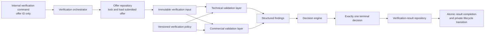
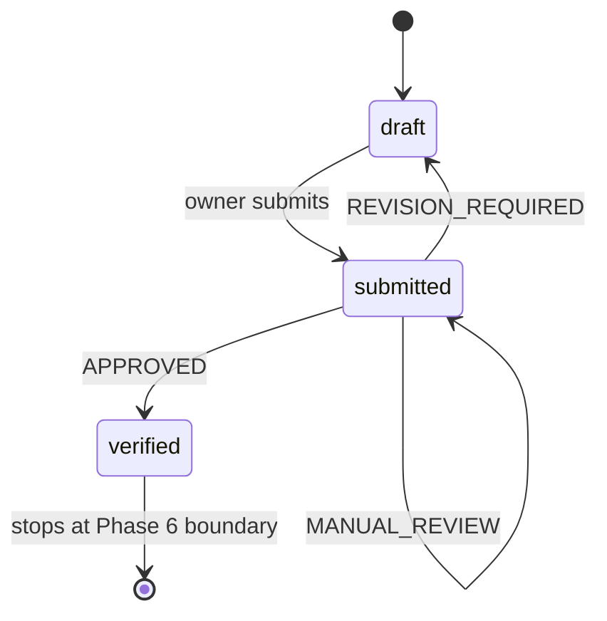
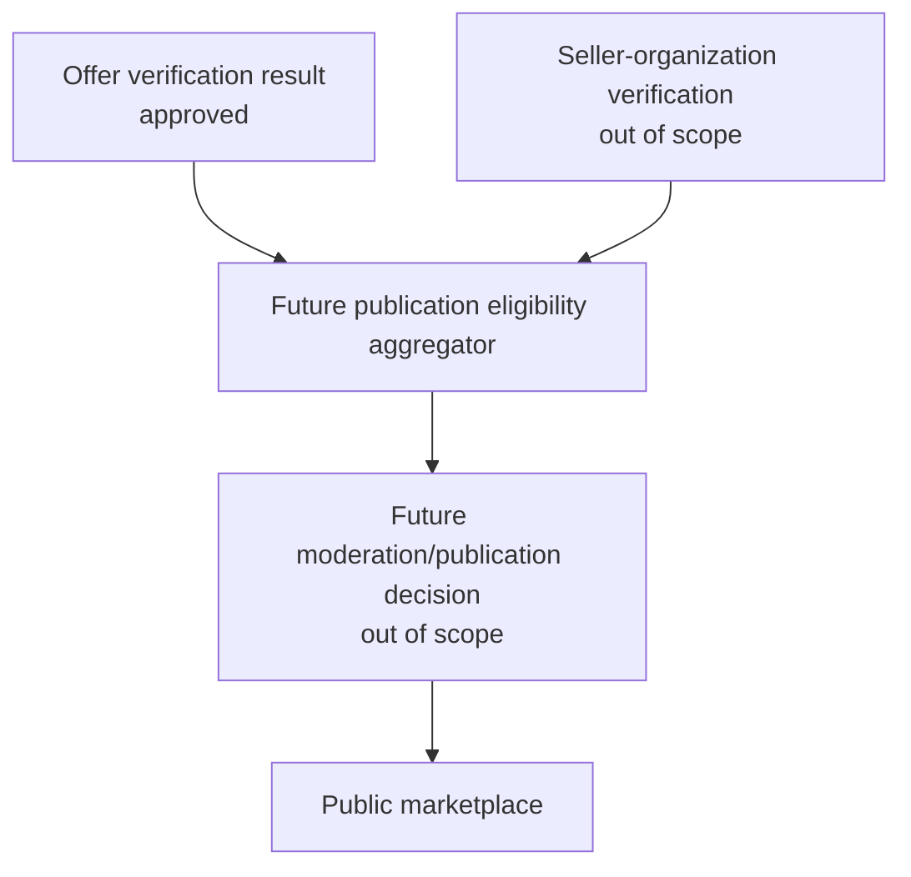

# Phase 6A — Verification Engine Architecture Specification

Date: 2026-07-28

Status: proposed for review; no implementation authorized

Scope: private offer verification only

## 1. Executive decision

Tutela should recover offer verification as a small, isolated business-decision
engine operating only on a private `submitted` offer.

The engine answers one question:

> Is this submitted offer technically and commercially eligible to continue in
> the Tutela workflow?

For each completed verification attempt, it produces exactly one decision:

- `APPROVED`
- `REVISION_REQUIRED`
- `MANUAL_REVIEW`

The decision is persisted independently from the offer lifecycle. The lifecycle
transition caused by the decision is:

- `APPROVED`: `submitted → verified`
- `REVISION_REQUIRED`: `submitted → draft`
- `MANUAL_REVIEW`: `submitted → submitted`

`verified` means only that the offer passed this engine. It does not mean that
the seller organization is trusted, that KYB passed, that the offer is
moderated, that it is public, or that a transaction may proceed.

Phase 6A defines this architecture only. It does not authorize application code,
schema changes, routes, migrations, database writes, or runtime workflow
execution.

## 2. Protected baseline

The specification was prepared from the accepted Phase 5C baseline:

- branch: `recovery/phase-2-runtime-workflows`
- revision: `46d20d6d23402841cd02d833793ae7344b550fa5`
- repository state before this document: clean
- protected database fingerprint:
  `d309afaee7935df8b4e91e42f9f6f6c6e9c646b810640e1683e0512e6777bdbe`
- migration `0008_add_submitted_offer_status`: succeeded
- recovery-owned offers: 0
- sessions: 0

The baseline verification was read-only. No application or database behavior
was changed while preparing this specification.

## 3. Current repository findings

The repository already contains several concepts named “verification,” but none
is the engine defined here.

| Existing concept | Current meaning | Phase 6A decision |
|---|---|---|
| `public.offer_verifications` | Offer-document manifest submitted by a user; supports only `pending` | Preserve unchanged and do not treat as an engine result |
| `public.verification_documents` | User/KYB document workflow | Out of scope |
| `users.verified` | Legacy user Boolean with unproven semantics | Never use as offer-verification evidence |
| `offers.verified` in the current Drizzle model | Legacy/mismatched Boolean expected by marketplace code but absent from the approved legacy database | Do not create, set, or infer it in this phase |
| `offers.seller_org_verified` in the current Drizzle model | Seller-organization proof expected by marketplace code but absent from the approved legacy database | Out of scope |
| `offer_status = submitted` | Private, frozen offer awaiting future platform processing | Sole valid engine input state |
| Public marketplace projection | Strict fail-closed gate requiring authoritative offer and seller-organization proof | Remains unchanged and empty |
| AI validation services | Optional/generated analysis with different semantics | Never call from this engine |

The existing `offer_verifications` table cannot safely be expanded by silently
changing its meaning. It stores documents, notes, a submitter, and a single
`pending` status. It has no engine version, policy version, structured reasons,
terminal decision, input snapshot, start/completion timestamps, or decision
constraints. Reusing it as the engine result would conflate evidence submission
with an authoritative platform decision.

The recovered engine therefore requires a separately named result history.
The existing table remains isolated until a later, explicitly approved evidence
workflow determines its future.

## 4. Boundaries

### 4.1 In scope

The engine may validate only:

- required offer fields;
- stored schema consistency;
- offer type;
- commodity identity and supported-commodity policy;
- quantity;
- unit;
- price per unit;
- currency;
- location presence;
- validity date;
- current commercial-model policy;
- current marketplace-entry policy that is specifically about the offer's
  technical or commercial integrity.

It may:

- load the authoritative stored submitted offer;
- evaluate deterministic rules;
- produce one terminal decision;
- persist an immutable attempt result;
- execute the approved private lifecycle transition atomically with completion;
- expose a future owner-safe result projection containing only state and reason
  codes.

### 4.2 Explicitly out of scope

The engine must not perform or infer:

- KYB, AML, PEP, sanctions, identity, or beneficial-owner checks;
- seller-organization verification;
- user or account trust;
- document authenticity review;
- moderation;
- public marketplace publication;
- offer activation;
- orders, negotiation, contracts, or trading lifecycle;
- payment, Stripe, escrow, or settlement;
- blockchain actions or external audit publication;
- AI analysis or AI-based decisions;
- email, notifications, or messaging;
- deployment behavior.

The engine must not write any existing business table other than the exact
offer lifecycle transition approved for its decision. It must not update legacy
offers, seed records, backfill evidence, or turn unknown values into positive or
negative proof.

## 5. Architectural principles

1. **Pure decision core.** Validation and decision logic receive an immutable
   offer snapshot, an explicit evaluation time, and a versioned policy. They do
   not read the database, call the network, or mutate state.
2. **Server-owned authority.** Clients may never send a decision, result,
   lifecycle target, engine version, policy version, or reason code.
3. **Fail closed.** Missing authority, ambiguous configuration, unexpected
   errors, and unavailable validation data can never produce `APPROVED`.
4. **One terminal decision.** A completed attempt contains exactly one of the
   three decisions.
5. **Separate state from evidence.** Offer lifecycle describes where the offer
   is. Verification history describes why the engine made a decision.
6. **Immutable history.** A completed result is never edited. A later
   submission creates a new attempt.
7. **Version every decision.** Every attempt records the engine version and the
   policy/ruleset version used.
8. **No publication side effect.** Verification completion has no path to
   `active`, public, published, or marketplace-visible.
9. **Minimal recovery.** The feature is isolated beside the recovered private
   draft/submission flow. It does not redesign generic offers, KYB, or the
   marketplace.

## 6. Component model



Recommended feature boundaries:

- **Contract layer:** decisions, states, reason-code catalog, safe DTOs.
- **Technical rule layer:** schema and field-integrity rules.
- **Commercial rule layer:** versioned platform-policy rules.
- **Decision core:** deterministic finding-to-decision reduction.
- **Orchestrator:** authorization boundary, locking, snapshot creation,
  idempotency, and transaction coordination.
- **Persistence adapter:** verification-attempt history only.

The decision core has no Express, PostgreSQL, Drizzle, authentication, UI, AI,
or marketplace dependency. The orchestrator depends on repository interfaces,
not on generic route storage methods.

## 7. Offer lifecycle



There is deliberately no edge from any state to `active`, `published`, an
order, a contract, a payment, or a blockchain operation.

### 7.1 Lifecycle meanings

| Offer status | Meaning in the recovered workflow | Mutable by owner |
|---|---|---|
| `draft` | Private commercial work in progress | Yes, through existing draft rules |
| `submitted` | Private, frozen, awaiting or undergoing platform verification | No |
| `verified` | Private offer that passed this engine and is eligible for a future, separately approved step | No in Phase 6 |

The proposed `verified` lifecycle value is not the legacy `offers.verified`
Boolean and is not a publication flag.

### 7.2 Transition invariants

- Verification can start only when the stored offer status is exactly
  `submitted`.
- `APPROVED` completion and `submitted → verified` occur in one database
  transaction.
- `REVISION_REQUIRED` completion and `submitted → draft` occur in one database
  transaction.
- `MANUAL_REVIEW` completion leaves status exactly `submitted`.
- If the offer is no longer `submitted` at completion, no transition or result
  completion occurs; the conflict is handled fail-closed.
- A returned draft retains the completed `REVISION_REQUIRED` history.
- Editing and resubmitting a returned draft produces a new verification
  attempt; the previous result is never overwritten.
- No transition copies a verification decision into a user, organization,
  moderation, or publication field.

## 8. Verification state and decision model

### 8.1 External/domain state

The owner-safe verification state is:

```text
not_started
in_progress
approved
revision_required
manual_review
```

- `not_started` is a projection when no attempt exists for the current
  submission.
- `in_progress` means an attempt exists without a terminal decision.
- The remaining three values are terminal results.

### 8.2 Terminal decision

The engine returns exactly one:

```text
APPROVED
REVISION_REQUIRED
MANUAL_REVIEW
```

The persistence representation may use lowercase values, but the mapping must
be one-to-one and exhaustive.

### 8.3 State is not authority for unrelated decisions

- `approved` is authoritative only for offer technical/commercial eligibility.
- `revision_required` means the owner can correct the offer; it is not a fraud,
  trust, or compliance judgment.
- `manual_review` means the automated engine could not safely decide; it is not
  failure or rejection.
- `not_started`, `in_progress`, and missing values are never equivalent to an
  approval or a rejection.

## 9. Validation layers

### 9.1 Authoritative input

The engine loads data from the stored offer and referenced commodity inside the
server boundary. The caller supplies only the offer ID.

The immutable input contains only fields used by the current rules:

- offer ID;
- stored record version (`updated_at` at submission);
- offer type;
- commodity ID, name, and category;
- quantity;
- unit;
- price per unit;
- currency;
- location;
- validity date;
- lifecycle state.

It contains no user profile, password/authentication data, KYB data,
organization trust data, documents, sessions, payment data, or public
marketplace projection.

### 9.2 Technical validation

Technical rules determine whether the stored offer is structurally valid:

- required fields are present;
- offer type is a recognized stored value;
- the commodity reference resolves;
- quantity and price parse exactly at supported database precision and are
  greater than zero;
- unit and currency are non-empty recognized identifiers;
- location is present within the existing storage boundary;
- validity is parseable and, when present, is still in the future;
- the record and referenced data are internally consistent;
- the current offer status is exactly `submitted`.

These rules revalidate authoritative stored data even though draft creation
already validates it. This protects the engine from legacy records, schema
drift, and future write paths.

### 9.3 Commercial validation

Commercial rules apply a versioned policy:

- the commodity is supported by the active Tutela ruleset;
- the offer type is supported by the current commercial model;
- the unit is allowed for the selected commodity;
- the currency is allowed by the current recovery policy;
- other explicitly configured offer-integrity rules pass.

The Phase 5B USD and commodity-unit restrictions may be consumed through the
policy adapter for the first recovery version. They remain a temporary policy,
not a permanent global currency or measurement design.

Commercial validation does not normalize, convert, infer, or replace the
customer's submitted quantity, unit, price, or currency.

## 10. Decision algorithm

Each rule emits zero or more structured findings. A finding contains:

- a stable reason code;
- its validation layer;
- a disposition category:
  `owner_correctable` or `requires_platform_review`.

It contains no human sentence and no client-supplied content.

The decision reduction is deterministic:

1. If any finding requires platform review, return `MANUAL_REVIEW`.
2. Otherwise, if any owner-correctable finding exists, return
   `REVISION_REQUIRED`.
3. Otherwise, return `APPROVED`.

The platform-review precedence is intentional. When the engine lacks authority
or encounters ambiguity, it must not imply that editing the offer alone will
resolve the condition.

Reason codes are deduplicated and sorted in stable catalog order before
persistence. An unexpected exception is converted at the orchestration boundary
to `MANUAL_REVIEW` with `UNKNOWN_VALIDATION_ERROR`; raw exception text is never
persisted or returned.

## 11. Reason-code model

### 11.1 Initial catalog

| Code | Layer | Default disposition | Meaning |
|---|---|---|---|
| `MISSING_REQUIRED_FIELD` | technical | owner correctable | One or more required commercial fields are absent |
| `INVALID_OFFER_TYPE` | technical | owner correctable | Stored offer type is invalid |
| `INVALID_COMMODITY` | technical | owner correctable | Commodity reference is invalid or unresolved |
| `INVALID_QUANTITY` | technical | owner correctable | Quantity is malformed, out of precision, or not positive |
| `INVALID_UNIT` | technical | owner correctable | Unit identifier is malformed or unknown |
| `INVALID_PRICE` | technical | owner correctable | Price is malformed, out of precision, or not positive |
| `INVALID_CURRENCY` | technical | owner correctable | Currency identifier is malformed or unknown |
| `INVALID_LOCATION` | technical | owner correctable | Required commercial location is absent or invalid |
| `INVALID_VALIDITY` | technical | owner correctable | Validity value cannot be interpreted |
| `EXPIRED_VALIDITY` | technical | owner correctable | Offer validity has expired |
| `SCHEMA_INCONSISTENCY` | technical | platform review | Stored data contradicts required schema invariants |
| `UNSUPPORTED_COMMODITY` | commercial | owner correctable | Valid commodity is not supported by the active ruleset |
| `UNSUPPORTED_COMMERCIAL_MODEL` | commercial | owner correctable | Offer type/model is not supported by the active ruleset |
| `UNIT_NOT_ALLOWED_FOR_COMMODITY` | commercial | owner correctable | Unit is valid but not allowed for this commodity by the active ruleset |
| `CURRENCY_NOT_ALLOWED_BY_CURRENT_POLICY` | commercial | owner correctable | Currency is valid but not accepted by the active temporary policy |
| `COMMERCIAL_POLICY_FAILED` | commercial | owner correctable | A cataloged commercial rule failed without a more specific public code |
| `POLICY_CONFIGURATION_UNAVAILABLE` | commercial | platform review | The required versioned policy cannot be loaded safely |
| `VALIDATION_DATA_UNAVAILABLE` | technical/commercial | platform review | Required authoritative reference data is temporarily unavailable |
| `OFFER_STATE_CONFLICT` | orchestration | platform review | Offer state/version changed during verification |
| `UNKNOWN_VALIDATION_ERROR` | orchestration | platform review | Fail-closed fallback for an unexpected internal error |

### 11.2 Code rules

- Codes are stable machine identifiers, never localized sentences.
- Human copy is mapped in the UI from a versioned localization catalog.
- Codes contain no submitted value, PII, document path, internal exception, or
  moderation/KYB detail.
- New codes are additive and reviewed with their default disposition.
- Renaming or reinterpreting an existing code is a breaking contract change.
- `APPROVED` requires an empty reason-code list.
- `REVISION_REQUIRED` and `MANUAL_REVIEW` require at least one reason code.
- The generic `COMMERCIAL_POLICY_FAILED` and `UNKNOWN_VALIDATION_ERROR` codes
  are fallbacks, not substitutes for a known specific code.

## 12. Persistence model

### 12.1 Separate engine history

The recommended new relation is `offer_verification_runs`. It is separate from
the existing `offer_verifications` document-submission table.

Proposed fields:

| Field | Purpose |
|---|---|
| `id` | Immutable attempt identifier |
| `offer_id` | Restricted foreign key to the offer |
| `submitted_record_version` | The offer's stored `updated_at` value at verification start |
| `input_snapshot` | Internal JSON snapshot containing only evaluated commercial fields |
| `input_fingerprint` | SHA-256 of canonicalized snapshot data |
| `run_state` | `in_progress` or `completed` |
| `decision` | Nullable while running; otherwise one terminal decision |
| `reason_codes` | Ordered machine-readable code array |
| `engine_version` | Immutable engine implementation identifier |
| `policy_version` | Immutable policy/ruleset identifier or content hash |
| `started_at` | Time evaluation started |
| `completed_at` | Time terminal decision was persisted |
| `created_at` | Database record creation time |

All timestamps should be timezone-aware. The snapshot stores original evaluated
values; it does not store user, authentication, KYB, organization, payment, or
document data.

### 12.2 Constraints

The schema must enforce:

- `run_state` is only `in_progress` or `completed`;
- `decision` is only `approved`, `revision_required`, or `manual_review`;
- an in-progress row has no decision and no completion timestamp;
- a completed row has exactly one decision and a completion timestamp;
- approved rows have no reason codes;
- revision/manual-review rows have one or more cataloged reason codes;
- at most one in-progress attempt exists per offer;
- the same submitted record version, engine version, and policy version cannot
  create duplicate attempts;
- deletion of an offer with verification history is restricted, not cascaded;
- a completed result cannot be modified through the application repository.

### 12.3 Why a snapshot is required

`REVISION_REQUIRED` returns the offer to an editable draft. Without an immutable
snapshot, later edits would erase the exact input that produced the historical
decision. The snapshot is therefore business-decision evidence, not a
publication DTO.

### 12.4 Existing table isolation

`offer_verifications` remains untouched. No migration should:

- rename it;
- copy its pending rows into engine results;
- reinterpret `pending` as `in_progress`;
- treat document existence as proof;
- infer a decision from its notes or submitter.

If an evidence workflow is recovered later, it may reference an engine attempt
through a separately approved model.

## 13. Transaction, concurrency, and idempotency

### 13.1 Start

The orchestrator:

1. begins a transaction;
2. locks the offer row;
3. requires exact status `submitted`;
4. loads the referenced commodity;
5. creates the canonical snapshot and fingerprint;
6. returns an existing attempt for the same submitted record and versions, or
   creates one `in_progress` attempt;
7. commits.

No owner or client payload contributes verification authority.

### 13.2 Evaluate

The pure engine evaluates the immutable snapshot using the recorded policy
version and an injected evaluation timestamp.

### 13.3 Complete

The orchestrator:

1. begins a new transaction;
2. locks both the attempt and offer;
3. confirms the attempt is still `in_progress`;
4. confirms the offer is still the same submitted record version;
5. writes the terminal decision, sorted reason codes, and completion time;
6. applies the matching private lifecycle transition;
7. commits both changes atomically.

If the state/version check fails, the orchestrator does not approve or move the
offer. It completes only through a separately defined fail-closed conflict
path; raw concurrency errors are not exposed.

### 13.4 Interrupted attempts

An interrupted attempt remains `in_progress`; it is never interpreted as
approved. Recovery of stale attempts must be an internal, idempotent operation
that either retries the exact stored snapshot and versions or completes
`MANUAL_REVIEW` with a cataloged reason. The timeout and retry policy must be
approved with implementation; no background worker is introduced by this
specification.

## 14. Trigger and API boundary

The engine is invoked through an internal application command accepting an
offer ID only. Its domain architecture is transport-neutral: the command can
later be called after successful submission or by a worker without changing
the rule engine.

Phase 6A does not authorize either transport.

Any later HTTP integration must satisfy all of the following:

- authenticated server-side workflow only;
- no body fields that select or influence a decision;
- no public or anonymous verification route;
- no reuse of the current document-submission
  `POST /api/offers/:offerId/verify` route as the engine;
- ownership-safe reads that expose only the current state, safe reason codes,
  and safe timestamps;
- generic not-found behavior for another owner's offer;
- no raw attempt snapshot, policy internals, stack traces, documents, user
  object, or organization/KYB data in a response.

The existing document-submission route remains blocked during controlled
recovery and requires its own future authorization review.

## 15. Configuration boundary

Commercial rules are supplied through an explicit immutable
`OfferVerificationPolicy` contract. Its first version should define:

- supported offer types;
- supported commodities;
- commodity-specific accepted units;
- currently accepted currencies;
- required/optional validity behavior;
- rule-to-reason-code mapping;
- rules that require manual review;
- a stable policy version.

The initial adapter may reuse the Phase 5B commodity/unit catalog and temporary
USD rule. The engine must not import UI constants or duplicate that list.

Policy requirements:

- configuration is validated at process startup or policy-load time;
- invalid or missing configuration fails closed;
- a policy version is immutable after use;
- every result records the exact policy version;
- policy changes are code/config review events, not ad hoc database edits;
- the boundary can later consume a governed database ruleset without changing
  the engine contract;
- no name, type, or documentation may imply that USD or today's unit catalog is
  Tutela's permanent global model.

The future “Flexible Commercial Measurement and Currency Layer” remains a
separate product capability. When introduced, it can provide preserved original
values and canonical comparison values to the policy without changing decision
or persistence semantics.

## 16. Marketplace relationship

The verification engine and public marketplace remain separate.



An `APPROVED` result may become one authoritative input to the existing
two-proof marketplace policy in a future approved phase. It is never sufficient
on its own.

Phase 6 must not:

- set or introduce legacy marketplace Booleans as shortcuts;
- query `users.verified`;
- set status `active`;
- call the public marketplace repository;
- change public DTOs or empty-state behavior;
- publish any legacy or recovery offer.

The expected public marketplace result remains HTTP 200 with zero published
offers until both authoritative proofs and a separately approved publication
workflow exist.

## 17. Security and privacy

- Only server-side stored data is evaluated.
- Decision inputs are allowlisted; unknown fields are rejected at boundaries.
- Clients cannot set reason codes, engine state, lifecycle state, or versions.
- The engine never loads password hashes, authentication providers, sessions,
  identity-provider IDs, user contact data, KYB data, documents, payment data,
  or secrets.
- Input snapshots are internal and never included in public or owner DTOs.
- Database permissions should allow the application persistence adapter to
  create attempts and complete only permitted fields; administrative access is
  not assumed.
- Logs contain attempt ID, offer ID, state, decision code, and versions only.
  They contain no full snapshot, submitted values, raw exceptions, connection
  strings, secrets, or personal data.
- Unexpected errors are redacted and mapped to
  `UNKNOWN_VALIDATION_ERROR`.
- Manual review does not grant a user or administrator any authority until a
  separate RBAC and review workflow is approved.
- Engine approval is not authorization to view, trade, contract, pay, or
  publish.

## 18. Observability and local auditability

The persistence record is the authoritative local audit history. Minimum
observable events are:

- verification started;
- verification completed;
- terminal decision;
- reason codes;
- engine version;
- policy version;
- start and completion timestamps.

Metrics may later count attempts and decision outcomes without offer content or
personal identifiers. External monitoring, blockchain anchoring, third-party
audit services, notifications, and AI telemetry are excluded.

## 19. Future extension points

The architecture permits future features without inserting them into the core
decision:

| Future capability | Extension boundary |
|---|---|
| Human review | Separate review service consumes `MANUAL_REVIEW`; it records its own authority and never edits the engine's completed result |
| KYB/compliance | Separate downstream eligibility source; never a technical/commercial engine rule |
| Seller-organization trust | Separate authoritative organization-verification source |
| Risk scoring | Advisory or separately governed downstream input |
| AI analysis | Optional advisory finding provider only after explicit approval; never silently authoritative |
| Marketplace rules | Publication eligibility aggregator requiring offer and organization proof |
| Flexible currencies/units | Versioned measurement/currency service behind the commercial policy adapter |
| Workflow automation | Internal command transport or worker using the same idempotent orchestrator |
| External audit/blockchain | Optional downstream export of completed immutable records after explicit approval |

These are extension seams, not Phase 6A or Phase 6 implementation work.

## 20. Proposed implementation sequence after approval

Approval of this specification would allow a separately bounded Phase 6B plan,
not automatic implementation.

The minimum safe sequence would be:

1. add shared decision, state, reason-code, and policy contracts;
2. add pure technical/commercial rules and deterministic decision tests;
3. design and rehearse an additive migration for:
   - the private `verified` lifecycle enum value;
   - `offer_verification_runs`;
   - required constraints and indexes;
4. add the persistence adapter and transaction/concurrency tests;
5. add the internal orchestrator with fail-closed error handling;
6. add owner-safe characterization without a public marketplace integration;
7. run controlled runtime verification using one recovery-owned temporary
   offer;
8. remove the exact temporary record and confirm protected-data invariance;
9. run the full recovery regression suite, `npm run check`, and
   `npm run build`;
10. stop before manual review, KYB, moderation, or marketplace publication.

The schema migration and lifecycle behavior require explicit approval before
Phase 6B writes or implementation begin.

## 21. Acceptance criteria for a later implementation

A Phase 6 implementation is complete only when tests prove:

- only a stored `submitted` offer can enter the engine;
- the client cannot influence any decision authority;
- every completed attempt has exactly one terminal decision;
- technical and commercial rules are deterministic and versioned;
- unknown/error conditions cannot approve;
- `APPROVED` moves only to private `verified`;
- `REVISION_REQUIRED` returns only to private editable `draft`;
- `MANUAL_REVIEW` remains private `submitted`;
- result persistence and lifecycle transition are atomic;
- completed history remains immutable across revisions and resubmissions;
- duplicate/concurrent execution cannot create contradictory decisions;
- no KYB, organization, moderation, payment, contract, blockchain, AI, email,
  or notification side effect occurs;
- no public marketplace response changes;
- legacy users and offers remain unchanged;
- temporary recovery data is removed exactly;
- protected fingerprints, sessions, and migration journal remain controlled;
- repository checks and production build pass.

## 22. Approval boundary

This document intentionally stops before implementation.

Approval is required before:

- adding `verified` to the database offer-status enum;
- creating `offer_verification_runs`;
- changing the private offer lifecycle;
- adding a trigger or route for verification;
- executing any runtime verification;
- writing any offer or verification record.

Marketplace publication, organization verification, KYB, human-review
authority, moderation, notifications, contracts, payments, blockchain, AI, and
deployment remain outside this approval boundary even after Phase 6A is
accepted.
