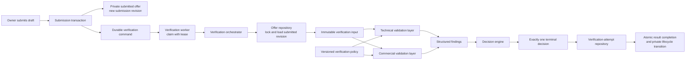
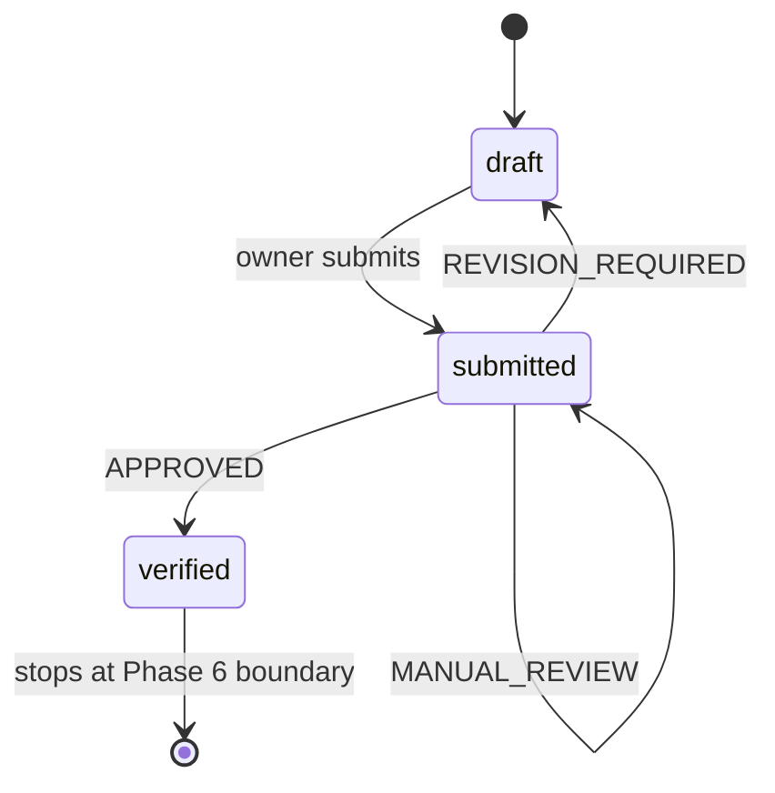
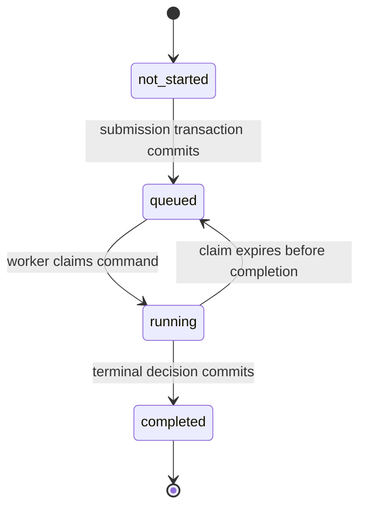
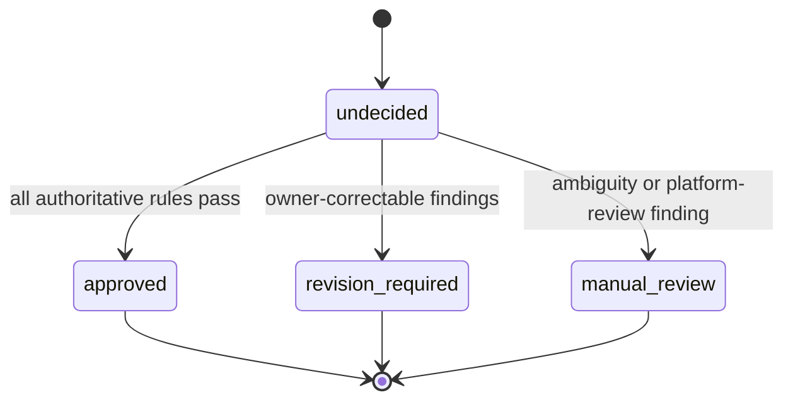
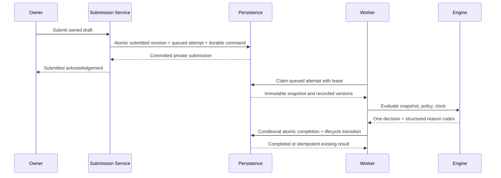
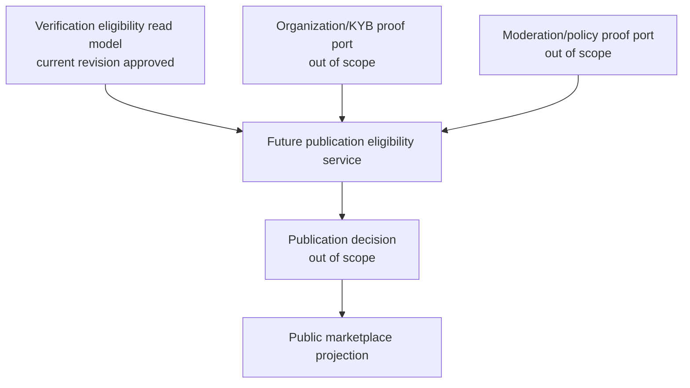
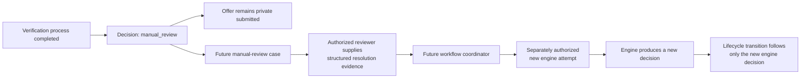

# Phase 6A — Verification Engine Architecture Specification

Date: 2026-07-28

Status: proposed for review; no implementation authorized

Scope: private offer verification only

## 1. Executive decision

Tutela should recover offer verification as a small, isolated business-decision
engine operating only on a private `submitted` offer.

The engine answers one question:

> Is this submitted offer technically and commercially eligible to continue in
> the Tutela workflow?

For each completed verification attempt, it produces exactly one decision:

- `APPROVED`
- `REVISION_REQUIRED`
- `MANUAL_REVIEW`

The decision is persisted independently from the offer lifecycle. The lifecycle
transition caused by the decision is:

- `APPROVED`: `submitted → verified`
- `REVISION_REQUIRED`: `submitted → draft`
- `MANUAL_REVIEW`: `submitted → submitted`

`verified` means only that the offer passed this engine. It does not mean that
the seller organization is trusted, that KYB passed, that the offer is
moderated, that it is public, or that a transaction may proceed.

Phase 6A defines this architecture only. It does not authorize application code,
schema changes, routes, migrations, database writes, or runtime workflow
execution.

## 2. Protected baseline

The specification was prepared from the accepted Phase 5C baseline:

- branch: `recovery/phase-2-runtime-workflows`
- revision: `46d20d6d23402841cd02d833793ae7344b550fa5`
- repository state before this document: clean
- protected database fingerprint:
  `d309afaee7935df8b4e91e42f9f6f6c6e9c646b810640e1683e0512e6777bdbe`
- migration `0008_add_submitted_offer_status`: succeeded
- recovery-owned offers: 0
- sessions: 0

The baseline verification was read-only. No application or database behavior
was changed while preparing this specification.

## 3. Current repository findings

The repository already contains several concepts named “verification,” but none
is the engine defined here.

| Existing concept | Current meaning | Phase 6A decision |
|---|---|---|
| `public.offer_verifications` | Offer-document manifest submitted by a user; supports only `pending` | Preserve unchanged and do not treat as an engine result |
| `public.verification_documents` | User/KYB document workflow | Out of scope |
| `users.verified` | Legacy user Boolean with unproven semantics | Never use as offer-verification evidence |
| `offers.verified` in the current Drizzle model | Legacy/mismatched Boolean expected by marketplace code but absent from the approved legacy database | Do not create, set, or infer it in this phase |
| `offers.seller_org_verified` in the current Drizzle model | Seller-organization proof expected by marketplace code but absent from the approved legacy database | Out of scope |
| `offer_status = submitted` | Private, frozen offer awaiting future platform processing | Sole valid engine input state |
| Public marketplace projection | Strict fail-closed gate requiring authoritative offer and seller-organization proof | Remains unchanged and empty |
| AI validation services | Optional/generated analysis with different semantics | Never call from this engine |

The existing `offer_verifications` table cannot safely be expanded by silently
changing its meaning. It stores documents, notes, a submitter, and a single
`pending` status. It has no engine version, policy version, structured reasons,
terminal decision, input snapshot, start/completion timestamps, or decision
constraints. Reusing it as the engine result would conflate evidence submission
with an authoritative platform decision.

The recovered engine therefore requires a separately named result history.
The existing table remains isolated until a later, explicitly approved evidence
workflow determines its future.

## 4. Boundaries

### 4.1 In scope

The engine may validate only:

- required offer fields;
- stored schema consistency;
- offer type;
- commodity identity and supported-commodity policy;
- quantity;
- unit;
- price per unit;
- currency;
- location presence;
- validity date;
- current commercial-model policy;
- current marketplace-entry policy that is specifically about the offer's
  technical or commercial integrity.

It may:

- load the authoritative stored submitted offer;
- evaluate deterministic rules;
- produce one terminal decision;
- persist an immutable attempt result;
- execute the approved private lifecycle transition atomically with completion;
- expose a future owner-safe result projection containing only state and reason
  codes.

### 4.2 Explicitly out of scope

The engine must not perform or infer:

- KYB, AML, PEP, sanctions, identity, or beneficial-owner checks;
- seller-organization verification;
- user or account trust;
- document authenticity review;
- moderation;
- public marketplace publication;
- offer activation;
- orders, negotiation, contracts, or trading lifecycle;
- payment, Stripe, escrow, or settlement;
- blockchain actions or external audit publication;
- AI analysis or AI-based decisions;
- email, notifications, or messaging;
- deployment behavior.

The engine must not write any existing business table other than the exact
offer lifecycle transition approved for its decision. It must not update legacy
offers, seed records, backfill evidence, or turn unknown values into positive or
negative proof.

## 5. Architectural principles

1. **Pure decision core.** Validation and decision logic receive an immutable
   offer snapshot, an explicit evaluation time, and a versioned policy. They do
   not read the database, call the network, or mutate state.
2. **Server-owned authority.** Clients may never send a decision, result,
   lifecycle target, engine version, policy version, or reason code.
3. **Fail closed.** Missing authority, ambiguous configuration, unexpected
   errors, and unavailable validation data can never produce `APPROVED`.
4. **One terminal decision.** A completed attempt contains exactly one of the
   three decisions.
5. **Separate state from evidence.** Offer lifecycle describes where the offer
   is. Verification history describes why the engine made a decision.
6. **Immutable history.** A completed result is never edited. A later
   submission creates a new attempt.
7. **Version every decision.** Every attempt records the engine version and the
   policy/ruleset version used.
8. **No publication side effect.** Verification completion has no path to
   `active`, public, published, or marketplace-visible.
9. **Minimal recovery.** The feature is isolated beside the recovered private
   draft/submission flow. It does not redesign generic offers, KYB, or the
   marketplace.

## 6. Resolved architecture decisions

The following decisions are authoritative for the proposed architecture:

| Question | Architecture decision |
|---|---|
| Who starts verification? | Tutela starts it automatically after a successful owner submission. The submission transaction creates a durable, platform-owned verification command for the new submission revision. |
| Does the HTTP request execute the engine? | No. Submission records the private `submitted` state and durable command. A worker claims that command as soon as possible. The request does not run policy rules or choose an outcome. |
| Can an administrator start ordinary verification? | No. An administrator is not the initiator and cannot select or override an engine decision. A future manual-review authority is a separate service and permission model. |
| What does a scheduler do? | It only wakes the worker and recovers expired claims. It does not create business authority or make decisions. |
| Can a future workflow engine start it? | Yes, through the same internal `VerificationTrigger` port and idempotency key. It replaces transport/orchestration, not engine rules. |
| Can verification execute twice? | Physical delivery and evaluation may retry. Only one logical attempt can complete for a given submission revision and attempt sequence. A new business attempt is created after correction and resubmission. |
| How is concurrency prevented? | Durable idempotency key, unique database constraints, one active attempt per submission revision, row locking, worker claim/lease tokens, and compare-and-set completion. |
| Are attempts immutable? | Attempt identity, input snapshot, submission revision, engine version, and policy version are immutable from creation. A terminal decision is write-once. After completion, the entire attempt is immutable. |
| How is history preserved after return to draft? | `REVISION_REQUIRED` completes and preserves its attempt before the offer returns to `draft`. Edits create no rewrite; the next submission increments the submission revision and creates a new attempt. |
| How is the current result identified? | It is the highest attempt sequence for the offer's current submission revision. It is derived by key, never by mutating historical rows or trusting chronological order alone. |
| How are process and decision separated? | Process is `not_started → queued → running → completed`. Decision is absent until completion, then exactly one of `approved`, `revision_required`, or `manual_review`. |
| How does KYB integrate? | A downstream eligibility coordinator consumes separate offer-verification and KYB/organization proofs. KYB is never a rule or dependency of this engine. |
| How does AI integrate? | A separate advisory provider may attach non-authoritative recommendations. The deterministic engine contract and decision catalog do not change. |
| How does publication integrate? | A publication-eligibility service consumes a stable verification read model plus other independent proofs. It does not query engine tables or infer approval from offer status. |

No scheduler, worker, outbox, trigger, administrator workflow, or schema object
is created in Phase 6A. These are design decisions for a later approved
implementation.

## 7. Component model



Recommended feature boundaries:

- **Contract layer:** decisions, states, reason-code catalog, safe DTOs.
- **Technical rule layer:** schema and field-integrity rules.
- **Commercial rule layer:** versioned platform-policy rules.
- **Decision core:** deterministic finding-to-decision reduction.
- **Trigger port:** creates one durable command for each submission revision.
- **Worker adapter:** claims commands, renews leases, and retries delivery.
- **Orchestrator:** authorization boundary, locking, snapshot creation,
  idempotency, and transaction coordination.
- **Persistence adapter:** verification-attempt and append-only event history.
- **Eligibility read-model port:** exposes a stable, minimal result to future
  downstream workflow consumers without exposing persistence tables.

The decision core has no Express, PostgreSQL, Drizzle, authentication, UI, AI,
or marketplace dependency. The orchestrator depends on repository interfaces,
not on generic route storage methods.

## 8. Offer lifecycle



There is deliberately no edge from any state to `active`, `published`, an
order, a contract, a payment, or a blockchain operation.

### 8.1 Lifecycle meanings

| Offer status | Meaning in the recovered workflow | Mutable by owner |
|---|---|---|
| `draft` | Private commercial work in progress | Yes, through existing draft rules |
| `submitted` | Private, frozen, awaiting or undergoing platform verification | No |
| `verified` | Private offer that passed this engine and is eligible for a future, separately approved step | No in Phase 6 |

The proposed `verified` lifecycle value is not the legacy `offers.verified`
Boolean and is not a publication flag.

### 8.2 Transition invariants

- Verification can start only when the stored offer status is exactly
  `submitted`.
- `APPROVED` completion and `submitted → verified` occur in one database
  transaction.
- `REVISION_REQUIRED` completion and `submitted → draft` occur in one database
  transaction.
- `MANUAL_REVIEW` completion leaves status exactly `submitted`.
- If the offer is no longer `submitted` at completion, no transition or result
  completion occurs; the conflict is handled fail-closed.
- A returned draft retains the completed `REVISION_REQUIRED` history.
- Editing and resubmitting a returned draft produces a new verification
  attempt; the previous result is never overwritten.
- No transition copies a verification decision into a user, organization,
  moderation, or publication field.

### 8.3 Complete lifecycle transition matrix

| From | Trigger | Required authority/evidence | To | Allowed |
|---|---|---|---|---|
| `draft` | owner submits | Authenticated owner; current editable revision passes submission validation | `submitted` | Yes; queues verification |
| `submitted` | engine completes | Current attempt decision `approved` | `verified` | Yes |
| `submitted` | engine completes | Current attempt decision `revision_required` | `draft` | Yes |
| `submitted` | engine completes | Current attempt decision `manual_review` | `submitted` | Yes; no lifecycle mutation |
| `draft` | engine starts/completes | Any | unchanged | No |
| `verified` | automatic engine retry | Any | unchanged | No; completed attempt is immutable |
| any | administrator chooses engine result | Administrator action alone | unchanged | No |
| any | queued/running process state | No terminal decision | unchanged | No |
| any | missing/stale historical result | Not current submission revision | unchanged | No |
| any | engine approval alone | No independent publication proofs | `active`/public | No |

Human-review resolutions, withdrawal, rejection, re-verification of a verified
offer, moderation, and publication transitions require separate future
business decisions and are not present in the engine lifecycle.

## 9. Verification process and decision model

### 9.1 Verification process state

Verification process and verification decision are two independent axes.

The process state is:

```text
not_started
queued
running
completed
```

- `not_started` is a projection when no attempt exists for the current
  submission.
- `queued` means the submission transaction created a durable attempt/command
  that has not yet been claimed.
- `running` means a worker holds a valid claim and is evaluating the immutable
  attempt input.
- `completed` means one terminal decision was persisted. It does not describe
  which decision.



Claim expiry returns the same logical attempt to `queued`; it does not create a
new business attempt or clear prior immutable events.

### 9.2 Verification decision

Decision is absent while the process is `not_started`, `queued`, or `running`.
On `completed`, the engine has exactly one decision:

```text
approved
revision_required
manual_review
```

Domain constants may use uppercase names. The mapping is one-to-one and
exhaustive.



### 9.3 Process/decision invariants

- Process state never encodes a decision.
- Decision never encodes whether work is queued or running.
- `completed` requires exactly one decision.
- `not_started`, `queued`, and `running` require no decision.
- `approved` is authoritative only for offer technical/commercial eligibility.
- `revision_required` means the owner can correct the offer; it is not a fraud,
  trust, or compliance judgment.
- `manual_review` means the automated engine could not safely decide; it is not
  failure or rejection.
- `not_started`, `queued`, `running`, and missing values are never equivalent to an
  approval or a rejection.

### 9.4 Complete process transition matrix

| From | Event | To | Creates a new logical attempt |
|---|---|---|---|
| `not_started` | successful submission transaction | `queued` | Yes |
| `queued` | valid worker claim | `running` | No |
| `running` | terminal completion transaction | `completed` | No |
| `running` | lease expiry and recovery | `queued` | No |
| `queued` | duplicate durable delivery | `queued` | No |
| `completed` | duplicate delivery or retry | `completed` | No |
| `completed` | corrected draft is resubmitted | new attempt `queued` on a new submission revision | Yes |

No process transition changes a terminal decision. No decision transition
changes a completed attempt.

## 10. Validation layers

### 10.1 Authoritative input

The engine loads data from the stored offer and referenced commodity inside the
server boundary. The caller supplies only the offer ID.

The immutable input contains only fields used by the current rules:

- offer ID;
- stored record version (`updated_at` at submission);
- offer type;
- commodity ID, name, and category;
- quantity;
- unit;
- price per unit;
- currency;
- location;
- validity date;
- lifecycle state.

It contains no user profile, password/authentication data, KYB data,
organization trust data, documents, sessions, payment data, or public
marketplace projection.

### 10.2 Technical validation

Technical rules determine whether the stored offer is structurally valid:

- required fields are present;
- offer type is a recognized stored value;
- the commodity reference resolves;
- quantity and price parse exactly at supported database precision and are
  greater than zero;
- unit and currency are non-empty recognized identifiers;
- location is present within the existing storage boundary;
- validity is parseable and, when present, is still in the future;
- the record and referenced data are internally consistent;
- the current offer status is exactly `submitted`.

These rules revalidate authoritative stored data even though draft creation
already validates it. This protects the engine from legacy records, schema
drift, and future write paths.

### 10.3 Commercial validation

Commercial rules apply a versioned policy:

- the commodity is supported by the active Tutela ruleset;
- the offer type is supported by the current commercial model;
- the unit is allowed for the selected commodity;
- the currency is allowed by the current recovery policy;
- other explicitly configured offer-integrity rules pass.

The Phase 5B USD and commodity-unit restrictions may be consumed through the
policy adapter for the first recovery version. They remain a temporary policy,
not a permanent global currency or measurement design.

Commercial validation does not normalize, convert, infer, or replace the
customer's submitted quantity, unit, price, or currency.

## 11. Decision algorithm

Each rule emits zero or more structured findings. A finding contains:

- a stable reason code;
- its validation layer;
- a disposition category:
  `owner_correctable` or `requires_platform_review`.

It contains no human sentence and no client-supplied content.

The decision reduction is deterministic:

1. If any finding requires platform review, return `MANUAL_REVIEW`.
2. Otherwise, if any owner-correctable finding exists, return
   `REVISION_REQUIRED`.
3. Otherwise, return `APPROVED`.

The platform-review precedence is intentional. When the engine lacks authority
or encounters ambiguity, it must not imply that editing the offer alone will
resolve the condition.

Reason codes are deduplicated and sorted in stable catalog order before
persistence. An unexpected exception is converted at the orchestration boundary
to `MANUAL_REVIEW` with `UNKNOWN_VALIDATION_ERROR`; raw exception text is never
persisted or returned.

## 12. Reason-code model

### 12.1 Initial catalog

| Code | Layer | Default disposition | Meaning |
|---|---|---|---|
| `MISSING_REQUIRED_FIELD` | technical | owner correctable | One or more required commercial fields are absent |
| `INVALID_OFFER_TYPE` | technical | owner correctable | Stored offer type is invalid |
| `INVALID_COMMODITY` | technical | owner correctable | Commodity reference is invalid or unresolved |
| `INVALID_QUANTITY` | technical | owner correctable | Quantity is malformed, out of precision, or not positive |
| `INVALID_UNIT` | technical | owner correctable | Unit identifier is malformed or unknown |
| `INVALID_PRICE` | technical | owner correctable | Price is malformed, out of precision, or not positive |
| `INVALID_CURRENCY` | technical | owner correctable | Currency identifier is malformed or unknown |
| `INVALID_LOCATION` | technical | owner correctable | Required commercial location is absent or invalid |
| `INVALID_VALIDITY` | technical | owner correctable | Validity value cannot be interpreted |
| `EXPIRED_VALIDITY` | technical | owner correctable | Offer validity has expired |
| `SCHEMA_INCONSISTENCY` | technical | platform review | Stored data contradicts required schema invariants |
| `UNSUPPORTED_COMMODITY` | commercial | owner correctable | Valid commodity is not supported by the active ruleset |
| `UNSUPPORTED_COMMERCIAL_MODEL` | commercial | owner correctable | Offer type/model is not supported by the active ruleset |
| `UNIT_NOT_ALLOWED_FOR_COMMODITY` | commercial | owner correctable | Unit is valid but not allowed for this commodity by the active ruleset |
| `CURRENCY_NOT_ALLOWED_BY_CURRENT_POLICY` | commercial | owner correctable | Currency is valid but not accepted by the active temporary policy |
| `COMMERCIAL_POLICY_FAILED` | commercial | owner correctable | A cataloged commercial rule failed without a more specific public code |
| `POLICY_CONFIGURATION_UNAVAILABLE` | commercial | platform review | The required versioned policy cannot be loaded safely |
| `VALIDATION_DATA_UNAVAILABLE` | technical/commercial | platform review | Required authoritative reference data is temporarily unavailable |
| `OFFER_STATE_CONFLICT` | orchestration | platform review | Offer state/version changed during verification |
| `UNKNOWN_VALIDATION_ERROR` | orchestration | platform review | Fail-closed fallback for an unexpected internal error |

### 12.2 Code rules

- Codes are stable machine identifiers, never localized sentences.
- Human copy is mapped in the UI from a versioned localization catalog.
- Codes contain no submitted value, PII, document path, internal exception, or
  moderation/KYB detail.
- New codes are additive and reviewed with their default disposition.
- Renaming or reinterpreting an existing code is a breaking contract change.
- `APPROVED` requires an empty reason-code list.
- `REVISION_REQUIRED` and `MANUAL_REVIEW` require at least one reason code.
- The generic `COMMERCIAL_POLICY_FAILED` and `UNKNOWN_VALIDATION_ERROR` codes
  are fallbacks, not substitutes for a known specific code.

## 13. Persistence and history model

### 13.1 Separate engine history

The recommended future relation is `offer_verification_attempts`. It is
separate from the existing `offer_verifications` document-submission table.
One row represents one logical evaluation attempt for one immutable submission
revision.

Proposed fields:

| Field | Purpose |
|---|---|
| `id` | Immutable attempt identifier |
| `offer_id` | Restricted foreign key to the offer |
| `submission_revision` | Monotonic offer submission generation; changes only on a new owner submission |
| `attempt_sequence` | Monotonic sequence within a submission revision |
| `idempotency_key` | Stable platform-generated key for command deduplication |
| `submitted_record_version` | The offer's stored record version at verification start |
| `input_snapshot` | Internal JSON snapshot containing only evaluated commercial fields |
| `input_fingerprint` | SHA-256 of canonicalized snapshot data |
| `process_state` | `queued`, `running`, or `completed` |
| `decision` | Nullable while running; otherwise one terminal decision |
| `reason_codes` | Ordered machine-readable code array |
| `engine_version` | Immutable engine implementation identifier |
| `policy_version` | Immutable policy/ruleset identifier or content hash |
| `snapshot_schema_version` | Version of canonical snapshot serialization |
| `claim_token_hash` | Hash of the current worker lease token; never exposed |
| `claim_expires_at` | Expiry used only for retry-safe worker recovery |
| `queued_at` | Time the durable attempt was created |
| `started_at` | Time evaluation started |
| `completed_at` | Time terminal decision was persisted |
| `created_at` | Database record creation time |

All timestamps should be timezone-aware. The snapshot stores original evaluated
values; it does not store user, authentication, KYB, organization, payment, or
document data.

### 13.2 Constraints

The schema must enforce:

- `process_state` is only `queued`, `running`, or `completed`;
- `decision` is only `approved`, `revision_required`, or `manual_review`;
- queued/running rows have no decision and no completion timestamp;
- a completed row has exactly one decision and a completion timestamp;
- approved rows have no reason codes;
- revision/manual-review rows have one or more cataloged reason codes;
- `(offer_id, submission_revision, attempt_sequence)` is unique;
- `idempotency_key` is globally unique;
- at most one non-completed attempt exists per offer submission revision;
- ordinary automatic submission creates only attempt sequence `1`;
- deletion of an offer with verification history is restricted, not cascaded;
- a completed result cannot be modified through the application repository.

### 13.3 Immutability model

An attempt is immutable in two stages:

1. From creation, its identity, offer ID, submission revision, attempt
   sequence, idempotency key, input snapshot/fingerprint, snapshot schema
   version, engine version, and policy version never change.
2. Process/lease fields may advance while work is queued or running. The
   terminal decision, reasons, completion timestamp, and lifecycle transition
   are written exactly once. After completion, no field may change.

A retry after claim expiry reuses the same attempt and immutable snapshot. It
does not create another history row. A correction and resubmission creates a
new submission revision and a new attempt.

### 13.4 Why a snapshot is required

`REVISION_REQUIRED` returns the offer to an editable draft. Without an immutable
snapshot, later edits would erase the exact input that produced the historical
decision. The snapshot is therefore business-decision evidence, not a
publication DTO.

### 13.5 Current versus historical attempt

Chronological “latest” is not sufficient because retries, future explicit
re-evaluations, and old revisions may coexist.

The current applicable attempt is derived as:

1. match `offer_id`;
2. match the offer's current `submission_revision`;
3. choose the greatest `attempt_sequence`;
4. require the stored input fingerprint to match that submission revision.

All attempts for lower submission revisions are historical. They remain
queryable for authorized audit and owner-safe history but cannot control the
current offer.

No historical row receives an `is_latest` or `is_current` mutation. A
repository projection or read model calculates current applicability from
immutable keys.

### 13.6 Append-only process history

An append-only `offer_verification_events` history is recommended so lease
recovery and process transitions are auditable without changing the decision
model.

Each event contains:

- event ID;
- attempt ID;
- event type;
- occurrence timestamp;
- system actor type;
- correlation ID;
- safe structured metadata defined by the event type.

Initial event types:

```text
verification_queued
verification_claimed
verification_claim_expired
verification_completed
```

Events never contain raw submitted values, snapshots, exception messages,
credentials, personal data, or human-authored notes. The attempt row is the
authoritative current process/result projection; the event stream is the
immutable transition history.

### 13.7 Existing table isolation

`offer_verifications` remains untouched. No migration should:

- rename it;
- copy its pending rows into engine results;
- reinterpret `pending` as `queued` or `running`;
- treat document existence as proof;
- infer a decision from its notes or submitter.

If an evidence workflow is recovered later, it may reference an engine attempt
through a separately approved model.

## 14. Transaction, concurrency, and idempotency



### 14.1 Queue

The future submission transaction:

1. locks the owner-controlled draft;
2. validates the exact `draft → submitted` transition;
3. increments the offer's submission revision;
4. creates the immutable verification snapshot and fingerprint;
5. creates attempt sequence `1` in `queued`;
6. creates a durable dispatch/outbox record using the attempt idempotency key;
7. commits the offer, attempt, and durable command atomically.

If the same submission command is retried, the unique idempotency key returns
the existing submission/attempt. No owner or client payload contributes
verification authority.

### 14.2 Claim and evaluate

A worker claims queued work using a short transaction and database-supported
skip-locked semantics. The claim:

- changes `queued → running`;
- assigns a random lease token and expiry;
- appends `verification_claimed`;
- never changes the immutable snapshot or versions.

The worker then evaluates outside the claim transaction. The pure engine uses
only the immutable snapshot, recorded policy version, recorded engine version,
and an injected evaluation timestamp.

Multiple physical workers may receive the same durable command. Only one can
hold the valid claim. Even if duplicate evaluation occurs after a network
timeout, completion is protected by the claim token and compare-and-set
conditions.

### 14.3 Complete

The orchestrator:

1. begins a new transaction;
2. locks both the attempt and offer;
3. confirms the attempt is still `running` under the same unexpired claim;
4. confirms the offer is still `submitted` at the same submission revision and
   record version;
5. conditionally changes the process to `completed`;
6. writes the terminal decision, sorted reason codes, and completion time once;
7. applies the matching private lifecycle transition;
8. appends `verification_completed`;
9. marks the durable command delivered;
10. commits all completion effects atomically.

If the state/version check fails, the orchestrator does not approve or move the
offer. It returns the attempt to a fail-closed recovery path using
`OFFER_STATE_CONFLICT`; raw concurrency errors are not exposed.

### 14.4 Interrupted attempts

An interrupted attempt remains `running` until its claim expires; it is never
interpreted as approved. The recovery worker atomically appends
`verification_claim_expired` and changes the same attempt back to `queued`.

Retry evaluates the exact stored snapshot under the exact stored engine and
policy versions. If those versions cannot be loaded or retry safety cannot be
proven, the attempt completes `MANUAL_REVIEW` with a cataloged reason instead of
approving.

Retry count, lease duration, and dead-letter thresholds belong to worker
configuration. Exhaustion produces `MANUAL_REVIEW`; it does not create a fourth
decision or a process-level `failed` state.

### 14.5 When a second logical attempt is allowed

During the initial recovery design, a second logical attempt is allowed only
after:

```text
revision_required
→ draft correction
→ owner resubmission
→ new submission_revision
→ new attempt_sequence = 1
```

Transport retries are not new attempts.

A future explicit re-evaluation of an unchanged submission could use
`attempt_sequence + 1`, but only through a separately approved policy defining
who may request it, why it is required, and how an already `verified` lifecycle
is handled. Administrators and workers do not receive implicit re-evaluation
authority from this architecture.

## 15. Trigger and API boundary

### 15.1 Authoritative trigger

Successful owner submission is the sole initial business trigger.

The submission application service, not the browser, creates a durable
verification command atomically with the new private submission revision. A
worker begins evaluation as soon as it can claim the command. “Immediately
after submission” therefore means durable asynchronous dispatch, not executing
the engine inside the HTTP request.

This choice provides:

- no lost verification between submission and process crash;
- a fast, deterministic submission response;
- isolated retry behavior;
- no client-selected decision authority;
- a transport-neutral engine.

### 15.2 Non-authoritative actors

- An administrator does not start ordinary automatic verification.
- A scheduled job may scan queued/expired work, but it does not create an
  attempt or decide an outcome.
- A worker transports and executes a recorded command; it does not originate
  business authority.
- A future workflow engine may replace the submission outbox dispatcher by
  invoking the same internal `VerificationTrigger` port with the same
  submission revision and idempotency key.

### 15.3 Internal command

The durable command contains only:

- attempt ID;
- offer ID;
- submission revision;
- idempotency key;
- correlation ID.

The command does not carry commercial values, decision values, reason codes,
user identity data, policy content, secrets, or credentials. The worker reloads
the immutable snapshot by attempt ID.

Phase 6A authorizes none of this runtime transport; it defines the later
implementation boundary only.

Any later HTTP integration must satisfy all of the following:

- authenticated server-side workflow only;
- no body fields that select or influence a decision;
- no public or anonymous verification route;
- no reuse of the current document-submission
  `POST /api/offers/:offerId/verify` route as the engine;
- ownership-safe reads that expose only the current state, safe reason codes,
  and safe timestamps;
- generic not-found behavior for another owner's offer;
- no raw attempt snapshot, policy internals, stack traces, documents, user
  object, or organization/KYB data in a response.

The existing document-submission route remains blocked during controlled
recovery and requires its own future authorization review.

## 16. Configuration boundary

Commercial rules are supplied through an explicit immutable
`OfferVerificationPolicy` contract. Its first version should define:

- supported offer types;
- supported commodities;
- commodity-specific accepted units;
- currently accepted currencies;
- required/optional validity behavior;
- rule-to-reason-code mapping;
- rules that require manual review;
- a stable policy version.

The initial adapter may reuse the Phase 5B commodity/unit catalog and temporary
USD rule. The engine must not import UI constants or duplicate that list.

Policy requirements:

- configuration is validated at process startup or policy-load time;
- invalid or missing configuration fails closed;
- a policy version is immutable after use;
- every result records the exact policy version;
- policy changes are code/config review events, not ad hoc database edits;
- the boundary can later consume a governed database ruleset without changing
  the engine contract;
- no name, type, or documentation may imply that USD or today's unit catalog is
  Tutela's permanent global model.

The future “Flexible Commercial Measurement and Currency Layer” remains a
separate product capability. When introduced, it can provide preserved original
values and canonical comparison values to the policy without changing decision
or persistence semantics.

## 17. Marketplace relationship

The verification engine and public marketplace remain separate.



An `APPROVED` result may become one authoritative input to the existing
two-proof marketplace policy in a future approved phase. It is never sufficient
on its own.

The publication service consumes a stable read model or domain event, not the
verification database table and not the offer lifecycle value:

```text
offer_id
submission_revision
verification_eligibility = eligible | not_eligible | pending
decision
completed_at
engine_version
policy_version
input_fingerprint
```

Only a completed `approved` decision for the current submission revision maps
to `eligible`. Missing, stale, queued, running, revision-required, and
manual-review states map fail-closed to `pending` or `not_eligible` according to
the publication service's separately approved contract.

This anti-corruption/read-model boundary allows publication rules, KYB, and
moderation to evolve without importing the engine repository or changing the
engine.

Phase 6 must not:

- set or introduce legacy marketplace Booleans as shortcuts;
- query `users.verified`;
- set status `active`;
- call the public marketplace repository;
- change public DTOs or empty-state behavior;
- publish any legacy or recovery offer.

The expected public marketplace result remains HTTP 200 with zero published
offers until both authoritative proofs and a separately approved publication
workflow exist.

## 18. Manual-review architecture

`MANUAL_REVIEW` is a completed automated-engine decision. It is not a running
engine state and is not a rejection.



The future manual-review capability is a separate bounded service:

- It consumes the immutable current attempt ID and safe reason codes.
- It creates its own case state, assignment, evidence access, and resolution
  history.
- It has separate RBAC; generic administrator status is not sufficient by
  itself.
- A reviewer cannot edit, replace, or delete the engine's `MANUAL_REVIEW`
  decision.
- A human resolution is stored as a separate authoritative record referencing
  the attempt and submission revision.
- The offer remains `submitted` and private while a case is open.
- A reviewer never moves the offer and never chooses an engine decision.
- A future workflow coordinator validates that resolution evidence applies to
  the current submission revision and may request a separately authorized new
  engine attempt.
- Only the new engine decision may perform the existing
  `submitted → verified`, `submitted → draft`, or no-op transition.
- Stale resolutions for an older submission revision have no effect.
- Reviewer notes, identity, evidence, and moderation data are never copied into
  the verification result or public/owner-safe DTO.

Suggested future manual-review process states are:

```text
open
claimed
resolved
cancelled_as_stale
```

Suggested resolution categories are:

```text
reference_data_resolved
additional_owner_information_needed
unable_to_resolve
```

These resolution categories supply future workflow evidence only. They are not
verification-engine decisions, cannot transition an offer, and are not
authorized for implementation in Phase 6A. Their separation prevents future
human review from forcing a redesign of the deterministic engine.

## 19. Security and privacy

- Only server-side stored data is evaluated.
- Decision inputs are allowlisted; unknown fields are rejected at boundaries.
- Clients cannot set reason codes, engine state, lifecycle state, or versions.
- The engine never loads password hashes, authentication providers, sessions,
  identity-provider IDs, user contact data, KYB data, documents, payment data,
  or secrets.
- Input snapshots are internal and never included in public or owner DTOs.
- Database permissions should allow the application persistence adapter to
  create attempts and complete only permitted fields; administrative access is
  not assumed.
- Logs contain attempt ID, offer ID, state, decision code, and versions only.
  They contain no full snapshot, submitted values, raw exceptions, connection
  strings, secrets, or personal data.
- Unexpected errors are redacted and mapped to
  `UNKNOWN_VALIDATION_ERROR`.
- Manual review does not grant a user or administrator any authority until a
  separate RBAC and review workflow is approved.
- Engine approval is not authorization to view, trade, contract, pay, or
  publish.

## 20. Observability and local auditability

The persistence record is the authoritative local audit history. Minimum
observable events are:

- verification queued;
- worker claim acquired;
- expired claim recovered, when applicable;
- verification completed;
- terminal decision;
- reason codes;
- submission revision and attempt sequence;
- engine version;
- policy version;
- queue, start, and completion timestamps.

Metrics may later count attempts and decision outcomes without offer content or
personal identifiers. External monitoring, blockchain anchoring, third-party
audit services, notifications, and AI telemetry are excluded.

## 21. Future extension points

The following ports are required so later features do not force a redesign:

| Extension point | Stable responsibility |
|---|---|
| `VerificationTrigger` | Accept one platform-owned submission revision and idempotency key |
| `VerificationCommandQueue` | Durable delivery, lease, retry, and acknowledgement |
| `VerificationAttemptRepository` | Attempt identity, immutable snapshot, process state, and write-once decision |
| `VerificationHistoryRepository` | Append-only process events and authorized history projection |
| `OfferSnapshotProvider` | Load and canonicalize only authoritative submitted-offer fields |
| `SnapshotSerializerRegistry` | Read historical snapshot schema versions without rewriting them |
| `VerificationPolicyProvider` | Resolve immutable policy by recorded version |
| `VerificationRuleRegistry` | Add versioned technical/commercial rules without modifying orchestration |
| `ReferenceDataProvider` | Supply governed commodity and commercial reference data |
| `Clock` | Make validity decisions deterministic and testable |
| `ReasonCodeCatalog` | Stable code metadata and disposition without human copy |
| `ReasonLocalizationCatalog` | Map codes to user-facing localized copy outside the engine |
| `ManualReviewPort` | Create a separate case from a completed manual-review decision |
| `AdvisoryAnalysisPort` | Attach non-authoritative AI/risk recommendations without changing decisions |
| `VerificationEligibilityReadModel` | Expose current-revision eligibility to downstream workflow consumers |
| `WorkflowCoordinatorPort` | React to results and later human resolutions without embedding downstream workflows in the engine |
| `OperationalMetricsPort` | Emit privacy-safe counts and timings |
| `AuditExportPort` | Optional future external audit/blockchain export of immutable completed records |
| `CommercialMeasurementPort` | Supply original and normalized values under a future versioned currency/unit model |

### 21.1 Future KYB integration

KYB and organization verification remain separate domains.

The verification engine neither requests nor reads KYB. A future workflow or
publication eligibility service composes independent facts:

```text
current offer verification eligible
AND
current seller-organization proof eligible
AND
any separately approved moderation/publication proof
```

Each fact has its own authority, version, timestamps, expiration, and history.
If KYB is unavailable or stale, the downstream coordinator fails closed; the
offer engine result remains unchanged.

### 21.2 Future AI recommendation integration

AI integrates through `AdvisoryAnalysisPort` after or alongside deterministic
verification:

- AI output is stored separately from the attempt decision.
- It references the same attempt and input fingerprint.
- It cannot emit `approved`, modify reason codes, or transition an offer.
- It may recommend human review or provide reviewer assistance.
- Failure or absence of AI never blocks deterministic approval unless a future
  explicitly versioned policy chooses to convert a governed advisory condition
  into a standard `requires_platform_review` finding.
- Any future authoritative use requires separate business, security, model,
  explainability, and data-handling approval; the decision engine interface
  remains unchanged because the policy adapter emits the existing finding
  contract.

### 21.3 Future workflow and publication integration

A future workflow engine subscribes to a completed-attempt event or reads
`VerificationEligibilityReadModel`. It does not call validation rules or query
attempt tables. Replacing the initial worker/outbox with a workflow platform
therefore changes only trigger and coordination adapters.

A publication service consumes the same read model together with independent
organization/KYB and moderation proofs. It owns publication decisions and
public DTOs; the verification engine remains private.

These are extension seams, not Phase 6A or Phase 6 implementation work.

## 22. Proposed implementation sequence after approval

Approval of this specification would allow a separately bounded Phase 6B plan,
not automatic implementation.

The minimum safe sequence would be:

1. add shared decision, state, reason-code, and policy contracts;
2. add pure technical/commercial rules and deterministic decision tests;
3. design and rehearse an additive migration for:
   - the private `verified` lifecycle enum value;
   - explicit submission revision identity;
   - `offer_verification_attempts`;
   - append-only `offer_verification_events`;
   - durable command/outbox persistence;
   - required constraints and indexes;
4. add the attempt/history persistence adapters and transaction/concurrency
   tests;
5. add automatic submission trigger, durable worker, lease recovery, and
   idempotency tests;
6. add the internal orchestrator with fail-closed error handling;
7. add owner-safe characterization without a public marketplace integration;
8. run controlled runtime verification using one recovery-owned temporary
   offer;
9. remove the exact temporary record and confirm protected-data invariance;
10. run the full recovery regression suite, `npm run check`, and
   `npm run build`;
11. stop before manual review, KYB, moderation, or marketplace publication.

The schema migration and lifecycle behavior require explicit approval before
Phase 6B writes or implementation begin.

## 23. Acceptance criteria for a later implementation

A Phase 6 implementation is complete only when tests prove:

- only a stored `submitted` offer can enter the engine;
- the client cannot influence any decision authority;
- successful submission durably queues exactly one logical attempt;
- process states and decision states remain independent;
- every completed attempt has exactly one terminal decision;
- technical and commercial rules are deterministic and versioned;
- unknown/error conditions cannot approve;
- `APPROVED` moves only to private `verified`;
- `REVISION_REQUIRED` returns only to private editable `draft`;
- `MANUAL_REVIEW` remains private `submitted`;
- result persistence and lifecycle transition are atomic;
- completed history remains immutable across revisions and resubmissions;
- current applicability is derived from submission revision and attempt
  sequence, not mutable history flags;
- duplicate delivery, lease expiry, retry, and concurrent execution cannot
  create contradictory decisions;
- no KYB, organization, moderation, payment, contract, blockchain, AI, email,
  or notification side effect occurs;
- no public marketplace response changes;
- legacy users and offers remain unchanged;
- temporary recovery data is removed exactly;
- protected fingerprints, sessions, and migration journal remain controlled;
- repository checks and production build pass.

## 24. Approval boundary

This document intentionally stops before implementation.

Approval is required before:

- adding `verified` to the database offer-status enum;
- adding submission revision identity;
- creating `offer_verification_attempts`, `offer_verification_events`, or
  durable command/outbox persistence;
- changing the private offer lifecycle;
- adding a trigger or route for verification;
- executing any runtime verification;
- writing any offer or verification record.

Marketplace publication, organization verification, KYB, human-review
authority, moderation, notifications, contracts, payments, blockchain, AI, and
deployment remain outside this approval boundary even after Phase 6A is
accepted.
