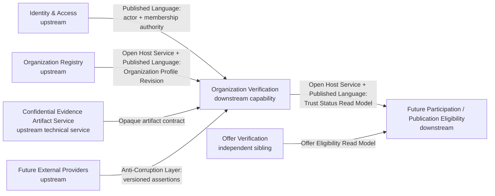

# Phase 7A — Domain Architecture Review Report

Date: 2026-07-28

Reviewed document:
`docs/architecture/organization-trust-v1.md`

Reviewed revision:
`57c4c2cc37194fade4a1237f199e75ea6a91e47f`

Review scope: domain architecture, bounded contexts, terminology, ownership,
state, evidence, policies, and integration contracts

Implementation status: not authorized

## 1. Executive Review Summary

Version 1 establishes a strong architecture foundation:

- one capability-owned Decision Engine;
- Workflow Coordinator ownership of lifecycle effects;
- immutable submissions and snapshots;
- append-only history;
- sealed completion boundaries;
- independent policy families;
- exact recorded-version resolution;
- generic evidence modeling;
- derived trust standing;
- fail-closed recovery;
- explicit separation from Offer Verification and Publication Eligibility.

The architecture is viable, but it is not precise enough for implementation in
its current form.

The central issue is semantic ownership.

Version 1 names the capability `Organization Trust`, while the capability's
actual behaviors are submission, evidence evaluation, verification attempts,
findings, decisions, and verification history. `Trust` is the current
effective business standing produced from that history and later validity
events. Naming the capability after its output blurs process, decision, and
status and creates unnecessary pressure for the capability to absorb
Participation Eligibility, administrative suspension, compliance, or other
trust-adjacent responsibilities.

The recommended capability name is:

```text
Organization Verification
```

The recommended model is Model B:

```text
Tutela Trust Architecture
├── Organization Verification
│   ├── Organization Verification Process
│   ├── Organization Verification Decision Engine
│   ├── Organization Evidence
│   └── Organization Trust Status
└── Offer Verification
```

`Organization Trust Status` remains a narrow derived output. The capability
does not become document-only: verification covers organization identity,
legal existence, structured evidence, ownership disclosures, jurisdiction
support, evidence validity, and governed review inputs.

The `Tutela Trust Domain` label is justified only as a product taxonomy and
architecture-governance model. It is not a DDD bounded context, runtime
service, shared kernel, data owner, policy owner, decision owner, or common
lifecycle owner.

Version 1 also needs a formal Context Map separating:

- Organization Registry/Identity;
- Identity and Access;
- Organization Verification;
- Confidential Evidence Artifact storage;
- Offer Verification;
- future Participation/Publication Eligibility.

The Organization aggregate belongs to Organization Registry/Identity.
Organization Verification is downstream and evaluates immutable published
Organization Profile Revisions through an Anti-Corruption Layer. It does not
own or duplicate Organization identity.

## 2. Final Review Decision

**APPROVED WITH REQUIRED REVISIONS**

Version 1 is approved as the basis for Version 2, subject to the required
revisions in Section 25.

No implementation should begin from Version 1.

Required before implementation:

- capability naming and ubiquitous-language correction;
- explicit Organization Registry versus Organization Verification boundaries;
- explicit non-runtime Trust Domain classification;
- final decision vocabulary;
- reduced Trust Status semantics;
- exact evidence/file ownership;
- exact downstream read model;
- snapshot inclusion of reviewer-input identity;
- rationalized policy-family boundaries.

No Version 2 work is authorized by this review.

## 3. Capability Naming Review

### 3.1 What the capability actually does

The proposed capability owns:

- verification submissions;
- immutable submission revisions;
- snapshots;
- evidence metadata and assessments;
- verification attempts;
- deterministic rules;
- normalized findings;
- verification decisions;
- verification history;
- trust-status derivation.

The dominant business operation is verification. Trust is a time-dependent
interpretation of authoritative verification history.

### 3.2 Why naming is architectural

Capability names shape:

- aggregate names;
- service and module boundaries;
- API paths;
- database table names;
- event names;
- policy namespaces;
- Rule IDs and Reason Codes;
- operational dashboards;
- business expectations;
- future responsibility drift.

If the capability is named `Organization Trust`, future developers may
reasonably add:

- participation rights;
- marketplace eligibility;
- administrative restrictions;
- counterparty risk;
- compliance flags;
- transaction authority;
- generalized trust scores.

Those additions would violate the approved boundary.

### 3.3 Recommendation

Use:

```text
Organization Verification
```

Reserve:

```text
Organization Trust Status
```

for the current effective standing derived from verification decisions and
validity/invalidation facts.

## 4. Organization Trust vs Organization Verification Comparison

### 4.1 Candidate models

| Criterion | Model A — Organization Trust | Model B — Organization Verification | Model C — Organization Assurance |
|---|---|---|---|
| Domain accuracy | Broad; describes desired outcome | Precise; describes owned capability behavior | Potentially precise but unfamiliar |
| Ubiquitous language | Risks using trust for process, decision, and status | Cleanly separates verification from trust standing | Requires teaching a new term |
| Capability responsibility | May imply all trust-related responsibilities | Clearly owns organization verification | Could imply certification or guarantee |
| Process/outcome separation | Weak | Strong | Moderate |
| Decision ownership clarity | `Trust Decision` may be confused with status/eligibility | `Verification Decision` is narrow | `Assurance Decision` is less obvious |
| Trust Status semantics | Risks becoming capability state | Clearly an output | Clear but business meaning less direct |
| Phase 6 consistency | Asymmetric without necessity | Strong sibling symmetry | Weak |
| Developer clarity | Medium | High | Medium |
| API/database clarity | Broad `organization_trust_*` namespace | Precise `organization_verification_*` namespace | Less recognizable namespace |
| Business stakeholder clarity | Intuitive but overpromising | Familiar verification language | Ambiguous guarantee |
| External provider integration | Provider may be mistaken for trust authority | Provider supplies verification evidence | Provider assurance may imply authority |
| Manual review integration | Reviewer may appear to decide trust | Reviewer contributes to verification | Similar ambiguity |
| Beyond documents | Broad | Still broad when explicitly defined as evidence-based verification | Broad |
| Participation separation | Weakest | Strongest | Moderate |
| Compliance/AML separation | Naming encourages drift | Easier to prohibit | Requires careful explanation |

### 4.2 Model A assessment

Model A is internally coherent but creates a wide semantic boundary.

Advantages:

- directly names the business objective;
- accommodates evidence expiry and effective trust standing;
- is understandable to non-technical stakeholders.

Disadvantages:

- uses `trust` for capability, decision, profile, evidence, and status;
- makes Participation Eligibility drift more likely;
- makes administrative suspension appear capability-owned;
- weakens symmetry with Offer Verification;
- can imply compliance or generalized counterparty assurance.

Model A is not recommended.

### 4.3 Model B assessment

Model B matches actual ownership:

- the process verifies;
- the Decision Engine decides verification;
- historical decisions remain immutable;
- a Trust Status Deriver interprets current effectiveness;
- downstream capabilities consume the status.

`Organization Verification` does not mean document verification only. Its
definition must explicitly include legal identity, profile, evidence,
structured facts, validity, and jurisdiction support.

Model B is recommended.

### 4.4 Model C assessment

`Organization Assurance` could distinguish process and outcome but introduces
an unfamiliar term, risks implying a warranty, and has no proven repository
ubiquitous language. It adds conceptual cost without improving ownership over
Model B.

Model C is rejected.

## 5. Recommended Ubiquitous Language

### 5.1 Capability and context

| Version 1 term | Recommended Version 2 term |
|---|---|
| Organization Trust capability | Organization Verification capability |
| Organization Trust bounded context | Organization Verification bounded context |
| Organization Trust Profile | Organization Verification Record |
| Organization Trust Decision | Organization Verification Decision |
| Organization Trust Decision Engine | Organization Verification Decision Engine |
| Trust Evidence | Organization Evidence |
| Organization Finding | Organization Verification Finding |
| Organization Trust Workflow Coordinator | Organization Verification Workflow Coordinator |
| Verification History | Organization Verification History |
| Organization Trust Read Model | Organization Trust Status Read Model |

### 5.2 Terms that remain

- Organization;
- Organization Profile;
- Organization Registration;
- Organization Lifecycle;
- Organization Verification Submission;
- Organization Verification Revision;
- Organization Verification Attempt;
- Organization Snapshot;
- Organization Trust Status;
- Participation Eligibility;
- Offer Verification;
- Publication Eligibility.

### 5.3 Decision vocabulary

Recommended decisions:

```text
approved
revision_required
manual_review
rejected
```

`approved` is preferred over `verified` because:

- it is an immutable result of one Attempt;
- it does not look like a lifecycle or status;
- it mirrors the Phase 6 decision style without forcing all other semantics to
  match;
- it leaves `trusted` exclusively for current effective Trust Status.

### 5.4 Status vocabulary

Recommended Trust Status values:

```text
not_established
trusted
not_trusted
expired
invalidated
```

Do not use:

- `verified` as Trust Status;
- `revision_required` or `manual_review` as Trust Status;
- `suspended` as Trust Status;
- process values as status values.

## 6. Tutela Trust Domain Review

### 6.1 Recommended construct

The `Tutela Trust Domain` should be modeled as:

- a product taxonomy;
- an architectural governance model;
- a shared philosophy and terminology guide;
- a capability portfolio.

For greater precision, Version 2 should describe it as:

```text
Tutela Trust Architecture
```

while retaining `Tutela Trust Domain` as the product-level grouping if desired.

### 6.2 Constructs explicitly not selected

| Construct | Decision | Reason |
|---|---|---|
| DDD bounded context | Rejected | It has no aggregate, model, transaction, or runtime language boundary of its own |
| Platform service | Rejected | It owns no runtime operation |
| Shared kernel | Rejected | Capability decisions, policies, and models must remain independent |
| Common lifecycle engine | Rejected | Lifecycles are capability-owned |
| Common decision engine | Rejected | Violates single capability authority |
| Shared mutable data model | Rejected | Creates dual ownership and coupling |

### 6.3 Runtime and ownership answers

The Trust Domain:

- owns no runtime behavior;
- owns no operational database;
- owns no decisions;
- owns no policies;
- owns no evidence;
- owns no common lifecycle;
- owns no current trust state;
- cannot orchestrate capabilities.

It may govern:

- naming conventions;
- decision-sealing requirements;
- immutability standards;
- audit requirements;
- integration rules;
- generic privacy/security standards;
- architecture compliance tests.

### 6.4 Governing principle

The principle is accepted:

> Unified trust philosophy, decentralized capability authority.

Conceptual unity is achieved through standards and published contracts, not
runtime centralization.

## 7. Bounded Context Review

### 7.1 Organization Verification validity

Organization Verification is a valid bounded context because it has:

- one business question;
- an authoritative vocabulary;
- owned submissions/revisions/attempts;
- owned snapshots and evidence semantics;
- owned policies and rules;
- one decision family;
- one current-effective status projection;
- internal invariants;
- narrow published outputs.

### 7.2 Organization identity placement

The Organization aggregate should not be owned by Organization Verification.

Organization Registry/Identity owns:

- Organization ID;
- legal identity;
- editable Organization Profile;
- Profile Revisions;
- registration;
- Organization Lifecycle;
- group/branch/subsidiary relationships.

Organization Verification consumes an immutable Profile Revision and does not
edit it.

### 7.3 Why separate contexts

Organization identity can exist without verification. Identity changes have
business value beyond verification. Verification has its own evidence,
attempts, policies, decisions, and history. Combining them creates:

- oversized aggregates;
- circular lifecycle ownership;
- ambiguous update authority;
- trust semantics leaking into registration;
- difficulty reusing Organization identity elsewhere.

The contexts may initially share deployment infrastructure, but not model
ownership.

## 8. Context Map Recommendation



### 8.1 Organization Registry → Organization Verification

Recommended relationship:

- Customer/Supplier;
- Organization Registry is upstream supplier;
- Organization Verification is downstream customer;
- Open Host Service with a Published Language;
- an Anti-Corruption Layer in Organization Verification protects verification
  semantics from legacy/current Organization representations.

Organization Verification may not write Organization Registry data.

### 8.2 Identity and Access → Organization Verification

Identity and Access publishes actor identity and organization-membership
authority. Organization Verification consumes an authorization result; it does
not import account or credential models.

### 8.3 Evidence Artifact Service → Organization Verification

The artifact service owns raw encrypted bytes and access mechanics.
Organization Verification owns evidence meaning, subject association,
fingerprints, assessments, and decision use.

This is an explicit integration contract, not a shared aggregate.

### 8.4 Organization Verification → future Eligibility

Organization Verification is upstream. It exposes an Open Host Service and
Published Language containing only current effective Trust Status and source
references.

### 8.5 Shared Kernel decision

No DDD Shared Kernel is recommended.

Stateless hashing, canonicalization, lease, and append-only technical utilities
may live in common infrastructure libraries. They do not carry Organization or
Offer domain semantics.

## 9. Ownership Review

| Concept | Recommended owner | Notes |
|---|---|---|
| Organization identity | Organization Registry | Stable legal entity identity |
| Editable Organization Profile | Organization Registry | Versioned upstream profile |
| Organization registration | Organization Registry | Creates no verification |
| Organization Lifecycle | Organization Registry Coordinator | Separate from trust |
| Account/session | Identity and Access | Never trust proof |
| Organization membership/roles | Identity and Access or Organization Registry membership context | Published authorization result |
| Verification Submission | Organization Verification | Draft then immutable submitted form |
| Submission Revision | Organization Verification | Immutable |
| Verification Attempt | Organization Verification | Operational until completed |
| Organization Snapshot | Organization Verification | Immutable evaluation input |
| Evidence semantic metadata | Organization Verification | Type, subject, issuer, validity, fingerprint |
| Raw evidence file | Confidential Evidence Artifact Service | Opaque reference only |
| Extracted data | Extraction observation owner; referenced by Verification | Non-authoritative |
| Normalized fact | Organization Verification | Immutable normalized observation |
| Assessed/verified fact | Organization Verification Evidence Assessment | Still not a decision |
| External assertion | Provider adapter boundary | Stored as versioned evidence |
| Reviewer input | Manual Review boundary under Organization Verification | Immutable assessment |
| Findings | Organization Verification | Engine/rule output |
| Reason Codes | Organization Verification | Capability-specific |
| Rule IDs | Organization Verification | Capability-specific |
| Policies/versions | Organization Verification | Independent immutable registries |
| Neutral reference data | Reference-data provider | Versioned; no decisions |
| Decision | Organization Verification Decision Engine | Exclusive |
| Confidence | Organization Verification Decision Engine | Recorded model only |
| Workflow transition | Organization Verification Coordinator | Append-only |
| Verification history | Organization Verification | Append-only |
| Trust-status derivation history | Organization Verification Status Deriver | Append-only derivation facts |
| Current Trust Status | Derived Organization Verification projection | Cache is not source of truth |
| Participation Eligibility | Future action-specific capability | Never Organization Verification |

No listed concept has dual ownership in the recommended model.

## 10. Aggregate Review

### 10.1 Organization Registry aggregates

- `Organization` aggregate root:
  - Organization ID;
  - current Profile Revision reference;
  - Organization Lifecycle;
  - group/legal-entity relationships.
- `OrganizationProfileRevision` immutable record.

These are upstream and outside Organization Verification ownership.

### 10.2 Organization Verification aggregates

Recommended boundaries:

1. `OrganizationVerificationRecord`
   - one per Organization;
   - current submission/revision references;
   - effective decision reference;
   - status projection sequence;
   - invalidation references.
2. `OrganizationVerificationSubmission`
   - draft ownership and submitted Revision creation.
3. `OrganizationEvidence`
   - semantic evidence identity, snapshots, status events, and assessments.
4. `OrganizationVerificationAttempt`
   - Snapshot/fingerprint, process, versions, findings, sealed decision.

History must not be loaded as one unbounded aggregate. Immutable history is
queried through repositories/read models.

### 10.3 Invariants

- one current submitted Revision per Verification Record;
- immutable submitted Revision;
- one canonical Snapshot fingerprint per Attempt;
- exact Organization/Profile Revision identity;
- no completed Attempt mutation;
- no decision before process completion;
- one engine-issued decision per completed Attempt;
- current applicability requires exact revision/fingerprint/version identity;
- Trust Status derives only from append-only authority.

### 10.4 Legacy adapter

The legacy adapter belongs in the Organization Verification Anti-Corruption
Layer, not in either core aggregate.

Legacy company-name strings and user flags become recovery candidates only.
They cannot create Organization identity or verification outcomes.

## 11. Lifecycle and State Review

### 11.1 State dimensions

| Dimension | Owner | Recommended values | Meaning |
|---|---|---|---|
| Organization Lifecycle | Organization Registry | `registered`, `active`, `suspended`, `closed` | Platform relationship with legal Organization |
| Verification Submission state | Organization Verification | `draft`, `submitted`, `superseded` | Mutability of submitted request |
| Verification Process | Organization Verification orchestration | `not_started`, `queued`, `running`, `completed` | Attempt progress only |
| Verification Decision | Decision Engine | `approved`, `revision_required`, `manual_review`, `rejected` | Terminal Attempt conclusion |
| Trust Status | Status Deriver | `not_established`, `trusted`, `not_trusted`, `expired`, `invalidated` | Current effective trust standing |
| Participation Eligibility | Future capability | Future action-specific model | Permission for a specific action |

### 11.2 Term consistency

| Term | Correct role | Incorrect roles |
|---|---|---|
| `approved` | Verification Decision | Lifecycle, Trust Status |
| `revision_required` | Verification Decision | Process, lifecycle, status |
| `manual_review` | Verification Decision/routing conclusion | Process state, status |
| `rejected` | Submission-scoped Verification Decision | Permanent Organization lifecycle state |
| `trusted` | Trust Status | Decision or lifecycle |
| `not_trusted` | Trust Status derived from current rejection | Permanent ban |
| `expired` | Trust Status derived from time/validity | Decision |
| `invalidated` | Trust Status derived from invalidation fact | Decision |
| `suspended` | Organization Lifecycle/admin access condition | Trust Status or Verification Decision |

### 11.3 Redundant state finding

Version 1's Trust Status `suspended` is redundant and crosses authority
boundaries.

Organization administrative suspension belongs to Organization Lifecycle.
Future action capabilities must consider that suspension when deriving
eligibility. It must not mutate the verification-derived Trust Status.

### 11.4 Previously trusted organizations

A previously trusted Organization may become:

- `expired` through validity passage;
- `invalidated` through material profile/evidence change or revocation;
- `not_trusted` through a later current rejected decision.

It does not become historically “unverified.” Historical approved decisions
remain facts.

`verification_required` is a command/read-model condition, not Trust Status.

## 12. Decision Model Review

### 12.1 Recommended smallest sufficient set

```text
approved
revision_required
manual_review
rejected
```

All four are terminal for one Attempt. A terminal Attempt decision does not
mean the broader organization-verification workflow is terminal.

### 12.2 `approved`

- True decision: yes.
- Terminal for Attempt: yes.
- Owner: Decision Engine.
- Status effect: may derive `trusted` if current, valid, and uninhibited.
- New work: expiry/invalidation later creates new attempt/revision as required.
- Reversible: decision no; applicability yes.
- Lifecycle overlap: none.

`approved` is preferred to `verified`.

### 12.3 `revision_required`

- True decision: yes; it is the automated conclusion for the frozen input.
- Terminal for Attempt: yes.
- Owner: Decision Engine.
- Status effect: no new trust.
- New work: changed submitted data/evidence requires new Revision/Snapshot/
  Attempt.
- Reversible: no; superseded by later decision.
- Lifecycle overlap: none.

It belongs in the same decision family because it is a deterministic outcome,
not merely process progress.

### 12.4 `manual_review`

- True automated decision/routing conclusion: yes.
- Terminal for Attempt: yes.
- Owner: Decision Engine.
- Status effect: no new trust.
- New work: immutable reviewer assessment allows a new Attempt for the same
  Revision; changed owner input requires a new Revision.
- Reversible: no.
- Process overlap: none; it is not `running`.

The name remains acceptable if Version 2 explicitly says “manual review
required” in business descriptions and never uses it as a process state.

### 12.5 `rejected`

- True decision: yes, only if a recorded policy recognizes a deterministic
  non-correctable submission finding.
- Terminal for Attempt: yes.
- Owner: Decision Engine.
- Status effect: current applicable rejection derives `not_trusted`.
- New work: material change and policy-governed resubmission create a new
  Revision.
- Reversible: decision no; applicability yes.
- Lifecycle overlap: none.

It means:

> This submitted revision does not establish Organization Verification approval
> under these recorded policies.

It does not mean:

- permanent Organization rejection;
- Organization closure;
- sanctions/AML failure;
- permanent platform exclusion.

### 12.6 Rejection rollout

Version 2 may retain `rejected` architecturally while deferring its use.

If initial approved policy has no safe deterministic rejection findings, those
conditions must route to `manual_review`. This avoids inventing rejection
rules during implementation.

## 13. Trust Status Review

### 13.1 Source of truth

Trust Status is:

- a derived projection;
- optionally materialized/cached;
- rebuildable from append-only history;
- never a free-form administrator-editable column.

Authoritative sources:

- current applicable Verification Decision;
- decision validity window;
- evidence expiry/revocation/withdrawal facts;
- material Profile Revision invalidation;
- current Revision/Attempt identity;
- status-deriver version.

### 13.2 Can it change without a new decision?

Yes.

Trust Status may change:

- `trusted → expired` when the recorded validity boundary passes;
- `trusted → invalidated` when a relied-upon evidence/profile fact is
  invalidated;
- `expired/invalidated → trusted` only after a new applicable approved
  decision.

Expiry does not create a new historical Verification Decision. It creates:

- a time-derived append-only status transition fact;
- a re-verification command where policy requires it.

### 13.3 Recommended status set

| Status | Exact meaning |
|---|---|
| `not_established` | No current effective trust conclusion grants trust |
| `trusted` | Current approved decision remains applicable and valid |
| `not_trusted` | Current applicable rejected decision exists |
| `expired` | Prior trust validity has ended |
| `invalidated` | Material authoritative event ended prior applicability |

### 13.4 Suspension answer

Organization suspension does not belong to Trust Status.

An Organization may remain historically/currently trusted but be operationally
suspended by Organization Registry. Future Participation Eligibility composes:

```text
Trust Status
AND Organization Lifecycle
AND action-specific policy
```

This prevents administrative conditions from contaminating verification
history.

### 13.5 Downstream output

Downstream capabilities consume the current status plus source/freshness
references. They do not consume process state as trust.

## 14. Evidence Architecture Review

### 14.1 General assessment

Version 1's evidence model is sufficiently generic for:

- multiple jurisdictions;
- documentary and structured evidence;
- government/bank/provider assertions;
- manually assessed evidence;
- expiry, revocation, withdrawal, supersession, and reuse.

The separation between raw artifact, extracted observation, assessed fact, and
decision is strong.

### 14.2 Required terminology refinement

Use:

- Raw Evidence Artifact;
- Artifact Reference;
- Extraction Observation;
- Normalized Fact;
- Evidence Assessment;
- Assessed Fact;
- External Assertion;
- Reviewer Assessment;
- Verification Finding;
- Verification Decision.

Avoid `Verified Fact` unless the document defines:

- who verified it;
- under which assessment policy/version;
- its validity;
- its evidence provenance;
- that it is still not a Verification Decision.

`Assessed Fact` is safer ubiquitous language.

### 14.3 Ownership

Recommended split:

- Confidential Evidence Artifact Service:
  - raw bytes;
  - encryption;
  - access;
  - retention/deletion execution;
  - malware/content transport controls.
- Organization Verification:
  - Evidence ID;
  - Organization subject;
  - Evidence Type;
  - issuer/source/jurisdiction;
  - Artifact Reference and content fingerprint;
  - semantic status;
  - assessments and facts;
  - use in Snapshots/Attempts.

The artifact service never declares evidence valid or creates trust.

### 14.4 Evidence cannot elevate trust directly

Document presence, provider response, reviewer note, status `active`, and
assessment `supported` remain inputs. Only normalized findings reduced by the
Decision Engine produce `approved`.

## 15. Policy Architecture Review

### 15.1 Independence and versions

Version 1 correctly requires:

- independent contracts;
- immutable versions;
- exact registries;
- neutral reference providers;
- no silent fallback;
- findings rather than policy-created decisions.

These requirements are approved.

### 15.2 Family-list assessment

The proposed list is directionally complete but over-fragmented for an initial
implementation.

Overlaps:

- Organization Identity and Legal Registration;
- Corporate Documentation and Evidence Sufficiency;
- Evidence Sufficiency and Evidence Validity;
- Manual Review Input Policy and general evidence-assessment acceptance.

### 15.3 Recommended initial families

Version 2 should define responsibilities first and defer the final number until
business policy approval.

Candidate minimum:

1. Organization Profile Integrity Policy.
2. Legal Existence and Registration Policy.
3. Evidence Requirements Policy.
4. Evidence Validity Policy.
5. Jurisdiction Support Policy.
6. Ownership Disclosure Policy, only if authorized as independent.
7. Decision Policy.

Business Activity Policy should become separate only if it has independently
governed rules. Reviewer Assessment Acceptance may be a policy or adapter
contract; Version 2 should justify its placement.

### 15.4 Unsupported jurisdictions

An unsupported jurisdiction must not silently reject or approve.

- Missing reference/configuration authority → `manual_review`.
- An explicit recorded policy saying the submission is unsupported may produce
  `rejected` only if that disposition is approved.

### 15.5 Retirement and upgrade

- Used versions remain registered indefinitely for replay/audit.
- Retirement prevents new selection; it does not delete history.
- Upgrade creates new attempts/revisions according to impact.
- No historical finding or decision is recomputed in place.
- A policy upgrade alone does not silently invalidate trust. A separately
  versioned activation/invalidation rule must append an event and schedule
  re-verification.

## 16. Manual Review Boundary Review

### 16.1 Accepted outputs

A reviewer may create:

- Evidence Assessments;
- Assessed Facts;
- structured contradiction declarations;
- structured recommendation codes;
- confidential rationale;
- evidence requests as workflow recommendations.

A reviewer should not create engine findings directly unless a governed adapter
maps an assessment through an exact policy/rule version. This preserves Rule ID
ownership.

### 16.2 Prohibited outputs

A reviewer cannot create:

- Verification Decision;
- confidence;
- Trust Status;
- Organization Lifecycle state;
- Participation Eligibility.

### 16.3 Return path

```text
completed manual_review decision
→ immutable review case
→ immutable reviewer assessment
→ new Attempt using exact assessment reference/fingerprint
→ policy rules produce findings
→ Decision Engine produces next decision
```

### 16.4 Conflict behavior

Conflicting reviewer inputs produce a structured conflict condition. They do
not use ad hoc majority or administrator override. A recorded Review Assessment
Policy determines whether:

- additional independent assessment is required;
- the engine remains `manual_review`;
- an evidence correction is requested.

## 17. Snapshot and Immutability Review

### 17.1 Approved contents

Version 1 correctly includes:

- Organization ID;
- Profile Revision;
- Verification Revision/Attempt identity;
- ownership/profile facts;
- Evidence Snapshot IDs and fingerprints;
- normalized/assessed facts;
- policy-family versions;
- reference-data versions;
- ruleset/engine/serializer/confidence versions;
- jurisdiction context;
- deterministic evaluation timestamp.

### 17.2 Required addition

For attempts following Manual Review, the Snapshot must include:

- Reviewer Assessment ID;
- assessment content fingerprint;
- reviewer-authority class reference;
- assessment policy/version;
- assessment timestamp;
- supersession relationship.

Reviewer prose should remain referenced and confidential, not embedded.

### 17.3 Integrity requirements

Approved:

- deterministic canonical ordering;
- stable array ordering;
- explicit nulls;
- runtime deep immutability;
- database immutability;
- SHA-256 fingerprint;
- completion-time fingerprint validation;
- exact current Revision comparison;
- no historical mutation.

### 17.4 Potential mutable inputs

Version 2 must ensure these cannot change outside snapshot identity:

- evidence semantic status;
- evidence expiry/revocation;
- external assertion version;
- Organization group relationship;
- issuer/reference-data identity;
- reviewer assessment;
- status-deriver version.

If any changes, a new Snapshot/Attempt or invalidation event is required.

## 18. History and Audit Review

### 18.1 Append-only coverage

Version 1 correctly requires append-only:

- submissions;
- revisions;
- attempts;
- findings;
- decisions;
- Evidence Assessments;
- reviewer inputs;
- workflow transitions;
- validity/invalidation events;
- Trust Status derivation changes;
- recovery operations.

### 18.2 Current status source

No single mutable row is source of truth.

The current Trust Status is deterministically reconstructed from:

1. current Organization/Profile Revision;
2. current applicable Verification Revision/Attempt;
3. immutable Decision;
4. decision validity;
5. evidence/profile invalidation history;
6. time;
7. recorded Status Deriver Version.

A materialized status row must include:

- source Decision ID;
- source Revision/Attempt;
- derivation sequence;
- derivation version;
- `as_of` timestamp;
- validity boundary.

### 18.3 Replay

History can reconstruct the same standing only if:

- all policies/reference versions remain resolvable;
- time-based transitions use recorded canonical instants;
- external assertions are snapshotted;
- reviewer assessments are fingerprinted;
- status-deriver versions remain available.

Version 2 must add the Status Deriver Version explicitly to the authoritative
version set.

## 19. Recovery Review

Version 1 is fail-closed across the required scenarios.

| Scenario | Review outcome |
|---|---|
| Incomplete submission | Reject submission or produce revision-required finding; never approve |
| Interrupted evaluation | Lease recovery reuses same Attempt |
| Abandoned claim | Return to queue with append-only recovery event |
| Duplicate submission | Idempotency returns same logical work |
| Concurrent evaluation | One completion; duplicates cannot decide |
| Stale result | No status/lifecycle effect |
| Corrupted Snapshot | Engine integrity finding and manual review |
| Missing policy version | Engine manual review; no fallback |
| Unknown evidence | Policy-governed revision/manual review, never approval |
| External provider unavailable | Use no unrecorded assumption |
| Partial extraction | Non-authoritative; revision/manual review |
| Expired evidence | Status expiry/invalidation plus re-verification |
| Policy upgrade | Append new governed work; preserve history |
| Database conflict | Roll back; no decision/status fabrication |

Required clarification:

- ordinary submission validation failure before Snapshot creation is not an
  engine decision;
- once an Attempt exists, only the Decision Engine may create its terminal
  conclusion.

## 20. Phase 6 Consistency Review

### 20.1 Patterns to reuse

- single Decision Engine ownership;
- Workflow Coordinator ownership;
- opaque sealed completion;
- immutable Snapshot and fingerprint;
- append-only history;
- independent policy registries;
- stable capability-owned Rule IDs and Reason Codes;
- severity metadata;
- fail-closed conditions;
- command/lease/idempotency;
- architecture enforcement tests.

### 20.2 Concepts not to copy mechanically

- Offer Lifecycle states;
- Offer Snapshot schema;
- Phase 6 Technical/Commercial Policy families;
- Offer Reason Codes or Rule IDs;
- `verified` Offer Lifecycle state;
- exact current Offer decision semantics where Organization policy differs.

### 20.3 Naming consistency

Recommended:

- Offer Verification capability;
- Offer Verification Decision;
- Organization Verification capability;
- Organization Verification Decision;
- Organization Trust Status.

This symmetry follows actual behavior, not aesthetic preference.

## 21. Integration Contract Review

### 21.1 Minimum sufficient contract

Recommended `OrganizationTrustStatusReadModel`:

```text
organization_id
organization_profile_revision
trust_status
effective_decision_id | null
effective_verification_revision | null
decision_at | null
trust_valid_from | null
trust_valid_until | null
status_sequence
status_as_of
status_deriver_version
projection_version
safe_status_reason_codes[]
```

### 21.2 Fields not required by normal downstream decisions

Do not expose by default:

- full policy-version map;
- raw findings;
- evidence references;
- reviewer information;
- raw profile fields;
- Organization members/users.

Policy versions remain available through restricted audit contracts. A
downstream capability needs current authoritative status and freshness, not
permission to reproduce verification.

### 21.3 Freshness

Freshness is represented by:

- `status_sequence`;
- `status_as_of`;
- validity boundary;
- projection version.

A consumer fails closed when:

- status is absent;
- projection version is unsupported;
- validity has passed;
- status is stale under its action policy;
- Organization/Profile Revision no longer matches.

### 21.4 Integration isolation

Offer Verification remains independent and does not consume Organization
Verification internals.

Future Publication Eligibility consumes:

- Offer Verification Eligibility;
- Organization Trust Status Read Model;
- its own publication policy.

It cannot reproduce either upstream decision.

## 22. Participation Eligibility Boundary Review

The Version 1 distinction is approved.

Organization Verification answers:

> Does current authoritative Organization Verification history support a
> currently trusted standing?

Participation Eligibility answers:

> May this Organization perform this particular action now?

Organization Verification does not grant:

- marketplace publication;
- negotiation;
- transaction;
- order;
- contract;
- payment;
- escrow;
- settlement authority.

Participation Eligibility may additionally consider:

- Organization Lifecycle;
- action-specific policy;
- independent Offer Verification;
- other future capability outputs.

It does not alter Organization Verification.

## 23. Future Expansion Review

### 23.1 Value of the Trust grouping

The grouping provides:

- architecture standards;
- vocabulary patterns;
- integration discipline;
- review checklists;
- audit expectations.

It should not require every future capability to use identical decisions or
evidence.

### 23.2 Independent future capabilities

Counterparty, Payment, Logistics, Shipment, Settlement, and External Provider
Trust may be added only as independent bounded contexts after their business
questions are defined.

They cannot be forced to reuse:

- Organization decisions;
- Organization policies;
- Organization Lifecycle;
- Organization Trust Status;
- Organization repositories;
- a universal verification engine.

### 23.3 Framework risk

Do not build a generic `TrustEngine`.

Safe reuse is limited to technical primitives:

- immutable value helpers;
- canonicalization/hashing;
- sealed-token mechanism;
- command/lease infrastructure;
- append-only storage patterns;
- audit utilities.

Domain contracts remain capability-owned.

## 24. Architectural Risks

| Risk | Severity | Review treatment |
|---|---|---|
| Trust Domain becomes a god domain | High | Define it as non-runtime governance/taxonomy |
| Organization Trust overlaps Participation Eligibility | High | Rename capability Organization Verification |
| Duplicated Organization identity ownership | High | Separate Organization Registry and formalize Context Map |
| Trust Status becomes uncontrolled state machine | High | Reduce status set and derive from append-only authority |
| Reviewer becomes second Decision Engine | High | Assessment-only output and new engine Attempt |
| `rejected` becomes permanent exclusion | High | Scope to submission/policy; permanent ban excluded |
| Raw documents become trust source | High | Separate artifacts, assessments, findings, and decision |
| Administrative suspension contaminates trust | Medium | Keep suspension in Organization Lifecycle/eligibility |
| Policy-family over-fragmentation | Medium | Rationalize initial policy families |
| Excessive Phase 6 reuse | Medium | Reuse patterns/primitives, not semantic models |
| Generic verification framework creates coupling | High | Explicitly reject universal engine/shared kernel |
| Group trust leaks between legal entities | High | Independent Organization IDs/Trust Status; no inheritance |
| Policy upgrades rewrite history | High | Immutable versions and append-only re-verification |
| External provider is treated as authority | High | ACL maps assertions to evidence only |
| Legacy model contaminates Organization identity/trust | High | Recovery ACL; no automatic proof/backfill |
| Cached Trust Status becomes authoritative | Medium | Require source references, sequence, derivation version |
| Evidence retention conflicts with audit | Medium | Separate raw artifacts from minimum audit facts; legal review |

## 25. Required Revisions

Every item in this section is required before implementation.

### R1 — Rename the capability to Organization Verification

Classification: **HIGH**

Required changes:

- capability/bounded-context name;
- Decision/Engine/Coordinator/History names;
- evidence and finding namespaces;
- integration language;
- diagrams and glossary.

Keep Organization Trust Status as the derived output.

### R2 — Formalize Organization Registry as a separate upstream context

Classification: **HIGH**

Required changes:

- remove Organization aggregate ownership from Organization Verification;
- define Organization Registry ownership;
- consume immutable Organization Profile Revisions;
- add Customer/Supplier + Open Host Service + Published Language;
- add a verification-side Anti-Corruption Layer.

### R3 — Classify Tutela Trust Domain as non-runtime governance

Classification: **HIGH**

Required changes:

- state that it is not a bounded context, platform service, or Shared Kernel;
- assign it no data, decisions, policies, lifecycle, or orchestration;
- describe shared technical primitives as infrastructure, not domain ownership.

### R4 — Finalize decision names and semantics

Classification: **HIGH**

Required changes:

- replace `verified` decision with `approved`;
- retain `revision_required`, `manual_review`, and submission-scoped
  `rejected`;
- mark every decision terminal for one Attempt;
- state that initial policies may decline to produce deterministic rejection.

### R5 — Reduce and isolate Trust Status

Classification: **HIGH**

Required changes:

- use `not_established`, `trusted`, `not_trusted`, `expired`, `invalidated`;
- remove `suspended`;
- keep Organization suspension in Organization Lifecycle;
- define exact deterministic derivation and Status Deriver Version.

### R6 — Define exact Evidence Artifact ownership

Classification: **MEDIUM**

Required changes:

- raw bytes owned by a Confidential Evidence Artifact service/context;
- Organization Verification owns semantic metadata, snapshots, assessments,
  and use;
- artifact contract exposes opaque reference + fingerprint only;
- use `Assessed Fact` or precisely define `Verified Fact`.

### R7 — Add reviewer assessments to Snapshot identity

Classification: **MEDIUM**

Required changes:

- include assessment ID/fingerprint/policy/time/supersession on follow-up
  Attempts;
- prevent mutable reviewer data from influencing a decision outside Snapshot
  identity.

### R8 — Rationalize policy families

Classification: **MEDIUM**

Required changes:

- reduce overlapping initial families;
- distinguish optional future splits;
- justify Manual Review assessment-policy placement;
- preserve independent versions and no private cross-family access.

### R9 — Minimize and version the downstream contract

Classification: **MEDIUM**

Required changes:

- publish the minimum Trust Status contract in Section 21;
- include status sequence, `as_of`, validity, and derivation version;
- move full policy versions/findings to restricted audit contracts.

### R10 — Make the legacy adapter an explicit Anti-Corruption Layer

Classification: **MEDIUM**

Required changes:

- place candidate mapping outside core aggregates;
- prohibit automatic Organization creation/trust backfill;
- preserve source provenance and unknown semantics.

### R11 — Clarify pre-attempt validation versus engine decisions

Classification: **LOW**

Required changes:

- request/schema rejection before Attempt creation is not a Verification
  Decision;
- every created Attempt terminates only through the Decision Engine.

### R12 — Align Rule ID and event namespaces with renamed capability

Classification: **LOW**

Required changes:

- use Organization Verification-specific namespaces;
- avoid generic `trust_*` runtime objects;
- keep Offer identifiers completely separate.

## 26. Optional Improvements

These are recommended refinements but do not block architecture approval after
the required revisions:

- Add a capability-level architecture decision record for naming.
- Add a separate glossary table showing process/decision/status examples.
- Define a privacy classification matrix for each evidence field.
- Add example replay scenarios for expiry and invalidation.
- Add an example group/subsidiary Context Map.
- Define audit-versus-operational read-model SLAs.
- Provide a policy-version retirement checklist.
- Define a future Architecture Compliance Matrix modeled after Phase 6C.
- Document public versus owner-safe versus reviewer-safe DTO boundaries.

## 27. Items Explicitly Rejected

The review rejects:

- Model A as the final capability naming model;
- `Organization Assurance` as a replacement name;
- Tutela Trust Domain as a runtime bounded context;
- Tutela Trust Domain as a platform service;
- a DDD Shared Kernel for capability semantics;
- a universal Trust/Verification Decision Engine;
- Organization Verification ownership of Organization identity;
- `verified` as both Decision and Status language;
- `suspended` as Organization Trust Status;
- permanent semantics for `rejected`;
- reviewer/administrator decision overrides;
- raw document presence as trust evidence sufficient for approval;
- external-provider decisions being copied as Tutela decisions;
- direct Organization Verification ↔ Offer Verification internal coupling;
- Organization Trust inheritance across parent/subsidiary entities;
- legacy `users.verified`, company name, document presence, role, rating, or
  offer status as trust proof;
- policy upgrades mutating historical decisions;
- Participation Eligibility inside Organization Verification.

## 28. Recommended Structure for Version 2

Version 2 should retain the 32-section depth of Version 1 with these structural
changes:

1. Executive Summary using Organization Verification.
2. Trust Architecture governance classification.
3. Capability portfolio without runtime ownership.
4. Core Domain Vocabulary with process/decision/status separation.
5. Context Map:
   - Identity and Access;
   - Organization Registry;
   - Evidence Artifact service;
   - Organization Verification;
   - Offer Verification;
   - future Eligibility.
6. Organization Registry published contract.
7. Organization Verification bounded context and aggregates.
8. Verification Submission and Process.
9. Final Decision Model using `approved`.
10. Derived Trust Status with reduced values.
11. Evidence semantics and raw-artifact boundary.
12. Rationalized independent policy families.
13. Manual Review assessment boundary.
14. Snapshot including reviewer-assessment identity.
15. History, Status Deriver, expiry, and replay.
16. Recovery and sealed completion.
17. Security, privacy, and retention.
18. Minimum downstream Trust Status Read Model.
19. Phase 6 relationship and prohibited shared semantics.
20. Required architecture compliance criteria.
21. Explicit deferred business-policy decisions.
22. Out-of-scope boundaries.

Version 2 should not implement or prescribe database schema.

## 29. Final Recommendation

Adopt Model B:

```text
Tutela Trust Architecture
├── Organization Verification
│   ├── Organization Verification Process
│   ├── Organization Verification Decision Engine
│   ├── Organization Evidence
│   └── Organization Trust Status
└── Offer Verification
```

Use the principle:

> Unified trust philosophy, decentralized capability authority.

Treat:

- Organization Registry as upstream owner of Organization identity/profile/
  lifecycle;
- Organization Verification as downstream owner of submissions, evidence
  semantics, attempts, findings, decisions, history, and Trust Status;
- raw evidence storage as a separate confidential artifact boundary;
- Offer Verification as an independent sibling;
- Participation/Publication Eligibility as a future downstream composition
  capability.

Final decision:

**APPROVED WITH REQUIRED REVISIONS**

Version 1 is a sound basis for Version 2 after the required revisions are
authorized. Implementation remains unauthorized.
