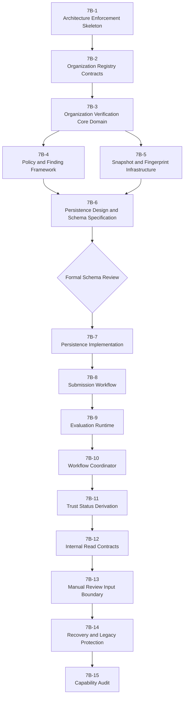

# Phase 7B — Organization Verification Implementation Plan

Date: 2026-07-28

Plan status: **PROPOSED — IMPLEMENTATION NOT AUTHORIZED**

Architecture authority:
`docs/architecture/organization-verification-v2.md`

Approved architecture commit:
`d2400dcc5fa8824057b4e13921464d96c2da6bf3`

## 1. Objective and Authorization Boundary

This plan translates the formally approved Organization Verification
architecture into fifteen small, reversible, reviewable implementation slices.

The plan contains no implementation code and authorizes none. Each slice must
receive explicit approval before work begins. Approval of one slice does not
authorize a later slice.

Recovery remains the priority:

- preserve current business behavior;
- preserve Phase 6 Offer Verification;
- do not infer authority from legacy data;
- default to fail-closed behavior;
- add capability behavior only after its authority and tests exist;
- stop at every business-policy, schema, security, or architecture boundary.

## 2. Implementation Planning Principles

1. **Architecture-first execution:** every implementation artifact maps to an
   approved authority and frozen boundary.
2. **Small reversible slices:** one independently reviewable outcome per
   slice, with a dedicated commit/checkpoint.
3. **One authority boundary per slice:** unrelated identity, decision,
   workflow, evidence, persistence, and eligibility authorities are not
   merged.
4. **Tests before exposure:** domain and negative authority tests precede any
   route, worker, or read contract.
5. **Schema after contract approval:** no migration before the Phase 7B-6
   schema specification receives formal review.
6. **Server authority before frontend:** no Organization Verification UI is
   planned in the initial sequence.
7. **No initial external integration:** provider APIs, OCR, AI Decisions, and
   external registry execution remain out of scope.
8. **No business-policy invention:** test fixtures demonstrate mechanics only
   and are never production policies.
9. **Fail-closed defaults:** missing versions, evidence, authority, freshness,
   or integrity cannot approve or produce `trusted`.
10. **Legacy remains non-authoritative:** recovery mappings cannot create
    Organizations, membership, evidence, approval, or trust.
11. **Phase validation:** every completed slice runs `npm run check`, then
    `npm run build`, then its applicable tests.
12. **Mandatory stop:** architecture changes, business rules, schema,
    protected-data mutation, public exposure, or production access require
    their own explicit approval.

## 3. Repository Module and Naming Plan

Candidate module boundaries, subject to slice-level review:

```text
shared/
└── organizationVerification.ts

server/
├── organization-registry/
│   ├── contracts.ts
│   ├── ports.ts
│   └── antiCorruption.ts
└── organization-verification/
    ├── domain/
    ├── policies/
    ├── snapshot/
    ├── persistence/
    ├── runtime/
    ├── workflow/
    ├── status/
    ├── contracts/
    ├── recovery/
    └── architecture.test.ts
```

The exact file set may be refined within a slice, but these rules are fixed:

- existing `server/verification/` remains the Phase 6 Offer Verification
  capability;
- Organization Verification uses `server/organization-verification/`;
- no generic `server/trust/` or universal verification runtime is introduced;
- capability Rule IDs, Reason Codes, events, and contracts use
  `org_verification.*` namespaces;
- no Organization Verification domain module imports Offer Verification domain
  internals;
- no Organization Verification module reads Registry tables or owns raw
  evidence bytes.

## 4. Implementation Authority Matrix

Every action has exactly one authority:

| Action | Sole authority | Forbidden creators |
|---|---|---|
| Create Organization ID | Organization Registry aggregate/service | Verification, Identity and Access, legacy adapter |
| Publish Organization Profile Revision | Organization Registry profile-publication boundary | Verification, routes, legacy adapter |
| Create Verification Revision | Organization Verification Submission Boundary | Registry, route handlers, repositories |
| Create Organization Snapshot | Organization Snapshot Factory | workers, policies, repositories, clients |
| Create Verification Attempt | Organization Verification Workflow Coordinator through an approved submission/re-evaluation command | routes, workers, reviewers |
| Create Verification Finding | Owning Organization Verification policy rule | reviewers, Decision Engine, repositories |
| Create Verification Decision | Organization Verification Decision Engine | every other component/actor |
| Persist sealed completion | Evaluation Completion Transaction Boundary after seal/currentness validation | workers directly, routes, coordinator |
| Apply verification workflow effect | Organization Verification Workflow Coordinator | Decision Engine, repository, route |
| Derive Organization Trust Status | Versioned Trust Status Deriver | coordinator, administrator, route, eligibility |
| Store raw artifacts | Confidential Evidence Storage | Organization Verification, Registry |
| Publish status contract | Organization Verification Status Projection Publisher | Registry, eligibility, route assembling internals |
| Create Participation Eligibility | Future Participation Eligibility Decision authority | Registry, Organization Verification, Offer Verification |

Adapters and repositories may transport or persist an authoritative value, but
transport/persistence does not transfer creation authority.

## 5. Slice Dependency Graph



7B-4 and 7B-5 may be implemented in either order after 7B-3, but 7B-6 requires
both. No persistence or runtime slice may begin before schema review. The
linear order after 7B-7 is intentional: it establishes write authority,
execution, workflow effects, status derivation, safe reads, manual input, and
recovery in that order.

## 6. Standard Slice Completion Protocol

Every slice:

1. begins from the accepted predecessor commit;
2. records baseline `git status`, `npm run check`, and `npm run build`;
3. confirms applicable architecture-frozen areas and business-policy gates;
4. implements only the authorized files and behavior;
5. adds positive, negative, and regression tests proportional to risk;
6. runs `npm run check`;
7. runs `npm run build`;
8. runs slice-specific and Phase 6 regression tests;
9. reports files changed, reason, risk, remaining issues, and rollback;
10. commits one logical slice or clearly documented sub-commits; and
11. stops for review before the next slice.

Unless a slice explicitly authorizes a disposable database, test commands must
not load `.env`, connect to Neon, or start the application.

## 7. Phase 7B-1 — Architecture Enforcement Skeleton

**Purpose:** establish compile-time and architecture-test boundaries before
business behavior exists.

| Required field | Plan |
|---|---|
| Scope | Create empty/capability-neutral module boundaries, ownership markers, architecture dependency rules, and prohibited-import tests |
| Files expected to change | New `server/organization-verification/architecture.test.ts`; boundary marker/index files under `server/organization-verification/`; optional test-only dependency scanner; no change to `server/verification/` behavior |
| Schema impact | None |
| Runtime impact | None; no module is wired into startup |
| Tests | Prohibit generic trust runtime namespace; cross-imports into Offer Verification internals; direct Registry persistence access; raw-artifact ownership; downstream Decision creation; capability ID namespace collisions |
| Validation commands | `npm run check`; `npm run build`; new architecture test command; `npm run test:verification-engine` |
| Rollback strategy | Revert the slice commit; only isolated modules/tests are added |
| Stop condition | Any rule requires changing Phase 6 internals, architecture boundaries, build system semantics, or runtime wiring |
| Explicit out of scope | Domain behavior, schema, persistence, routes, workers, UI, policy rules |

Acceptance evidence:

- architecture tests fail against intentional forbidden test fixtures;
- Organization Verification code cannot import internal files from
  `server/verification/`;
- no `server/trust/` runtime namespace exists;
- no route or startup import exposes the skeleton.

## 8. Phase 7B-2 — Organization Registry Contracts

**Purpose:** define the internal versioned contracts that Organization
Verification consumes without building a second identity authority.

| Required field | Plan |
|---|---|
| Scope | Pure value types and ports for Organization ID, Profile Revision, legal identity/lifecycle projections, registry contract version, actor authority reference, and verification-side Anti-Corruption Layer |
| Files expected to change | `server/organization-registry/contracts.ts`, `ports.ts`, `antiCorruption.ts`, unit/architecture tests; possibly safe shared identifier DTOs in `shared/organizationVerification.ts` |
| Schema impact | None |
| Runtime impact | None; ports have no production adapter or startup wiring |
| Tests | Contract version validation; immutable Profile Revision; allowlisted mapping; unknown field rejection; Lifecycle remains Registry-owned; legacy values cannot satisfy contract |
| Validation commands | `npm run check`; `npm run build`; Registry contract/ACL tests; 7B-1 architecture tests; `npm run test:verification-engine` |
| Rollback strategy | Revert the slice commit; no persistence or runtime state exists |
| Stop condition | Full Registry persistence, registration business rules, membership reconciliation, or authority semantics are required |
| Explicit out of scope | Organization table/schema, Registry routes, registration/activation workflow, legacy Organization creation |

Business-policy gate:

- supported legal forms and registration/activation authority do not block
  contract shapes;
- they block production Registry policy/adapters and full persistence.

## 9. Phase 7B-3 — Organization Verification Core Domain

**Purpose:** implement pure capability types, invariants, Decisions, and status
source semantics with no database or runtime.

| Required field | Plan |
|---|---|
| Scope | `OrganizationVerificationRecord`, Draft, Submission, Revision, Snapshot identity, Attempt/process types, Findings, four Decisions, Decision Engine, sealed completion, Trust Status source facts and Deriver, policy/evidence interfaces |
| Files expected to change | New files under `server/organization-verification/domain/`; safe integration/value contracts in `shared/organizationVerification.ts`; domain tests |
| Schema impact | None |
| Runtime impact | None; pure modules are not imported by startup/routes |
| Tests | Aggregate invariants; Decision truth table; one terminal Decision per Attempt; sealed completion; process/Decision/status separation; five-status derivation; forbidden actor construction; fail-closed unknowns |
| Validation commands | `npm run check`; `npm run build`; core domain tests; 7B-1/7B-2 tests; `npm run test:verification-engine` |
| Rollback strategy | Revert the slice commit; pure files have no persisted consumers |
| Stop condition | Any unresolved policy value is needed, approved vocabulary changes, or capability authority cannot be enforced without architecture change |
| Explicit out of scope | Production policies, canonical payload implementation, database, repository, worker, coordinator wiring, routes, UI |

Required negative assertions:

- only the Decision Engine can produce a sealed Decision;
- `approved` does not directly create `trusted`;
- `revision_required` and `manual_review` are not Trust Status values;
- `suspended` cannot be constructed as Trust Status;
- no legacy Boolean can construct an approved Decision or Verified Fact.

## 10. Phase 7B-4 — Policy and Finding Framework

**Purpose:** implement Organization Verification-specific policy mechanics
without inventing production business rules.

| Required field | Plan |
|---|---|
| Scope | Seven policy-family interfaces, immutable version IDs, `org_verification.rule.*`, `org_verification.reason.*`, Severity metadata, Disposition, finding normalization, exact-version registry, missing-version failure |
| Files expected to change | New `server/organization-verification/policies/` files and tests; capability catalog contracts; no Phase 6 catalog changes unless a stateless primitive extraction receives separate review |
| Schema impact | None |
| Runtime impact | None; only pure registries and test fixtures |
| Tests | Namespace stability; duplicate/unknown version rejection; no fallback; family isolation; normalized finding determinism; Severity cannot alter Decision; fixtures clearly marked test-only |
| Validation commands | `npm run check`; `npm run build`; policy/finding tests; core and architecture tests; `npm run test:verification-engine` |
| Rollback strategy | Revert slice commit; no production catalog or persistence exists |
| Stop condition | A test requires selecting jurisdictions, legal forms, evidence matrices, retention, rejection, or renewal business rules |
| Explicit out of scope | Production policy catalog, external providers, sanctions, AML, KYC, compliance, AI, risk scoring |

Test fixtures must use unmistakable test namespaces and cannot be reachable
from production registries.

## 11. Phase 7B-5 — Snapshot and Fingerprint Infrastructure

**Purpose:** implement reproducible immutable evaluation inputs.

| Required field | Plan |
|---|---|
| Scope | Canonical allowlisted schema, stable ordering, explicit nulls, timestamp/identifier/text normalization, canonical serialization, cryptographic fingerprint, immutable construction, integrity validation, historical resolver ports |
| Files expected to change | New `server/organization-verification/snapshot/` files and tests; optional reuse of reviewed stateless Phase 6 primitives without importing Phase 6 domain modules |
| Schema impact | None |
| Runtime impact | None; pure Snapshot factories/resolvers only |
| Tests | Golden canonical payloads; field-order and array-order invariance; null/timestamp cases; mutation resistance; fingerprint mismatch; version resolution; reviewer/external-assessment identity inclusion |
| Validation commands | `npm run check`; `npm run build`; Snapshot tests; core/policy/architecture tests; `npm run test:verification-engine` |
| Rollback strategy | Revert slice commit; no persisted snapshots exist |
| Stop condition | Reuse would couple Phase 6 domain semantics, cryptographic/version choices need architecture change, or a mutable authoritative input cannot be frozen |
| Explicit out of scope | Database serialization, migration, artifact retrieval, worker, external provider/OCR |

Snapshot fixtures contain synthetic non-personal data only. No local
credentials, production identifiers, or copied business rows are permitted.

## 12. Phase 7B-6 — Persistence Design and Schema Specification

**Purpose:** translate approved ownership and immutability into a reviewable
persistence proposal before any migration is written.

| Required field | Plan |
|---|---|
| Scope | Documentation-only table/constraint/index/transaction design for Registry references, Verification records/revisions, evidence metadata, Snapshots, Attempts, findings, Decisions, commands, claims/leases, workflow/applicability/status history, status projection, Reviewer Assessment references |
| Files expected to change | New schema specification and authority matrix under `docs/recovery/phase-7b/`; migration rehearsal plan; no `shared/schema.ts` or migration file |
| Schema impact | Proposed only; **zero actual schema change** |
| Runtime impact | None |
| Tests | Paper/schema consistency checks; invariant-to-constraint traceability; migration-order analysis; rollback/branch-reset design; compatibility analysis against observed legacy schema |
| Validation commands | `npm run check`; `npm run build`; documentation/schema lint if available; prior architecture/domain tests |
| Rollback strategy | Revert documentation commit; no database or migration exists |
| Stop condition | Before creating any migration; on naming/type/FK ambiguity; destructive legacy interaction; unresolved retention or ownership rule |
| Explicit out of scope | Migration SQL, Drizzle schema edits, repository implementation, DB connection, schema push, seeds, business data |

Required schema-design topics:

- separate append-only and mutable projection records;
- immutable Revision, Snapshot, Assessment, finding, and Decision rows;
- completion sealing and one-Decision-per-Attempt uniqueness;
- monotonic Revision/Attempt/status sequences;
- currentness and stale-completion constraints;
- outbox/command idempotency, lease epoch, and claim identity;
- evidence references/fingerprints without raw bytes;
- exact policy/reference-version identities;
- applicability, expiry, revocation, withdrawal, and invalidation history;
- rebuildable status projection with source high-water mark;
- legacy coexistence with no backfill or FK mutation;
- migration ordering and branch reset/rollback.

Mandatory checkpoint: deliver the schema specification and stop. Phase 7B-7
requires separate formal schema approval.

## 13. Phase 7B-7 — Persistence Implementation

**Purpose:** implement only the formally reviewed schema and repository
contracts on a disposable database branch.

| Required field | Plan |
|---|---|
| Scope | Approved additive migrations, repository ports/adapters, database immutability/append-only protections, transaction boundaries, idempotency, completion sealing, stale-completion rejection |
| Files expected to change | Reviewed additions to migrations and `shared/schema.ts`; `server/organization-verification/persistence/`; migration/repository tests and rehearsal tooling |
| Schema impact | Additive only and exactly matching approved Phase 7B-6 specification |
| Runtime impact | Persistence adapters remain unwired from public routes/startup unless separately included in the slice approval |
| Tests | Migration up/rehearsal; repository contract; immutable update/delete rejection; append-only protections; FK/unique checks; transactions; idempotency; concurrency; stale completion; rollback/branch-reset |
| Validation commands | `npm run check`; `npm run build`; `npm run test:migrations`; new repository/migration tests; Phase 6 regression suite |
| Rollback strategy | Reset/recreate disposable Neon branch from approved pre-migration baseline; revert slice commit; use reviewed down/compensating plan only when explicitly approved |
| Stop condition | Database identity ambiguity; baseline fingerprint/count mismatch; unexpected data; destructive SQL; schema divergence; migration error exposing protected data; production/Render target detected |
| Explicit out of scope | Production DB, legacy mutation, seeds, resets, routes, workers, policy catalog, public API |

Database authorization must be re-established at slice start. Environment
values are confidential and may be loaded only through the approved process;
their values must never be printed.

The slice must capture only:

- database identity metadata approved for reporting;
- table/schema fingerprints;
- approximate business-row counts;
- migration journal state; and
- migration/repository test results without row contents or personal data.

## 14. Phase 7B-8 — Submission Workflow

**Purpose:** implement the server-authoritative draft-to-submitted transaction.

| Required field | Plan |
|---|---|
| Scope | Actor authority validation, Registry contract resolution, Evidence Reference validation, immutable Revision/Snapshot creation, Attempt and durable command creation, atomic commit, duplicate-submission idempotency |
| Files expected to change | `server/organization-verification/workflow/submission*`; approved Registry/evidence adapters; persistence transaction methods; tests; no public route unless separately authorized |
| Schema impact | None beyond the reviewed 7B-7 schema |
| Runtime impact | Internal submission service only; no marketplace/public exposure |
| Tests | Authorization/ownership; stale Profile Revision; unknown artifact; atomic all-or-none commit; duplicate idempotency; concurrent submission; owner/evidence/profile changes create new Revision; transport retry does not |
| Validation commands | `npm run check`; `npm run build`; submission unit/integration tests on disposable DB; repository/migration tests; Phase 6 regressions |
| Rollback strategy | Disable/unwire internal service and revert commit; transaction rollback leaves no partial Revision/Attempt/command |
| Stop condition | Registration/membership authority cannot be resolved, evidence ownership is crossed, schema change is needed, or route/public behavior would be required |
| Explicit out of scope | Approval logic in routes/coordinator, evaluation execution, public API, UI, legacy reconciliation, external evidence upload |

Submission request validation that fails before Attempt creation produces no
Verification Decision. The workflow cannot accept client-supplied Decision,
confidence, Trust Status, policy versions, or fingerprints as authority.

## 15. Phase 7B-9 — Evaluation Runtime

**Purpose:** execute policy evaluation around the pure Decision Engine while
preserving one sealed completion.

| Required field | Plan |
|---|---|
| Scope | Durable command claim, lease/epoch, exact-version resolution, Snapshot integrity validation, independent policy execution, finding normalization, engine invocation, sealed completion, atomic persistence, retry/recovery, stale rejection |
| Files expected to change | `server/organization-verification/runtime/worker*`, command/claim adapters, completion transaction boundary, integration/concurrency tests; no external adapters |
| Schema impact | None beyond 7B-7 |
| Runtime impact | Internal worker execution; startup wiring requires explicit slice authorization and recovery-mode safety |
| Tests | Claim concurrency; expired lease; retry same Attempt; missing policy version; corrupt Snapshot; finding determinism; one completion; stale claim/epoch; interrupted run; no partial Decision/history |
| Validation commands | `npm run check`; `npm run build`; evaluation runtime/concurrency tests on disposable DB; domain/policy/Snapshot/repository tests; Phase 6 regressions |
| Rollback strategy | Stop/unwire worker, preserve queued commands and immutable completed history, revert commit; never edit Decisions |
| Stop condition | External provider/OCR/AI is required, policy business rule is missing, runtime startup would seed/mutate unrelated data, or completion sealing cannot be enforced |
| Explicit out of scope | External providers, OCR, AI Decisions, email/notifications, routes, workflow effects, Trust Status projection |

Evaluation runtime may transport a Decision Engine completion but cannot create
or reinterpret it. Raw runtime errors become safe technical audit records, not
Reason Codes or rejection decisions.

## 16. Phase 7B-10 — Workflow Coordinator

**Purpose:** apply persisted sealed Decisions to Organization Verification
workflow state.

| Required field | Plan |
|---|---|
| Scope | Current/stale checks; approved applicability facts; new draft after `revision_required`; preservation after `manual_review`; rejected Revision termination; idempotent effects; append-only transitions |
| Files expected to change | `server/organization-verification/workflow/coordinator*`; repository workflow transaction methods; decision-mapping and concurrency tests |
| Schema impact | None beyond reviewed schema |
| Runtime impact | Internal workflow consumer; no Organization Lifecycle or public route changes |
| Tests | One mapping per Decision; idempotent replay; stale Decision rejection; approved applicability only; immutable prior Revision; no status write; no Registry mutation; no Decision construction |
| Validation commands | `npm run check`; `npm run build`; coordinator/repository integration tests on disposable DB; evaluation and Phase 6 regressions |
| Rollback strategy | Stop/unwire coordinator; queued persisted Decisions remain authoritative; revert code; never undo history by mutation |
| Stop condition | Any effect requires Organization Lifecycle, direct Trust Status edit, publication/eligibility, or unapproved resubmission/renewal rule |
| Explicit out of scope | Trust Status derivation, Registry lifecycle, reviewer decisions, participation/publication, routes/UI |

Approved mappings:

| Decision | Coordinator-owned workflow effect |
|---|---|
| `approved` | Append current applicability and validity source references |
| `revision_required` | Preserve history and create/permit a new editable draft |
| `manual_review` | Preserve immutable result; wait for separately governed structured input |
| `rejected` | Mark only the evaluated Revision workflow terminal and append applicability |

The Coordinator cannot manufacture confidence, Decision, Reason Code, or
status.

## 17. Phase 7B-11 — Trust Status Derivation

**Purpose:** implement deterministic, rebuildable, current-effective
Organization Trust Status.

| Required field | Plan |
|---|---|
| Scope | Ordered source facts; Decision applicability; validity/expiry; withdrawal/revocation/material invalidation; pure versioned Deriver; projection rebuild/versioning/freshness; fail-closed unavailable/stale handling |
| Files expected to change | `server/organization-verification/status/deriver*`, projection builder/repository methods, replay tools/tests |
| Schema impact | None beyond reviewed status/history schema |
| Runtime impact | Internal projection/rebuild process; no eligibility or public exposure |
| Tests | Full status truth table; source ordering; `status_as_of`; approved→trusted; rejected→not_trusted; expiry; invalidation; manual/revision→unestablished; replay determinism; stale/missing source failure |
| Validation commands | `npm run check`; `npm run build`; status unit/replay/integration tests on disposable DB; full Organization/Offer verification regressions |
| Rollback strategy | Stop/unwire projection process, rebuild from unchanged authority after reverting code; never edit source history |
| Stop condition | Renewal continuity, validity duration, or material-change classification must be invented; action eligibility or suspension is requested |
| Explicit out of scope | `suspended` Trust Status, Organization Lifecycle, participation/publication eligibility, public API |

Initial fail-closed rule: without an explicitly approved renewal rule, a
current `revision_required` or `manual_review` Decision does not preserve older
trusted standing by assumption.

Projection freshness requires source high-water mark, `status_as_of`,
`status_revision`, `status_deriver_version`, and `projection_version`.

## 18. Phase 7B-12 — Internal Read Contracts

**Purpose:** publish the narrow internal status contract without exposing
verification internals.

| Required field | Plan |
|---|---|
| Scope | `OrganizationVerificationTrustStatusV1`, projection publisher, version compatibility, source/freshness validation, privacy-safe Reason Code summaries |
| Files expected to change | `shared/organizationVerification.ts`; `server/organization-verification/contracts/statusV1*`; mapping/privacy/integration tests |
| Schema impact | None |
| Runtime impact | Internal read contract only; no marketplace or public route |
| Tests | Exact allowlist; null/reference semantics; stale projection refusal; version mismatch; serialization stability; forbidden raw evidence/reviewer/policy/user/session fields |
| Validation commands | `npm run check`; `npm run build`; contract/privacy tests; status tests; marketplace/Phase 6 regression tests |
| Rollback strategy | Remove/unwire internal publisher and revert commit; no source authority changes |
| Stop condition | A consumer requests new fields, public exposure, eligibility behavior, or private audit data |
| Explicit out of scope | Public APIs/UI, marketplace publication, eligibility Decision, raw evidence or reviewer access |

Approved fields only:

```text
organization_id
organization_identity_revision
trust_status
effective_decision_id | null
effective_verification_revision_id | null
decision_timestamp | null
valid_from | null
valid_until | null
status_as_of
status_revision
status_deriver_version
projection_version
safe_status_reason_codes[]
```

Any contract change requires architecture change control or a separately
versioned contract approved through review.

## 19. Phase 7B-13 — Manual Review Input Boundary

**Purpose:** implement constrained reviewer inputs that always return through
the Decision Engine.

| Required field | Plan |
|---|---|
| Scope | Immutable Reviewer Assessment, fingerprint, reviewer authority reference, Evidence Assessment, scoped Verified Fact, conflict classification, recommendation code, supersession, new Snapshot/Attempt generation |
| Files expected to change | `server/organization-verification/domain/reviewerAssessment*`; review-input policy/ports; persistence/repository methods approved in schema; tests |
| Schema impact | None beyond reviewed Reviewer Assessment/reference schema |
| Runtime impact | Internal structured command boundary only; no UI/queue/case workflow |
| Tests | Immutability/fingerprint; authority scope; structured-code allowlist; confidential rationale isolation; supersession; new Attempt/Snapshot identity; Decision/status construction denied; return-through-engine integration |
| Validation commands | `npm run check`; `npm run build`; reviewer-boundary and end-to-end internal tests on disposable DB; all prior regressions |
| Rollback strategy | Disable/unwire input command, preserve existing immutable assessments/history, revert code |
| Stop condition | Reviewer quorum, case workflow, direct approval/rejection, admin override, UI, notification, or new evidence policy must be invented |
| Explicit out of scope | Reviewer UI, assignment queue, case management, quorum, override, direct Decision/status editing, email |

The reviewer is the author of an Assessment, not the authority for its
verification interpretation. The next Decision remains engine-owned.

## 20. Phase 7B-14 — Recovery and Legacy Protection

**Purpose:** implement recovery controls and make legacy non-authority
executable and testable.

| Required field | Plan |
|---|---|
| Scope | Legacy candidate mapping value types, provenance/unknown authority, no-auto-create guards, interrupted Attempt recovery, projection rebuild, consistency diagnostics, recovery audit events |
| Files expected to change | `server/organization-verification/recovery/`; Legacy Organization ACL types/tests; diagnostic/rebuild tools with recovery-mode guards |
| Schema impact | None beyond reviewed recovery/audit structures; no legacy-column changes |
| Runtime impact | Explicit recovery/diagnostic entry points only; not public; no automatic startup action |
| Tests | `users.verified`/company/role/document/offer data cannot create authority; no inferred membership; abandoned lease recovery; stale completion; projection rebuild; diagnostic read-only behavior; audit events |
| Validation commands | `npm run check`; `npm run build`; recovery/legacy tests; existing `npm run test:recovery`; auth/marketplace/offer/Phase 6 regressions |
| Rollback strategy | Disable recovery entry points and revert code; immutable history remains; disposable branch reset for test writes |
| Stop condition | Any backfill, Organization creation, membership reconciliation, business-row mutation, production DB, seed/reset, or destructive operation is proposed |
| Explicit out of scope | Legacy backfill, automated reconciliation, credentials testing, seed/demo promotion, production repair |

Recovery diagnostics must redact secrets and personal data. Reports may include
approved metadata, fingerprints, counts, and machine-safe consistency codes,
never row contents or credentials.

## 21. Phase 7B-15 — Capability Audit

**Purpose:** determine whether the implementation complies with the formally
approved architecture and is safe to consider for later exposure.

| Required field | Plan |
|---|---|
| Scope | Read-only code/schema/test/runtime-evidence audit of authority, isolation, Decisions, status, history, snapshots, policy versions, recovery, security/privacy, legacy isolation, Phase 6 independence, and contracts |
| Files expected to change | Documentation-only compliance report under `docs/recovery/phase-7b/`; tests may be added only through a separately authorized remediation slice |
| Schema impact | None |
| Runtime impact | None; audit may run approved read-only/rehearsal tests on disposable environment |
| Tests | Full suite matrix; architecture dependency scan; negative authority tests; deterministic replay; migration/repository/recovery/privacy/contract/regression evidence |
| Validation commands | `npm run check`; `npm run build`; all Phase 7B test commands; Phase 6 and existing business regression suites |
| Rollback strategy | Revert audit-document commit only; audit does not modify implementation or database |
| Stop condition | Any deviation requiring remediation; protected-data risk; incomplete evidence; non-disposable target; business-policy gap required for release |
| Explicit out of scope | Fixes, refactoring, production deployment, public exposure, policy invention |

The audit verdict must be exactly one of:

```text
APPROVED
APPROVED WITH REQUIRED REMEDIATION
REJECTED
```

No production release or external capability exposure may proceed before an
`APPROVED` audit verdict and separate release authorization.

## 22. Business-Policy Gates

| Unresolved policy | First blocked slice/capability | What may proceed safely |
|---|---|---|
| Supported jurisdictions | Production Policy Catalog / rollout after 7B-4 | Architecture, pure domain, policy interfaces, fail-closed missing support |
| Supported legal forms | Production Policy Catalog and full Registry adapter | Registry contracts and test-only synthetic types |
| Required evidence matrix | Production Evidence Requirements policies | Evidence types/framework and synthetic fixtures |
| Validity duration and renewal windows | Final 7B-11 rollout behavior | Deriver mechanics, expiry/invalidation types, fail-closed tests |
| Older approval during renewal | 7B-11 production behavior | Default `unestablished` fail-closed behavior |
| Deterministic rejection enablement | Production Decision Policy | Decision type/mechanics; `manual_review` safe fallback |
| Owner-correctable/rejection dispositions | Production Policy Catalog | Disposition types and test-only fixtures |
| Reviewer quorum/conflict policy | Full manual-review workflow beyond 7B-13 | Structured reviewer input types and engine return path |
| Retention/deletion periods | Production evidence-storage rollout | Ownership/privacy contracts and synthetic artifact references |
| Public disclosure policy | Public API/UI beyond 7B-12 | Internal minimum contract and privacy-negative tests |
| Registration/activation authority | Full Organization Registry implementation | Registry ports/contracts; no persistence or activation |
| Evidence issuer/source allowlists | Production Evidence Validity Policy | Versioned provider/reference interfaces |
| Appeal/resubmission/waiting rules | Production rejected/revision workflow | Immutable new Revision mechanics; no invented waiting rule |

No default, seed, migration value, fixture, route, UI, or legacy adapter may
silently answer one of these gates.

## 23. Migration and Database Safety Gates

Database work begins no earlier than Phase 7B-7 and only after:

1. Phase 7B-6 delivers a complete persistence/schema specification.
2. The schema specification receives formal review and explicit approval.
3. A newly confirmed disposable Neon recovery branch is configured.
4. The endpoint is verified without printing credentials.
5. No production or Render database configuration is active.
6. The pre-migration schema fingerprint, migration journal, and approved
   business-table row counts are recorded.
7. The disposable branch is distinguishable from protected environments.
8. The migration set is additive and contains no legacy-data backfill.
9. Rollback is defined as disposable branch reset/recreation or an explicitly
   reviewed reversible migration strategy.
10. Test reporting excludes row contents, personal data, tokens, and secrets.

Every database-writing slice must:

- rehearse migrations on the disposable branch;
- compare pre/post schema fingerprints;
- compare protected business-row counts;
- prove no destructive legacy mutation;
- prove append-only and immutability constraints;
- test transaction rollback and idempotency;
- inspect migration journal state;
- run repository and concurrency tests; and
- stop before any production access.

Prohibited:

- `drizzle push`;
- automatic startup migrations or seeding;
- reset/demo routes;
- legacy trust backfill;
- production/Render DB access;
- copying credentials into commands, fixtures, logs, reports, or commits.

If database identity is ambiguous or baseline counts/fingerprint differ, the
slice stops before all writes.

## 24. Test Strategy

### 24.1 Required layers

| Test layer | Primary purpose | Introduced/expanded |
|---|---|---|
| Architecture dependency tests | Prove context and import isolation | 7B-1 onward |
| Registry contract/ACL tests | Prove versioned allowlisted upstream inputs | 7B-2 |
| Pure domain unit tests | Prove aggregates/value invariants | 7B-3 |
| Decision Engine truth-table tests | Prove sole deterministic Decision authority | 7B-3/7B-4 |
| Trust Status derivation tests | Prove five-status source reduction | 7B-3, completed 7B-11 |
| Policy-version resolution tests | Prove exact version/no fallback | 7B-4 |
| Canonicalization/fingerprint tests | Prove reproducible immutable inputs | 7B-5 |
| Migration tests | Prove additive schema/journal behavior | 7B-7 |
| Repository contract tests | Prove persistence invariants | 7B-7 |
| Transaction/idempotency tests | Prove atomic submission/completion/effects | 7B-7–7B-10 |
| Concurrency/stale-completion tests | Prove claims, epochs, one completion | 7B-7–7B-10 |
| Recovery/replay tests | Prove safe resumption and projection rebuild | 7B-11/7B-14 |
| Privacy contract tests | Prove forbidden field exclusion/redaction | 7B-12/7B-14 |
| Integration contract tests | Prove versioned Registry/evidence/status shapes | 7B-2/7B-12 |
| Phase 6 regression tests | Prove Offer Verification independence | Every slice |
| Negative authority tests | Prove forbidden actors cannot decide/edit status | Every relevant slice |

### 24.2 Mandatory negative proofs

Tests must prove that:

- routes, repositories, workers, reviewers, administrators, Registry,
  policies, providers, and eligibility cannot create Decisions;
- the Coordinator cannot derive or directly edit Trust Status;
- the Deriver cannot create Decisions or workflow effects;
- raw artifacts are not owned or returned by Organization Verification;
- `suspended` is not constructible as Organization Trust Status;
- legacy fields cannot create identity, membership, evidence, approval, or
  trust;
- missing policy/reference versions never fall back;
- stale/corrupt/incomplete inputs never produce approval/trusted;
- Offer Verification cannot import Organization Verification internals and
  vice versa;
- downstream contracts contain no raw evidence, reviewer, policy-internal,
  user, credential, or session data.

### 24.3 Regression cadence

At minimum, every slice runs:

```text
npm run check
npm run build
npm run test:verification-engine
```

Relevant existing marketplace, authentication, dashboard, draft, submission,
recovery, and migration tests are added according to affected code. Database
or runtime tests may run only when the slice explicitly authorizes the
disposable environment.

## 25. Commit and Review Strategy

Expected minimum commits/checkpoints:

1. 7B-1 architecture enforcement.
2. 7B-2 Registry contracts.
3. 7B-3 core domain.
4. 7B-4 policy/finding framework.
5. 7B-5 Snapshot/fingerprint.
6. 7B-6 schema specification.
7. formal schema review record.
8. 7B-7 persistence/migrations.
9. 7B-8 submission workflow.
10. 7B-9 evaluation runtime.
11. 7B-10 Workflow Coordinator.
12. 7B-11 Trust Status derivation.
13. 7B-12 internal read contract.
14. 7B-13 manual input boundary.
15. 7B-14 recovery/legacy protection.
16. 7B-15 compliance audit.

A complex slice may use multiple internally organized commits, but its final
checkpoint must be reviewable as one logical phase. No commit may mix unrelated
authority boundaries or hide generated artifacts/secrets.

## 26. Global Stop Conditions

Stop immediately and request approval before:

- altering any architecture-frozen boundary;
- inventing a jurisdiction, evidence, validity, rejection, renewal, retention,
  disclosure, reviewer, registration, appeal, or resubmission business rule;
- changing authentication or Organization membership semantics;
- changing Organization Lifecycle;
- changing Decision or Trust Status vocabularies/semantics;
- exposing a public route, API, marketplace behavior, or frontend;
- writing migration SQL before schema approval;
- accessing a non-disposable or ambiguous database;
- mutating/backfilling legacy business data;
- storing raw evidence in Organization Verification;
- introducing external provider, OCR, AI Decision, sanctions, AML, KYC,
  compliance, risk, payment, contract, blockchain, or notification behavior;
- discovering a regression in Phase 6 or an existing business workflow.

## 27. Phase 7B Completion Definition

Phase 7B is complete only when:

- all explicitly authorized slices are implemented and accepted;
- the approved architecture remains unchanged or has passed formal change
  control;
- required business-policy gates for the intended release are approved;
- check/build and the complete test matrix pass;
- schema/migrations are formally reviewed and rehearsed;
- protected legacy data remains unchanged;
- Organization Verification authority and privacy boundaries are proven;
- Phase 6 Offer Verification regressions pass;
- Phase 7B-15 returns `APPROVED`; and
- production/release authorization is separately granted.

This plan stops before Phase 7B-1. The next action requires explicit
authorization for:

**Phase 7B-1 — Architecture Enforcement Skeleton**
